# 기술보고서

|  |  |
| --- | --- |
| **제목** | CIWS-II 데이터처리를 위한 좌표계 및 좌표변환 |
| **관련 프로젝트** | CIWS-II |
| **관련 기술** | 좌표계, 좌표변환 |

## Summary

본 기술보고서에서는 CIWS-II 사업에서 데이터처리 추적에서 사용되는 좌표계에 대한 정리와 좌표변환에 대하여 기술한다. 좌표계 정리에 앞서, 분류 방식에 따른 좌표계 정의를 하고 CIWS-II에서 사용하는 좌표계에 대하여 용도별로 기술한다. 그리고 기본적인 좌표계 변환 행렬식에 대하여 설명하고 CIWS-II 좌표계간의 좌표변환 식에 대해서 서술한다.

---

<!-- p.2 -->

# 1. 서론

CIWS-II 사업도 다양한 체계에서 사용하는 좌표계들이 많이 존재하며 이들이 서로 동시 다발적으로 사용된다. 따라서, 본 문서에서는 CIWS-II에서 사용하는 좌표계에 대한 정의와 좌표계간 변환식에 대한 정의를 다루고자 한다.

# 2. 본론

## 2.1 CIWS-II에서 사용되는 좌표계

### 2.1.1. ECEF (Earth-Centric, Earth-Fixed) 좌표계

지구 질량중심을 원점으로 한 직각 좌표계로, 지구 자전축을 $z$축으로 정의하고 원점으로부터 위도 0°, 그린위치 경도 0°가 만나는 지점의 방향을 $x$축으로 정의하고 $y$축은 $z$축과 $x$축을 외적한 축으로 정의한다. 좌표계 정의에 따라 원점으로부터 각 축의 거리를 좌표로 한다.

GPS로부터 측정된 LLA 위치데이터를 가장 보편적인 관성 직교좌표계인 ECEF 좌표계를 이용하여 함선의 절대적인 위치를 가리키도록 하며, 이를 이용해 추후 함선의 Body, Vehicle-carried NED(ENU) 좌표계로부터 측정된 목표물의 상대 위치를 절대적인 좌표로 확인하기 위한 용도로 사용된다.

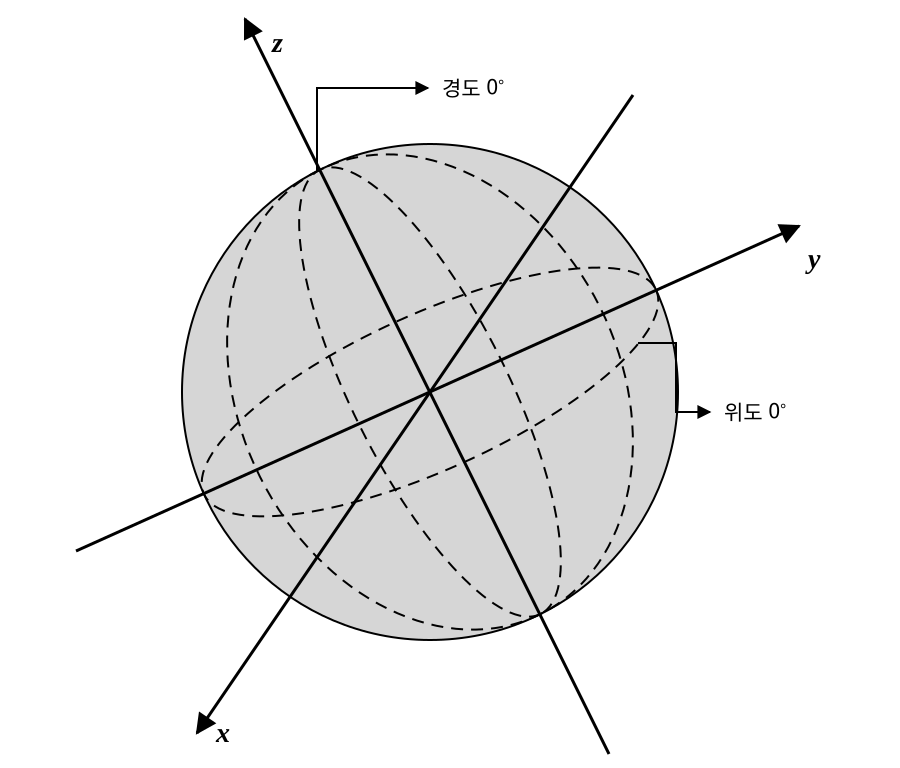

### 2.1.2. LLA (Latitude, Longitude, Altitude) 좌표계

지구를 기준으로 한 3차원 구면좌표계를 뜻한다. 좌표를 표현하는 방법은 (위도, 경도, 고도)로 표현하며 위도는 적도를 0°로 하여 –90°~90°까지 표현하며, 경도는 본초자오선을 0°로 하여 0°~360°까지 표현한다. 고도는 지구 지표면을 기준으로 수직 거리를 표현한다. 위도와 고도는 지구 형상에 따라 다르게 측정 될 수 있기 때문에 지구 모델을 어떠한 좌표계로 사용하는지에 따라 결과가 다르게 측정된다. 대표적으로 Bessel, GRS80, WGS84 등이 있으며, 현재 많은 GPS와 같은 센서들의 발달로 WGS84 좌표계를 대중적으로 사용한다.

CIWS-II에서는 GPS(INS) 센서를 통하여 함선의 LLA 위치 정보를 수신하며, 이를 이용해 함선의 NED, Body 좌표계를 형성하여 데이터처리에서 사용된다.

---

<!-- p.3 -->

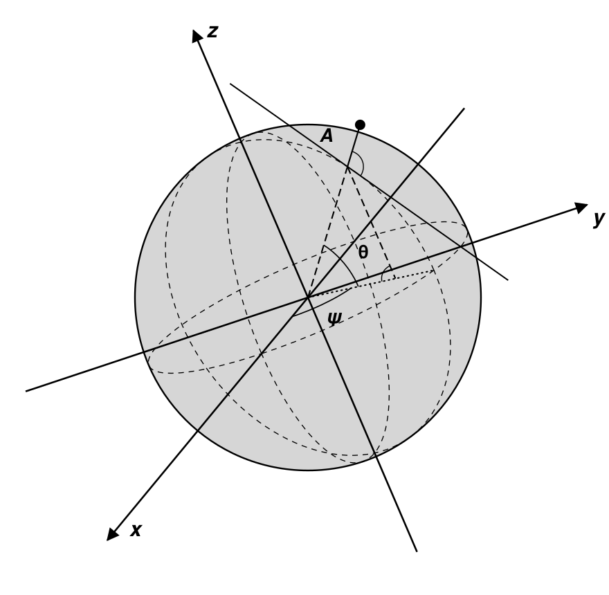

WGS84 좌표계는 지구를 이상적인 Ellipsoidal로 가정하여 위도, 고도를 정의한다. WGS84의 타원체 파라미터는 장반경 $a = 6378137.0[m]$, 단반경 $b = 6356752.3[m]$ 이다.

### 2.1.3. Local ENU (Local East-North-Up) 좌표계

GPS와 같은 센서에서 LLA 좌표 정보를 전달받게 되었을 때, 직각좌표계가 아니기 때문에 직관적으로 위치를 가늠하기 힘들기 때문에 ECEF 좌표계로 변환하게 된다. 이 때, 지구 중심을 기준으로 하기 때문에 좌표값이 매우 크고 상대적인 위치를 측정하기 힘들어 진다. 따라서, 지구 상의 사용자 임의의 위치를 기준으로 하고 $x$축을 East방향, $y$축을 North방향으로 정의하고 $z$축은 Up방향으로 정의된다. ENU 좌표계를 이용하여 특정 위치에서 북쪽, 동쪽, 높이 별로 상대 위치를 구할 수 있으며 활용할 수 있어진다.

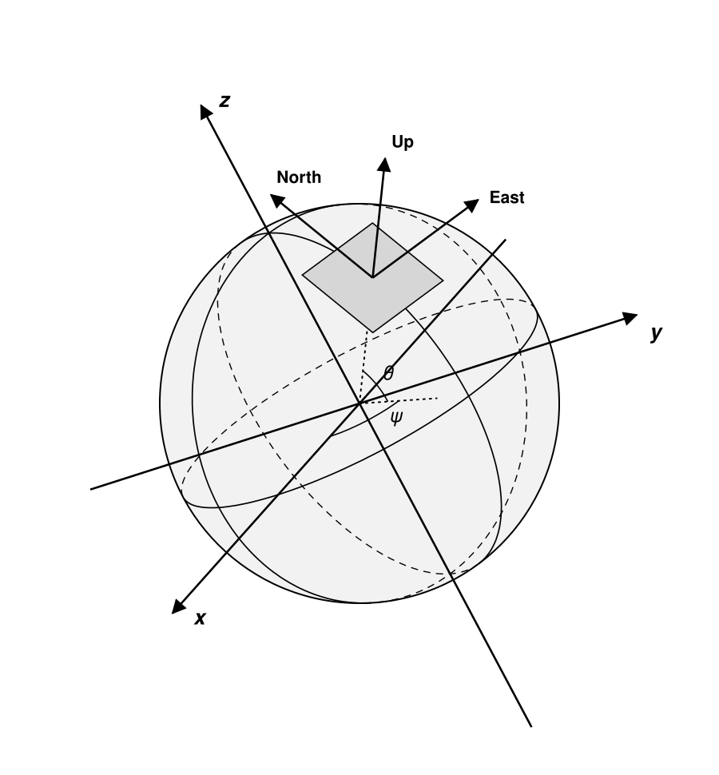

### 2.1.4. Local NED (Local North-East-Down) 좌표계

Local ENU 좌표계와 동일하게 지구 상의 사용자 임의의 위치를 기준으로 하고 $x$축을 North방향, $y$축을 East방향으로 정의하고 $z$축은 Down방향으로 정의된다. NED 좌표계를 이용하여 특정 위치에서 북쪽, 동쪽, 높이 별로 상대 위치를 구할 수 있으며 활용할 수 있어진다. ENU 좌표계와 NED 좌표계는 축의 방향만 다를 뿐 매우 유사하며 사용자의 정의에 따라 사용하게 된다. CIWS-II 데이터처리에서는 함선의 Local 좌표계를 Local NED좌표계를 사용하며, 자세 또한 NED 좌표계를 기준으로 재정의하여 사용한다.

---

<!-- p.4 -->

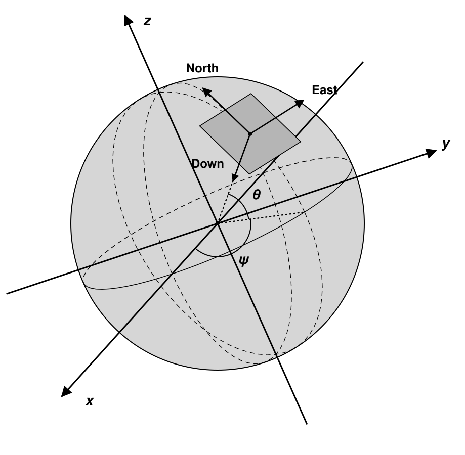

### 2.1.5. Vehicle-Carried ENU 좌표계 (Platform)

레이더를 장착한 플랫폼의 질점(Mass Point)를 중심으로 하여 Local ENU 좌표계와 같이 $x$축을 East, $y$축을 North, $z$축을 Up 방향으로 정의한다. 그렇기 때문에 플랫폼의 자세에 따라서 좌표계가 회전하지 않는다. 플랫폼의 위치에 따라 평행이동만 하게 된다.

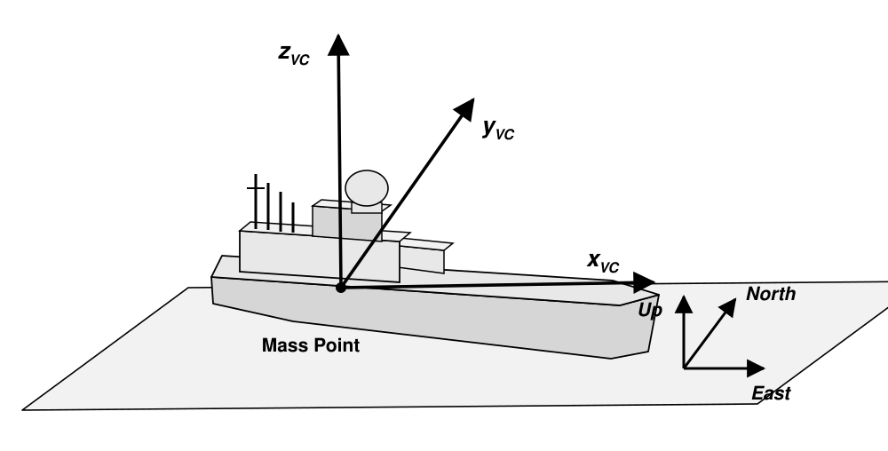

### 2.1.6. Vehicle-Carried NED 좌표계 (Platform)

레이더를 장착한 플랫폼의 질점(Mass Point)를 중심으로 하여 Local ENU 좌표계와 같이 $x$축을 North, $y$축을 East, $z$축을 Down 방향으로 정의한다. 그렇기 때문에 플랫폼의 자세에 따라서 좌표계가 회전하지 않는다. 플랫폼의 위치에 따라 평행이동만 하게 된다. CIWS-II 데이터 처리에서 내부적으로 사용하며, 이를 이용하여 함선을 기준으로 한 Track을 형성하여 사용한다.

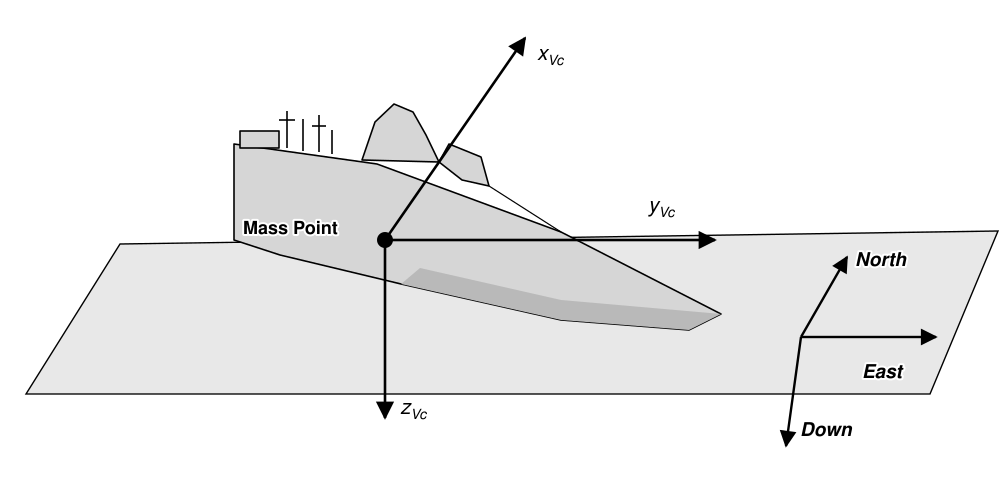

---

<!-- p.5 -->

### 2.1.7. Platform Body 좌표계

함선 플랫폼의 질점을 기준으로 하고 함선의 Head 방향을 $x$축으로 정의하고 함선 기준 수직 아래의 방향을 $z$축으로 정의한다. 이에 따라 $y$축은 동체의 오른쪽 방향으로 정의된다. Vehicle-Carried NED 좌표계와 연관하여 $z$축을 기준으로 회전한 각도를 Yaw(Heading), $y$축을 기준으로 회전한 각도를 Pitch, $x$축으로 회전한 각도를 Roll으로 정의한다. CIWS-II 체계에서 정의하는 좌표계가 다를 경우, 데이터 처리를 하는 과정에서의 Converting이 필요하다.

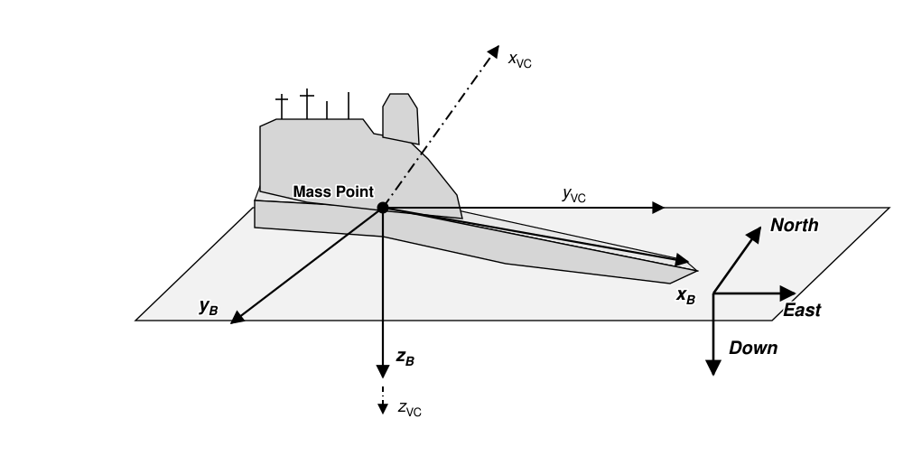

### 2.1.8. GunBody 좌표계

함선 Body에 장착되어 회전하는 CIWS-II 함포에 대한 동축 좌표계이다. 함포는 회전되지 않은 정렬 상태에서 함선의 Body 좌표계와 동일하게 함포의 정면이 $x$축이고 함포의 오른쪽 면이 $y$축, 아래 방향을 $z$축으로 정의한다. 이는 Platform Body 좌표계에서 함포 좌표계로 축 변환 없이 바로 좌표변환을 하기 위한 정의 방식이다. 이에 따라, 함포의 Panning은 $z$축으로 이루어지며 시계방향이 (+)방향이며 Tilting은 $y$축으로 이루어지며 함포가 위로 올라가는 방향이 (+)방향이다. CIWS-II 체계의 함포 좌표계의 정의는 데이터처리에서 사용하는 좌표계와 상이할 수 있으며, 이에 따라 데이터처리부에서 Converting을 하여 사용하게 된다.

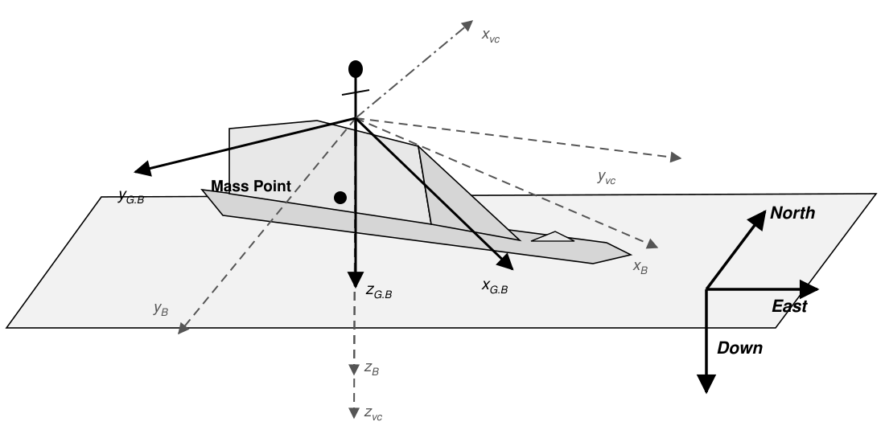

### 2.1.9. Antenna XYZ 좌표계 (Detect Antenna, Tracking Antenna)

안테나 면을 기준으로 하여 구성되는 직각 좌표계이다. 안테나 면과 수직인 방향을 $z$축으로 정의하고 안테나 면에서 위 방향을 $y$축으로 정의한다. 이에 따라 $x$축은 안테나의 왼쪽 방향으로 정의된다.

---

<!-- p.6 -->

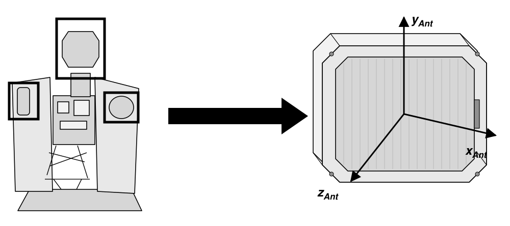

### 2.1.10. Antenna Spherical 좌표계 (Detect Antenna, Tracking Antenna)

안테나면을 기준으로 하여 구성되는 구형좌표계이다. 측정되는 Plot은 안테나로부터의 거리 $R_{Ant}$과 안테나면 기준으로 반시계 방향인 방위각 $\psi_{Ant}$, 안테나면의 중심을 기준으로 고각 $\theta_{Ant}$로 정의되어 3차원 좌표 $(R_{Ant}, \psi_{Ant}, \theta_{Ant})$로 구성된다. 이 때, 오른손 법칙에 따라 Azimuth는 반시계방향이 (+), Elevation은 위방향이 (+)방향이다.

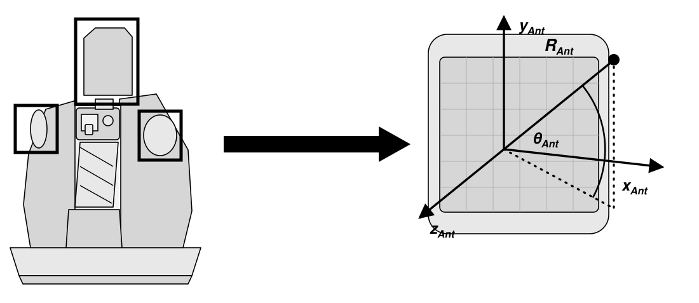

---

<!-- p.7 -->

## 2.2. CIWS-II 좌표계간 변환 정리

2.3에서 정의된 각 좌표계들에서의 좌표 값들을 원하는 좌표계로 변환하기 위한 좌표계간의 변환식을 정의한다. 좌표계간의 변환 과정은 다음과 같다.

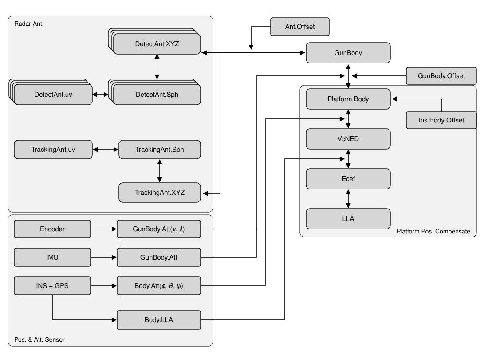

위의 그림은 2.3.절에서 소개된 좌표계들 간의 좌표계 변환 정리에 대한 블락도이며, 왼쪽 아래에 있는 블락은 함포, 함체에 대한 위치 및 자세를 획득하기 위한 Sensor이다.

Antenna로부터 측정된 목표물은 uv 좌표계를 통하여 안테나 면에서의 위치로 측정된다. 이를 레이다에서 보편적으로 사용되는 구 좌표계(Al-El)를 사용하여 Antenna로부터 측정된 거리, 방위각, 고각으로 변환하기 위해 구 좌표계로 변환한다. Antenna 기준 구 좌표계의 목표물 좌표를 데이터처리(추적)에서 사용하기 위하여 함선에 대한 좌표계로 변환할 필요가 있다. 이 때, 추적에서 사용하는 좌표계는 Vehicle-carried NED 좌표계를 사용하며, 목표물을 이 좌표계로 변환하여야 한다. 따라서, 안테나의 구 좌표계로부터 직교좌표계로 변환하여 같은 좌표 시스템으로 맞춘다. 이후 안테나가 회전하는 함포에 장착되어있기 때문에, 바로 Vehicle-carried NED 좌표계로 변환할 수 없으며 함포에 부착되어있는 방향과 축에 맞춰서 함포 좌표계로 좌표변환을 시행한다. 이후에는 함포의 구동 정보를 이용하여 Platform Body좌표계로 변환한 후, 함선의 자세정보를 이용하여 Vehicle-carried NED 좌표계로 변환하여 데이터처리에서 사용하게 된다. 이후, 추적된 결과에 따라 다음 빔 방사를 하기 위한 명령 생성 시에도, 이에 대한 역순으로 변환하여 사용한다. 이 때, 함선의 무게중심 (Vehicle-carried NED 좌표계의 원점)에서 함포의 위치, 안테나의 위치 오차에 대한 보상은 위에 있는 그림과 같이 변환 단계에서 포함되어 보정이 이루어진다.

### 2.2.1. LLA to ECEF 좌표계 변환

GPS 센서로부터 얻은 좌표값은 대부분 WGS-84를 기반으로 한 LLA 좌표계이다. 이는 지구의 중심을 기준으로 각도를 측정하고 그 표면에서의 수직 고도를 표현한 것이다. 이를 지구 중심을 기준으로한 직각 좌표계, 단위는 $m$로 변환한 것이 ECEF 좌표계다. 이를 유도하기 위한 수식은 타원체를 기준으로 하

---

<!-- p.8 -->

기 때문에 복잡하며 단순히 결과 계산식만 표현하면 아래와 같다.

$$
\begin{aligned}
X_{ECEF} &= (R_n + h)\cos(\theta)\cos(\psi) \\
Y_{ECEF} &= (R_n + h)\cos(\theta)\sin(\psi) \\
Z_{ECEF} &= (r_c + h)\sin(\theta)
\end{aligned}
\qquad
\begin{aligned}
r_c &= (1 - e^2)R_n \\
R_n &= \frac{a}{\sqrt{1 - e^2 \sin^2(\theta)}}
\end{aligned}
\qquad
\begin{aligned}
e &\approx 0.8181919... \\
a &= 6378137\,[m] \\
\theta &= Latitude \\
\psi &= Longitude \\
h &= Altitude
\end{aligned}
$$

위의 수식을 이용하여 $LLA$ 좌표계 값으로부터 $ECEF$ 좌표계 값으로 계산할 수 있다.

실제 장비에서는 INS(GPS)의 위치 오차에 따라 이를 보상해야할 필요가 있으며, 현재 이는 무게중심에 정확하게 장착이 되어있다 가정하고 생략한다.

### 2.2.2. ECEF to LLA 좌표계 변환

계산 자체는 간단할 수 있으나, 2.4.3.1절에서의 식에서 위도, 고도로 3가지 항이 모두 계산이 되기 때문에 종속성을 풀기 위해선 1개의 수식이 더 필요하다. 따라서, 한번의 계산으로는 정확한 $LLA$ 좌표계의 계산 값을 구할 수 없기 때문에, 반복적으로 위도와 고도를 계산하는 방식을 사용하여 정확한 값에 근사한 값으로 수렴시킨 후 사용한다.

먼저 경도를 산출하는 식은 간단하게 다음과 같이 표현할 수 있다.

$$
\psi = \tan^{-1}\left(\frac{Y_{ECEF}}{X_{ECEF}}\right)
$$

경도 산출 후, 위도, 고도 산출을 위한 반복 과정은 다음과 같이 진행한다.

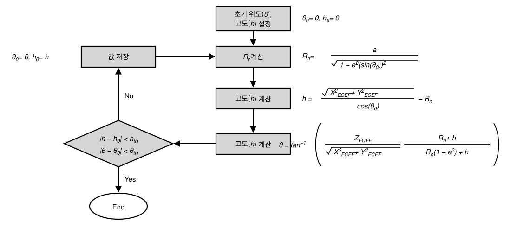

### 2.2.3. ECEF to VcNED 좌표계 변환

$ECEF$ 좌표계를 그대로 사용하게 되면 직관적으로 현재 운용자 관점에서 목표물의 위치를 파악하기 힘들다. 따라서, 운용자가 원하는 Local 지역을 원점으로 하여 $NED$ 좌표계로 변환하여 사용한다. 이 중에서 Platform을 원점으로 하여 정의한 좌표계가 Vehicle carried 좌표계이다. $ECEF$ 좌표계에서 $VcNED$ 좌표계로 변환하는 식은 아래와 같다.

$$
P_T^{VcNED} = R_{ECEF}^{VcNED}(P_T^{ECEF} - P_{Platform}^{ECEF})
$$

$$
R_{VcNED}^{ECEF} = R_z(\psi)R_y(-90-\theta) =
\begin{bmatrix}
-\sin(\theta)\cos(\psi) & -\sin(\psi) & -\cos(\theta)\cos(\psi) \\
-\sin(\theta)\sin(\psi) & \cos(\psi) & -\cos(\theta)\sin(\psi) \\
\cos(\theta) & 0 & -\sin(\theta)
\end{bmatrix}
$$

### 2.2.4. VcNED to ECEF 좌표계 변환

---

<!-- p.9 -->

$VcNED$ 좌표계에서 반대로 $ECEF$ 좌표계로 변환하는 식은 2.4.3.3절의 내용을 참고하여 아래와 같이 표현할 수 있다.

$$
P_T^{ECEF} = R_{VcNED}^{ECEF} P_T^{VcNED} + P_{Platform}^{ECEF}
$$

$$
R_{VcNED}^{ECEF} = R_z(\psi) R_y(-90-\theta) =
\begin{bmatrix}
-\sin(\theta)\cos(\psi) & -\sin(\psi) & -\cos(\theta)\cos(\psi) \\
-\sin(\theta)\sin(\psi) & \cos(\psi) & -\cos(\theta)\sin(\psi) \\
\cos(\theta) & 0 & -\sin(\theta)
\end{bmatrix}
$$

### 2.2.5. VcNED to Platform Body 좌표계 변환

$VcNED$ 좌표계에서 함체의 자세 정보 Roll $\phi_B$, Pitch $\theta_B$, Yaw $\psi_B$를 반영하여 함체 기준 동체 좌표계로 변환한 식이 다음과 같다.

$$
P_T^{B} = \left(R_B^{VcNED}\right)^{T} P_T^{VcNED}
$$

$$
\begin{aligned}
R_B^{VcNED} &= R_z(\psi_B) R_y(\theta_B) R_x(\phi_B) \\
&=
\begin{bmatrix}
\cos(\psi_B)\cos(\theta_B) & \cos(\psi_B)\sin(\theta_B)\sin(\phi_B)-\sin(\psi_B)\cos(\phi_B) & \sin(\psi_B)\sin(\phi_B)+\cos(\psi_B)\sin(\theta_B)\cos(\phi_B) \\
\sin(\psi_B)\cos(\theta_B) & \cos(\psi_B)\cos(\phi_B)+\sin(\psi_B)\sin(\theta_B)\sin(\phi_B) & \sin(\psi_B)\sin(\theta_B)\cos(\phi_B)-\cos(\psi_B)\sin(\phi_B) \\
-\sin(\theta_B) & \cos(\theta_B)\sin(\phi_B) & \cos(\theta_B)\cos(\phi_B)
\end{bmatrix}
\end{aligned}
$$

### 2.2.6. Platform Body to VcNED 좌표계 변환

$VcNED$ 좌표계에서 함체의 자세 정보 Roll $\phi_B$, Pitch $\theta_B$, Yaw $\psi_B$를 반영하여 함체 기준 동체 좌표계로 변환한 식이 다음과 같다.

$$
P_T^{VcNED} = R_B^{VcNED} P_T^{B}
$$

$$
\begin{aligned}
R_B^{VcNED} &= R_z(\psi_B) R_y(\theta_B) R_x(\phi_B) \\
&=
\begin{bmatrix}
\cos(\psi_B)\cos(\theta_B) & \cos(\psi_B)\sin(\theta_B)\sin(\phi_B)-\sin(\psi_B)\cos(\phi_B) & \sin(\psi_B)\sin(\phi_B)+\cos(\psi_B)\sin(\theta_B)\cos(\phi_B) \\
\sin(\psi_B)\cos(\theta_B) & \cos(\psi_B)\cos(\phi_B)+\sin(\psi_B)\sin(\theta_B)\sin(\phi_B) & \sin(\psi_B)\sin(\theta_B)\cos(\phi_B)-\cos(\psi_B)\sin(\phi_B) \\
-\sin(\theta_B) & \cos(\theta_B)\sin(\phi_B) & \cos(\theta_B)\cos(\phi_B)
\end{bmatrix}
\end{aligned}
$$

### 2.2.7. Platform Body to GunBody 좌표계 변환

$Body$ 좌표계로부터 Pan각 $\nu$, Tilt각 $\lambda$ 회전을 반영하여 함포 기준 동체 좌표계로 변환한 식이 다음과 같다. 이 때, 함포는 함선의 무게중심에 정확히 배치되지 않으며 오차를 가지고 배치된다. 이 때, 장착 오차에 대해서는 함선의 Body 좌표계를 관점으로 하여 정의 될 때, 식을 아래와 같이 전개할 수 있다.

$$
P_{Off}^{B} =
\begin{bmatrix}
x_{Off}^{B} \\
y_{Off}^{B} \\
z_{Off}^{B}
\end{bmatrix}
$$

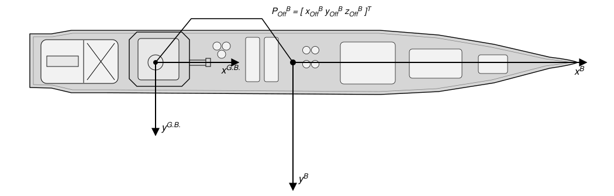

---

<!-- p.10 -->

$$
P_T^{G.B.} = R_B^{G.B.}(P_T^B - P_{Off.}^B)
$$

$$
R_{G.B.}^{B} = R_z(\nu)R_y(\lambda) =
\begin{bmatrix}
\cos(\nu)\cos(\lambda) & -\sin(\nu) & \cos(\nu)\sin(\lambda) \\
\sin(\nu)\cos(\lambda) & \cos(\nu) & \sin(\nu)\sin(\lambda) \\
-\sin(\lambda) & 0 & \cos(\lambda)
\end{bmatrix}
$$

### 2.2.8. GunBody to Platform Body 좌표계 변환

$Body$ 좌표계로부터 Pan각 $\nu$, Tilt각 $\lambda$ 회전을 반영하여 함포 기준 동체 좌표계로 변환한 식이 다음과 같다.

$$
P_T^B = R_{G.B.}^{B} P_T^{G.B.} + P_{Off}^B
$$

$$
R_{G.B.}^{B} = R_z(\nu)R_y(\lambda) =
\begin{bmatrix}
\cos(\nu)\cos(\lambda) & -\sin(\nu) & \cos(\nu)\sin(\lambda) \\
\sin(\nu)\cos(\lambda) & \cos(\nu) & \sin(\nu)\sin(\lambda) \\
-\sin(\lambda) & 0 & \cos(\lambda)
\end{bmatrix}
$$

### 2.2.9. GunBody to Antenna XYZ 좌표계 변환

CIWS-II는 함체에 부착되어 있는 것이 아닌 함포에 부착이 되어있다. 따라서 $Body$ 좌표계로부터 $Antenna$ 좌표계로 바로 변환하는 것은 불가능 하다. $GunBody$ 좌표계에서 각 안테나의 $Antenna$ 좌표계로 변환하여야 한다. 변환하는 행렬식은 2가지 변환 순서로 구성된다.

1\. $GunBody$의 무게중심으로부터 각 $Antenna$의 부착 위치 오차만큼 보상한다. 이 때의 부착 위치의 Offset은 $GunBody$ 좌표계로 정의 되며 $P_{Off}^{G.B.}$라 정의한다.

1\. $GunBody$로부터 $Antenna$ 좌표계와 같은 방향으로 축 변환을 한다.

2\. 변환된 축에서 각 탐색레이더의 Antenna, 추적레이다 Antenna의 $Pan$각도 $\nu$, $Tilt$각도 $\lambda$의 각도를 반영하여 회전변환한다. (탐색레이더는 함포의 $Tilt$에 영향을 받지 않고 부착 각도에 따른 $Tilt\ Offset$에만 영향을 받는다. 추적레이더는 함포의 $Tilt$에 영향을 받으며 부착 $Offset$은 없다고 가정한다.)

1번에 해당하는 회전변환 행렬이 $R_{Ant.Temp}^{G.B}$, 2번에 해당하는 회전변환 행렬이 $R_{Ant}^{Ant.Temp}$라 할 때, 수식으로 표현하면 다음과 같이 표현할 수 있다.

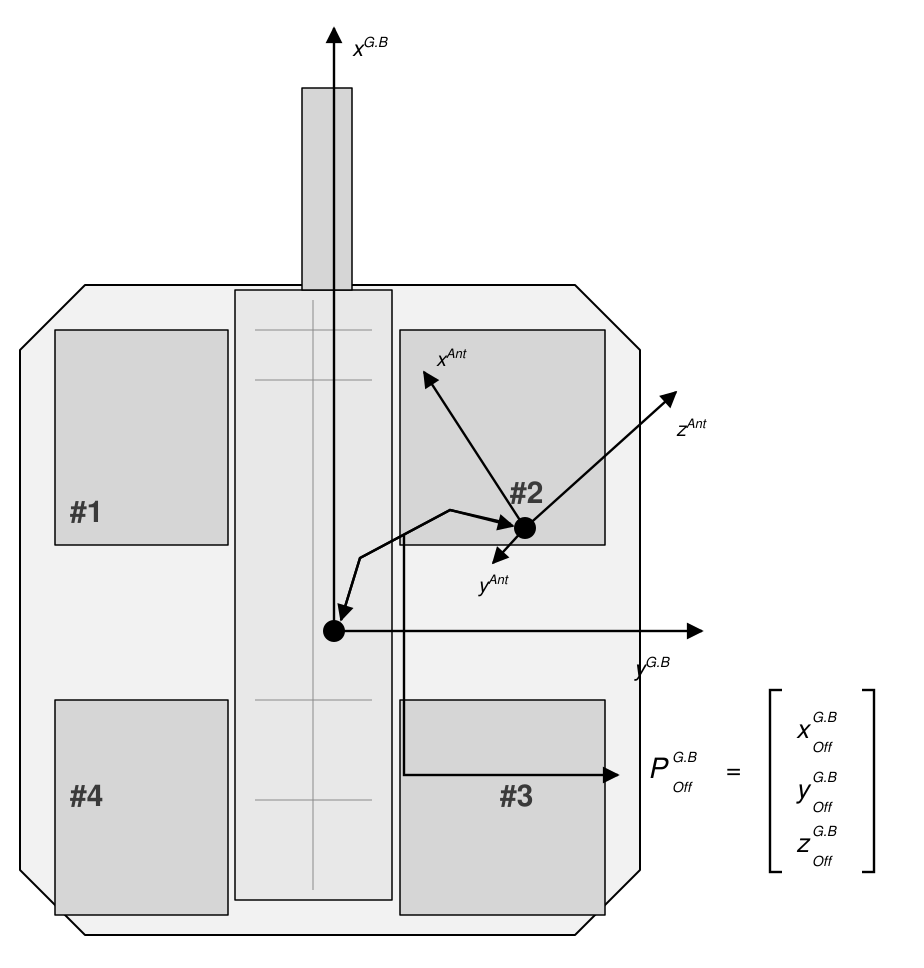

---

<!-- p.11 -->

$$
P_T^{G.B} = R_{Ant}^{G.B} P_T^{Ant} + P_{Off}^{G.B.} = R_{Ant.Temp}^{G.B} R_{Ant}^{Ant.Temp} P_T^{Ant} + P_{Off}^{G.B.}
$$

$$
R_{Ant.Temp}^{G.B} = R_z(-90) R_x(-90) = \begin{bmatrix} 0 & 0 & 1 \\ -1 & 0 & 0 \\ 0 & -1 & 0 \end{bmatrix}
$$

$$
\begin{aligned}
R_{Ant}^{Ant.Temp} &= R_y(\nu_{Ant.Pan}) R_x(-\lambda_{Ant.Tilt}) \\
&= \begin{bmatrix}
\cos(\nu_{Ant.Pan}) & -\sin(\nu_{Ant.Pan})\sin(\lambda_{Ant.Tilt}) & \sin(\nu_{Ant.Pan})\cos(\lambda_{Ant.Tilt}) \\
0 & \cos(\lambda_{Ant.Tilt}) & \sin(\lambda_{Ant.Tilt}) \\
-\sin(\nu_{Ant.Pan}) & -\cos(\nu_{Ant.Pan})\sin(\nu_{Ant.Tilt}) & \cos(\nu_{Ant.Pan})\cos(\lambda_{Ant.Tilt})
\end{bmatrix}
\end{aligned}
$$

따라서, GunBody에서 Antenna 좌표계로 좌표를 변환하는 식은 다음과 같다.

$$
P_T^{Ant} = R_{G.B}^{Ant}(P_T^{G.B} - P_{Off}^{G.B}) = (R_{Ant}^{G.B})^T (P_T^{G.B} - P_{Off}^{G.B})
$$

Antenna의 각 Pan, Tilt 값은 체계의 각도 정의에 따라 부호가 바뀔 수 있다. 여기서 정의한 내용은, Pan은 안테나 좌표축에서 정의한 각도로 그대로 가져갔으며, Tilt는 탐색레이더, 추적레이더에 따라 각도가 사용되는 것이 다르지만, 탐색레이더의 부착 각도에 대한 정의와 추적레이더의 Tilt에 대한 정의는 모두 GunBody축에서 일어나는 방향으로 정의를 하여, 편의상 (-) 부호를 넣었다.

### 2.2.10. Antenna XYZ to GunBody 좌표계 변환

위의 회전변환을 반대로 진행하면 되며, 식으로 표현하면 다음과 같다.

$$
P_T^{G.B} = R_{Ant}^{G.B} P_T^{Ant} + P_{Off}^{G.B.} = R_{Ant.Temp}^{G.B} R_{Ant}^{Ant.Temp} P_T^{Ant} + P_{Off}^{G.B.}
$$

$$
R_{Ant.Temp}^{G.B} = R_z(-90) R_x(-90) = \begin{bmatrix} 0 & 0 & 1 \\ -1 & 0 & 0 \\ 0 & -1 & 0 \end{bmatrix}
$$

$$
\begin{aligned}
R_{Ant}^{Ant.Temp} &= R_y(\nu_{Ant.Pan}) R_x(-\lambda_{Ant.Tilt}) \\
&= \begin{bmatrix}
\cos(\nu_{Ant.Pan}) & -\sin(\nu_{Ant.Pan})\sin(\lambda_{Ant.Tilt}) & \sin(\nu_{Ant.Pan})\cos(\lambda_{Ant.Tilt}) \\
0 & \cos(\lambda_{Ant.Tilt}) & \sin(\lambda_{Ant.Tilt}) \\
-\sin(\nu_{Ant.Pan}) & -\cos(\nu_{Ant.Pan})\sin(\nu_{Ant.Tilt}) & \cos(\nu_{Ant.Pan})\cos(\lambda_{Ant.Tilt})
\end{bmatrix}
\end{aligned}
$$

# 3. 결론

본문 2장에서 기술하는 바와 같이, CIWS-II 레이더 데이터처리에서 사용하는 좌표계의 종류와 이에 대한 변환식에 대하여 분류 및 정리하였다. 함선 및 함포, 안테나에 대한 각 좌표계에 대한 축 정의, 회전변환을 통하여 측정된 목표물의 위치를 사용자가 원하는 좌표계로 표현할 수 있다. 또한, 실제로 각 시스템의 장착 오차에 대한 보상하는 부분을 추가하여 각 시스템의 위치에 정확한 좌표계를 표현할 수 있게 정리하였다.
