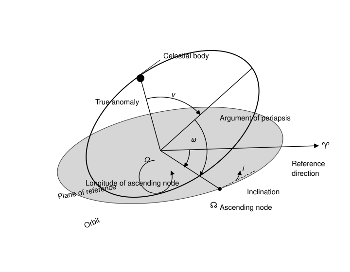
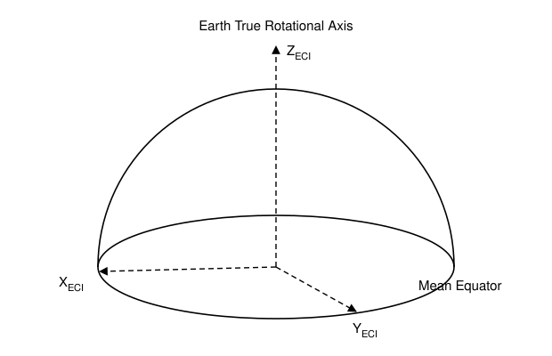
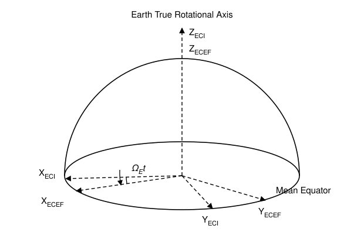
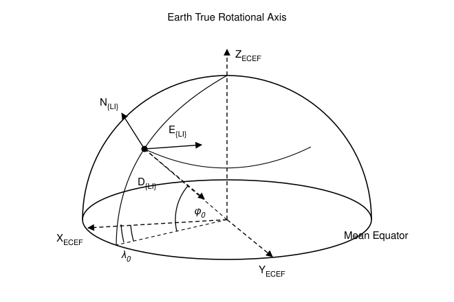
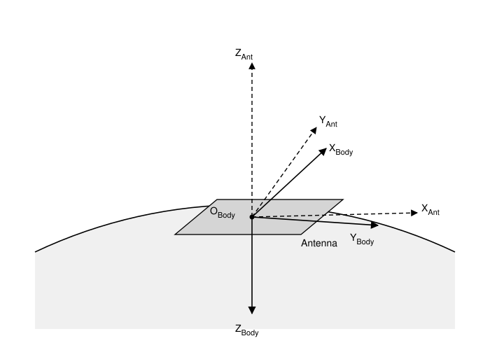
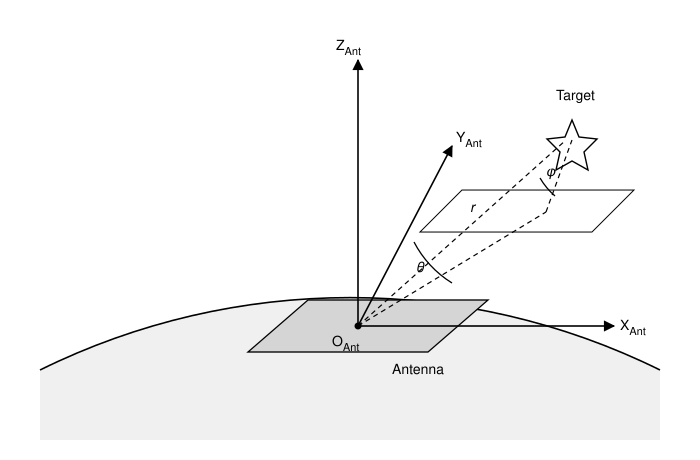
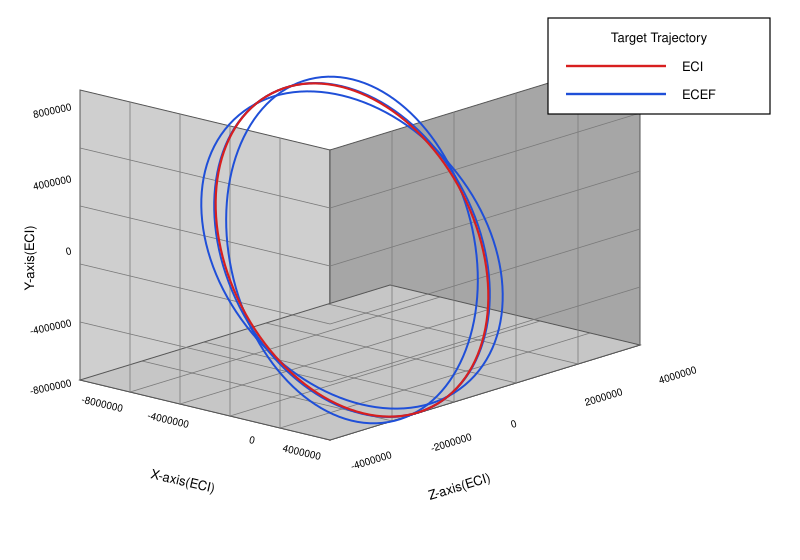

**제목**  우주물체 표적추적 시뮬레이션을 위한 표적 모의 방법 및 좌표 변환 소개

## Summary

현재까지 수 만 대 이상의 인공위성들이 지구 저궤도에 배치되어 임무 수행 중에 있으며 우주 파편을 포함한 매우 작은 크기의 우주 물체의 경우 수 십 만개 이상 저궤도에서 운동하고 있는 것으로 파악되고 있다. 위성을 포함한 이러한 우주 물체들은 초고속으로 지구 궤도를 따라 운동하고 있기 때문에 우주 물체 간 충돌 및 추락 위험성이 점점 더 커지고 있으며 이에 따라 우주 물체 감시에 대한 필요성이 크게 증가되고 있다. 미래 우주 산업에서는 이러한 위험성을 대비하여 우주 물체를 탐지 추적하고 효과적으로 관리하기 위한 우주 물체 감시 레이다 개발이 시급한 상황이며 이에 따라 초고속 초장거리 표적을 놓치지 않고 효과적으로 추적하기 위해서는 지구 궤도를 운동하는 우주 물체에 대한 시스템 설계가 매우 중요하다고 할 수 있다. 본 기술 보고서에서는 우주물체 표적 추적 시뮬레이션 개발에 필요한 우주물체 표적 모의 방법과 사용된 좌표계 그리고 좌표 변환에 대한 내용을 다루고 있으며 해당 기법을 적용한 모의 표적 결과를 시뮬레이션을 통해 확인해 보았다.

---

<!-- p.1 -->

# 1. 우주물체 표적 모의/추적을 위한 좌표계 소개

## 1.1. 천구 좌표계와 궤도 파라미터

천구 좌표계는 천체 관측에서 천체의 위치를 나타내기 위해 지구를 중심으로 나타낸 좌표계이며 천구는 관측자를 중심으로 거대한 반지름을 갖는 구를 설정하고 모든 천체가 구의 표면에서 움직인다는 것을 전제로 하는 개념을 가진다. 우주물체 표적 추적 시뮬레이션에서 지구를 중심으로 공전하는 우주물체 표적을 모의하기 위해서는 먼저 천구 좌표계에서 표적에 대한 6가지 궤도 정보를 정해야 하는데 이를 궤도 6요소라 한다. 그림 1은 천구 좌표계에서의 궤도 6요소를 표현한 것이며 이에 대한 설명은 아래 표와 같다.



**그림 1. 천구 좌표계와 궤도의 6요소**

### 표 1. 궤도 6요소

| 궤도의 6요소 | 설명 |
|---|---|
| **a** : 장반경(semi major axis of the orbit) | 타원 궤도의 장축 반지름[meter] |
| **e** : 이심률(eccentricity) | 타원 궤도의 일그러진 정도 (0:원, 0~1:타원, 1:포물선) |
| **i** : 궤도 경사(inclination) | 적도면과 궤도면이 이루는 각[radians] |
| **Ω** : 승교점 경도(Longitude of ascending node) | 적도면 내 춘분점과 상승 교점 사이의 각[radians] |
| **ω** : 근일점 편각(argument of periapsis) | 궤도면 내 상승교점과 근지점 사이의 각[radians] |
| **ν** : 실제 비행각(True anomaly) | 궤도면 내 근지점과 위성 사이의 각[radians] |

\* 춘분점 : 기준점으로 천구 상 황도와 적도면과의 교점이 되는 분점 중에 태양이 남에서 북으로 적도를 통과할 때의 점으로 적도 좌표계, 황도좌표계 등의 원점이 되는 중요한 점임

\* 상승교점 : 위성이 상승할 때 적도면을 지나는 교점

\* 하강교점 : 위성이 하강할 때 적도면을 지나는 교점

\* 근지점 : 궤도 상의 점 중 지구와 가장 가까운 점

---

<!-- p.2 -->

## 1.2. 지구중심 관성 좌표계(ECI Frame, Earth Centered Inertial Frame)

지구중심 관성 좌표계는 관성의 법칙이 적용되는 좌표계다. 시간의 변화에 따라 가속하거나 회전하지 않는 좌표계로 실제로 지구가 회전하고 있지만 다른 좌표계들과의 관계를 기술하기 위한 목적으로 만든 가상의 좌표계로 시간이 변하여도 움직이지 않는다. ECI 좌표계의 초기 위치는 원점이 지구의 중심(Center of mass)이고, Z축은 북극방향을 X축은 본초 자오선에 수직인 방향을 가리키며, 오른손 법칙을 적용하여 Y축을 설정한다.



**그림 2. ECI 좌표계**

## 1.3. 지구중심 지구고정 좌표계(ECEF Frame, Earth Centered Earth Fixed Frame)

지구 회전(자전)이 포함된 지구중심 좌표계로 지구상의 목표물의 위치를 그림 3과 같이 3차원 직각좌표계로 나타낼 수 있다. 좌표계 원점은 지구 질량중심이며 Z축은 지구 자전축(북극)을 향하고 X축은 본초 자오선에 수직인 방향을 가리키며, 오른손 법칙을 적용하여 Y축을 설정한다. 지구 자전시 X축은 항상 본초 자오선을 가리키며 지구 회전율 Ω<sub>E</sub>이 고려되어 지구에 고정되어 지구와 같이 회전한다. 성층권 내에 있는 지구상의 물체들은 지구와 함께 자전하기에 ECEF 좌표계를 통해 지구 내에서 절대 위치를 표현할 수 있으며 지구의 자전으로 인해 회전하는 좌표계이기 때문에 t=0 시점에서는 지구 중심 관성 좌표계와 동일하다.



**그림 3. ECEF 좌표계**

---

<!-- p.3 -->

## 1.4. NED 좌표계(NED Frame, North East Down Frame)

지구 성층권 내에서의 Local 좌표계이며 아래 그림과 같이 지구 표면상의 한 지점을 고정시키고 고정점을 원점으로 하여 목표물의 위치를 표현하는 방식이다. NED 좌표계는 X축은 북쪽, Y축은 동쪽 그리고 Z축은 원점에서 지구 중심방향으로 정의된다.



**그림 4. NED 좌표계**

## 1.5. Body 좌표계

본 기술보고서에서 정의한 우주물체 탐지/추적 레이다의 Body 좌표계는 아래 그림과 같다. 지표면에 안테나가 수직 방향으로 설치된 고정형 레이다의 Body 좌표계 X축을 안테나 좌표계의 Y축과 동일한 축으로 정의하였으며 Body 좌표계 X축의 오른쪽을 Y축 그리고 Z축은 원점으로부터 연직 하향으로 정의하였다. M&S 편의상 Body 좌표계 X축은 진북 방향으로 가정하였기 때문에 Body 좌표계와 NED 좌표계 축은 동일하다고 볼 수 있다.



**그림 5. Body 좌표계**

---

<!-- p.4 -->

## 1.6. Antenna 좌표계

본 기술보고서에서는 기술하는 우주물체 탐지/추적 레이다의 안테나는 아래 그림과 같이 지표면으로부터 수직한 방향으로 설치되었다는 가정 하에 안테나 직교 좌표계를 정의하였다. X축은 Y축과 Z축의 CrossProduct 방향으로 X<sub>Ant</sub>로 표시하였으며 Y축은 안테나의 상부 방향으로 진북방향을 향하도록 설정하였으며 Y<sub>Ant</sub>로 표시하였다. Z축은 안테나면의 normal 방향으로 Z<sub>Ant</sub>로 표시하였다. Antenna 극 좌표계 성분으로 표현된 slant 거리, 방위각 그리고 고각은 아래 그림과 같이 각각 r, θ, Φ로 정의하여 표현하였다.



**그림 6. Antenna 좌표계**

# 2. 우주물체 표적 모의 방법

## 2.1. 우주물체 표적 상태변수 초기 값 추출

본 기술보고서에서 제안하는 우주물체 표적을 모의하기 위한 표적 상태변수 초기 값은 천구 좌표계상에서 먼저 추출해야하는데 이를 위해 아래 매트랩 코드와 같이 케플러 6요소(궤도 6요소)에 대한 값을 설정해야한다. kepel(1)은 장반경, kepel(2)는 이심률, kepel(3)은 궤도 경사, kepel(4)는 승교점 경도, keple(5)는 근일점 편각, kepel(6)은 실제 비행각 값을 나타낸다.

```matlab
% vector containing the keplerian elements
% kepel(1) : a (semimajor axis of the orbit)
% kepel(2) : e (eccentricity)
% kepel(3) : i (inclinatsion in radians)
% kepel(4) : Ω (right ascension of ascending node)
% kepel(5) : ω (argument of perigee)
% kepel(6) : ν (mean anomaly)
```

케플러 6요소 설정 후 아래와 같이 kepel_statvec() 함수를 이용해 천구 좌표계에서의 표적 상태변수( $X_{Orbit}$ ) 초기 값을 구할 수 있으며 표적 상태변수는 식 (1)과 같이 천구 좌표계 3축의 직교 성분(X, Y, Z)에 대한 위치 정보와 속도 정보로 구성 하였다.

$$
\boldsymbol{X}_{Orbit} = \begin{bmatrix} x_{orbit} & \dot{x}_{orbit} & y_{orbit} & \dot{y}_{orbit} & z_{orbit} & \dot{z}_{orbit} \end{bmatrix}^{T}
\tag{1}
$$

---

<!-- p.5 -->

```matlab
function statvec = kepel_statvec(kepel)

EARTH_GRAVITY = 3.9860064e+14;   % Earth's gravitational constant (m**3/s**2)

c1 = sqrt(1. - kepel(2)*kepel(2));
E  = kepler(kepel(6), kepel(2));    % Kepler's equation
sE = sin(E);
cE = cos(E);
c3 = sqrt(EARTH_GRAVITY/a) / (1. - exc*cE);

% orbit coordinate state vector
    statvec(1,1) = kepel(1)*(cE - kepel(2));    % X축 위치 성분
    statvec(2,1) = -c3*sE;                      % X축 속도 성분
    statvec(3,1) = kepel(1)*c1*sE;              % Y축 위치 성분
    statvec(4,1) = c1*c3*cE;                    % Y축 속도 성분
    statvec(5,1) = 0.;                          % Z축 위치 성분
    statvec(6,1) = 0.;                          % Z축 속도 성분

end
```

```matlab
function [eccentric] = kepler(mean_anomaly, eccentricity)

  exc2  = eccentricity*eccentricity;
  am1   = mod(mean_anomaly, 2*pi);
  am2   = am1 + am1;
  am3   = am1 + am2;
  shoot = am1 + eccentricity*(1. - 0.125*exc2)*sin(am1) + 0.5*exc2*(sin(am2) + 0.75*eccentricity*sin(am3));
  shoot = mod (shoot, 2*pi);
  e1    = 1.0;
  ic    = 0;

  while ((abs(e1) > 1.e-12) && (ic <= 10))
          e1    = (shoot - am1 - eccentricity*sin(shoot)) / (1.0 - eccentricity*cos(shoot));
          shoot = shoot - e1;
          ic    = ic + 1;
  end

  eccentric = shoot;

end
```

---

<!-- p.6 -->

## 2.2. 천구 좌표계 → ECI 좌표계

다음으로 표적 기동을 모의하기 위해서는 앞 절에서 구한 천구 좌표계상의 표적 상태변수 $X_{Orbit}$ 를 아래와 같이 지구중심 관성 좌표계상에서의 표적 상태변수 $X_{Eci}$ 로 변환해주어야 한다.

$$
\boldsymbol{X}_{Eci} = \begin{bmatrix} x_{eci} & \dot{x}_{eci} & y_{eci} & \dot{y}_{eci} & z_{eci} & \dot{z}_{eci} \end{bmatrix}^{T}
\tag{2}
$$

$X_{Eci}$ 성분을 구하기 위해서는 회전 행렬 $C^{Eci}_{Orbit}$ 를 이용해야 하는데 $C^{Eci}_{Orbit}$ 는 아래 수식과 같이 승교점 경도(Ω)와 궤도 경사각(i) 그리고 근일점 편각(ω)을 이용하여 Z축 회전행렬, X축 회전행렬 그리고 다시 Z축에 대한 회전행렬 순서로의 곱으로 구할 수 있으며 이를 좌표 변환 회전 행렬로 이용하여 천구 좌표계 성분을 지구중심 관성 좌표계 성분으로 변환할 수 있다. 아래 수식은 천구 좌표계 상에서의 표적 위치 성분을 지구중심 관성 좌표계 상에서의 위치 성분으로 변환하는 과정을 표현한 것이며 지구중심 관성 좌표계 상에서의 표적 속도 성분도 같은 방법으로 구할 수 있다.

$$
\begin{bmatrix} x_{Eci,pos} \\ y_{Eci,pos} \\ z_{Eci,pos} \end{bmatrix}
=
\begin{bmatrix}
\cos(\Omega) & \sin(\Omega) & 0 \\
-\sin(\Omega) & \cos(\Omega) & 0 \\
0 & 0 & 1
\end{bmatrix}
\begin{bmatrix}
1 & 0 & 0 \\
0 & \cos(i) & \sin(i) \\
0 & -\sin(i) & \cos(i)
\end{bmatrix}
\begin{bmatrix}
\cos(\omega) & \sin(\omega) & 0 \\
-\sin(\omega) & \cos(\omega) & 0 \\
0 & 0 & 1
\end{bmatrix}
\begin{bmatrix} x_{orbit} \\ y_{orbit} \\ z_{orbit} \end{bmatrix}
\tag{3}
$$

$$
\boldsymbol{X}_{Eci,pos} = \boldsymbol{C}^{Eci}_{Orbit}\,\boldsymbol{X}_{Orbit,pos}
$$

## 2.3. 우주물체 표적 상태변수 갱신

앞 절에서 구한 ECI 좌표계상에서의 표적 상태변수 초기 값을 시간에 따라 갱신하기 위해서는 표적 궤도 모델을 이용해야하는데 이를 위한 궤도 모델 수식은 아래와 같다.

$$
\ddot{r} = -\frac{\mu}{r^{3}}r + \boldsymbol{\omega}
\tag{4}
$$

우주 물체는 지구를 중심으로 공전하는 궤도 운동을 하는데 식 (4)와 같이 표적의 가속도 성분을 거리에 따른 미분방정식으로 표현할 수 있다. 여기서 $r$ 은 지구 중심으로부터 우주물체까지의 거리를 의미하며 $\boldsymbol{\omega}$ 는 섭동에 의한 영향을 의미한다. $\mu$ 는 지구중력상수로 398,600 km³/s²이다. 미분 방정식으로 표현된 궤도 모델을 이용하여 시간에 따라 표적의 상태 변수를 갱신하기 위해서는 수치해석적 접근을 통해 해를 구할 수 있는데 보편적으로 가장 많이 사용하는 방법으로 4차 룬지쿠타 적분법이 있다. 4차 룬지쿠타 적분법을 이용하면 구하고자 하는 시점 t에서의 표적의 상태 변수(위치, 속도) 값을 비교적 정확하게 계산할 수 있는데 이를 위한 4차 룬지쿠타 수식은 아래와 같다.

$$
\boldsymbol{X}_{t+1} = \boldsymbol{X}_{t} + \frac{\Delta t}{6}\left(K_{1} + 2K_{2} + 2K_{3} + K_{4}\right)
\tag{5}
$$

$$
K_{1} = f(X_{t}),\quad K_{2} = f\left(X_{t} + \frac{\Delta t}{2}K_{1}\right),\quad K_{3} = f\left(X_{t} + \frac{\Delta t}{2}K_{2}\right),\quad K_{4} = f\left(X_{t} + \Delta t K_{3}\right)
$$

---

<!-- p.7 -->

여기서 $\Delta t$ 는 룬지쿠타 스텝 사이즈를 의미하며 $f(X)$ 는 식 (6)과 같이 표적 상태 변수의 시간에 대한 미분 값을 의미한다.

$$
f(\boldsymbol{X}) = \frac{d\boldsymbol{X}}{dt} = \dot{\boldsymbol{X}}
\tag{6}
$$

시간에 대한 표적 상태 변수 미분 값은 식 (7)과 같이 표적 속도 성분과 가속도 성분으로 표현될 수 있는데 이때 가속도 성분의 경우 ECI 좌표계 축 별로 궤도 모델을 이용하여 구할 수 있다.

$$
\dot{\boldsymbol{X}} = \begin{bmatrix} \dot{x} & \ddot{x} & \dot{y} & \ddot{y} & \dot{z} & \ddot{z} \end{bmatrix}^{T}
\tag{7}
$$

# 3. 우주물체 플롯 모의를 위한 좌표 변환 과정

앞 절에서 기술한 지구중심 관성 좌표계상의 갱신된 표적 위치 정보를 이용하여 지구 표면에 고정된 레이다에서 탐지되는 플롯을 모의하기 위해서는 ECI 좌표계상에서의 표적 위치 정보를 안테나 좌표계상에서의 위치 정보로 변환하는 좌표 변환 과정이 필요하다. 본 절에서는 ECI 좌표계에서부터 안테나 좌표계까지 표적 위치 정보를 좌표 변환 하는 과정을 기술하였다.

## 3.1. ECI 좌표계 → ECEF 좌표계

식 (8)은 ECI 좌표계에서 ECEF 좌표계로 좌표변환 하는 수식을 기술한 것이며 $\Omega_{E}$ 는 지구자전각속도이고 $\Delta t$ 는 세계표준시인 UTC(Universal Time Coordinated)를 초 단위로 표현한 시간 변화량을 의미한다.

$$
\begin{bmatrix} x_{ecef} \\ y_{ecef} \\ z_{ecef} \end{bmatrix}
=
\begin{bmatrix}
\cos(\Omega \Delta t) & \sin(\Omega \Delta t) & 0 \\
-\sin(\Omega \Delta t) & \cos(\Omega \Delta t) & 0 \\
0 & 0 & 1
\end{bmatrix}
\begin{bmatrix} x_{eci} \\ y_{eci} \\ z_{eci} \end{bmatrix},
\;\text{where } \Omega = 7.292115 \times 10^{-5}
\tag{8}
$$

$$
\boldsymbol{X}_{Ecef} = \boldsymbol{C}^{Ecef}_{Eci}\,\boldsymbol{X}_{Eci}
$$

## 3.2. ECEF 좌표계 → NED 좌표계

식 (9)는 ECEF 좌표계에서 NED 좌표계로 좌표변환 하는 수식을 기술한 것이며 $\varphi$ 와 $\lambda$ 는 각각 지표면상에 설치된 레이다의 위도와 경도를 나타낸 것이며 $X_{Ref}$ 는 레이다의 위치 성분이다.

$$
\begin{bmatrix} x_{ned} \\ y_{ned} \\ z_{ned} \end{bmatrix}
=
\begin{bmatrix}
-\sin(\varphi)\cos(\lambda) & -\sin(\varphi)\sin(\lambda) & \cos(\varphi) \\
-\sin(\lambda) & \cos(\lambda) & 0 \\
-\cos(\varphi)\cos(\lambda) & -\cos(\varphi)\sin(\lambda) & -\sin(\varphi)
\end{bmatrix}
\left(
\begin{bmatrix} x_{ecef} \\ y_{ecef} \\ z_{ecef} \end{bmatrix}
-
\begin{bmatrix} x_{ref,ecef} \\ y_{ref,ecef} \\ z_{ref,ecef} \end{bmatrix}
\right)
\tag{9}
$$

$$
\boldsymbol{X}_{Ned} = \boldsymbol{C}^{Ned}_{Ecef}\left(\boldsymbol{X}_{Ecef} - \boldsymbol{X}_{Ref,Ecef}\right)
$$

---

<!-- p.8 -->

## 3.3. NED 좌표계 → Body 좌표계

NED 좌표계에서 Body 좌표계로 좌표변환 하는 식은 아래와 같으며 이때 축별 자세 각에 해당하는 ROLL은 'r', YAW는 'y', PITCH는 'p'로 표현하였다.

$$
\begin{bmatrix} x_{body} \\ y_{body} \\ z_{body} \end{bmatrix}
=
\begin{bmatrix}
\cos(y)\cos(p) & \sin(y)\cos(p) & -\sin(p) \\
(-\sin(y)\cos(r)) + (\cos(y)\sin(p)\sin(r)) & (\cos(y)\cos(r)) + (\sin(y)\sin(p)\sin(r)) & \cos(p)\sin(r) \\
(\sin(y)\sin(r)) + (\cos(y)\sin(p)\cos(r)) & (-\cos(y)\sin(r)) + (\sin(y)\sin(p)\cos(r)) & \cos(p)\cos(r)
\end{bmatrix}
\begin{bmatrix} x_{ned} \\ y_{ned} \\ z_{ned} \end{bmatrix}
\tag{10}
$$

$$
\boldsymbol{X}_{Body} = \boldsymbol{C}^{Body}_{Ned}\,\boldsymbol{X}_{Ned}
$$

## 3.4. Body 좌표계 → Antenna 좌표계

식 (11)은 Body 좌표계에서 Antenna 좌표계로 변환하는 과정을 표현한 수식이다.

$$
\begin{bmatrix} x_{ant} \\ y_{ant} \\ z_{ant} \end{bmatrix}
=
\begin{bmatrix}
0 & 1 & 0 \\
1 & 0 & 0 \\
0 & 0 & -1
\end{bmatrix}
\begin{bmatrix} x_{body} \\ y_{body} \\ z_{body} \end{bmatrix}
\tag{11}
$$

$$
\boldsymbol{X}_{Ant} = \boldsymbol{C}^{Ant}_{Body}\,\boldsymbol{X}_{Body}
$$

# 4. 표적 추적을 위한 좌표변환 과정

지구 밖에서 궤도 운동을 하고 있는 표적을 추적하기 위해서는 지구중심 관성 좌표계상에서 정의된 표적 상태 변수를 이용한 추적 알고리즘 및 시스템 설계가 필요하다. 본 절에서는 플롯이 추출되는 안테나 좌표계에서부터 표적 추적을 수행하기 위해 필요한 지구중심 관성 좌표계까지의 좌표 변환 과정을 기술하였다.

## 4.1. Antenna 좌표계 → Body 좌표계

식 (12)는 Antenna 좌표계에서 Body 좌표계로 변환하는 과정을 표현한 수식이다.

$$
\begin{bmatrix} x_{body} \\ y_{body} \\ z_{body} \end{bmatrix}
=
\begin{bmatrix}
0 & 1 & 0 \\
1 & 0 & 0 \\
0 & 0 & -1
\end{bmatrix}
\begin{bmatrix} x_{ant} \\ y_{ant} \\ z_{ant} \end{bmatrix}
\tag{12}
$$

$$
\boldsymbol{X}_{Body} = \boldsymbol{C}^{Body}_{Ant}\,\boldsymbol{X}_{Ant}
$$

## 4.2. Body 좌표계 → NED 좌표계

Body 좌표계에서 NED 좌표계로 좌표변환 하는 식은 아래와 같으며 이때 축별 자세 각에 해당하는 ROLL은 'r', YAW는 'y', PITCH는 'p'로 표현하였다.

$$
\begin{bmatrix} x_{ned} \\ y_{ned} \\ z_{ned} \end{bmatrix}
=
\begin{bmatrix}
\cos(y)\cos(p) & \sin(r)\sin(p)\cos(y) - \cos(r)\sin(y) & \cos(r)\sin(p)\cos(y) + \sin(r)\sin(y) \\
\cos(p)\sin(y) & \sin(r)\sin(p)\sin(y) + \cos(r)\cos(y) & \cos(r)\sin(p)\sin(y) - \sin(r)\cos(y) \\
-\sin(p) & \sin(r)\cos(p) & \cos(r)\cos(p)
\end{bmatrix}
\begin{bmatrix} x_{body} \\ y_{body} \\ z_{body} \end{bmatrix}
\tag{13}
$$

$$
\boldsymbol{X}_{Ned} = \boldsymbol{C}^{Ned}_{Body}\,\boldsymbol{X}_{Body}
$$

---

<!-- p.9 -->

## 4.3. NED 좌표계 → ECEF 좌표계

식 (14)는 NED 좌표계에서 ECEF 좌표계로 좌표변환 하는 수식을 기술한 것이며 $\varphi$ 와 $\lambda$ 는 각각 지표면상에 설치된 레이다의 위도와 경도를 나타낸다.

$$
\begin{bmatrix} x_{ecef} \\ y_{ecef} \\ z_{ecef} \end{bmatrix}
=
\begin{bmatrix}
-\sin(\varphi)\cos(\lambda) & -\sin(\lambda) & -\cos(\varphi)\cos(\lambda) \\
-\sin(\varphi)\sin(\lambda) & \cos(\lambda) & -\cos(\varphi)\sin(\lambda) \\
\cos(\varphi) & 0 & -\sin(\varphi)
\end{bmatrix}
\begin{bmatrix} x_{ned} \\ y_{ned} \\ z_{ned} \end{bmatrix}
+
\begin{bmatrix} x_{ref,ecef} \\ y_{ref,ecef} \\ z_{ref,ecef} \end{bmatrix}
\tag{14}
$$

$$
\boldsymbol{X}_{Ecef} = \boldsymbol{C}^{Ecef}_{Ned}\,\boldsymbol{X}_{Ned} + \boldsymbol{X}_{Ref,Ecef}
$$

## 4.4. ECEF 좌표계 → ECI 좌표계

식 (15)는 ECEF 좌표계에서 ECI 좌표계로 좌표변환 하는 수식을 기술한 것이며 $n$ 은 $0 \le \Lambda \le 2\pi$ 를 만족시키는 정수이며 $\Omega_{E}$ 는 지구자전각속도 그리고 $\Delta t$ 는 세계표준시인 UTC(Universal Time Coordinated)를 초 단위로 표현한 시간 변화량을 의미한다.

$$
\begin{bmatrix} x_{eci} \\ y_{eci} \\ z_{eci} \end{bmatrix}
=
\begin{bmatrix}
\cos(\Lambda) & -\sin(\Lambda) & 0 \\
\sin(\Lambda) & \cos(\Lambda) & 0 \\
0 & 0 & 1
\end{bmatrix}
\begin{bmatrix} x_{ecef} \\ y_{ecef} \\ z_{ecef} \end{bmatrix},
\;\text{where } \Lambda = \Omega_{E}\Delta t - 2n\pi
\tag{15}
$$

$$
\boldsymbol{X}_{Eci} = \boldsymbol{C}^{Eci}_{Ecef}\,\boldsymbol{X}_{Ecef}
$$

# 5. 시뮬레이션

## 5.1. 시뮬레이션 환경

우주물체 표적 모의 결과를 확인해 보기 위해 표 2와 같이 시뮬레이션 궤도 파라미터를 구성하여 시뮬레이션을 수행해보았다. 지구를 중심으로 한 궤도 운동을 하는 궤도 운동 모델을 적용하여 1개의 표적 궤적을 생성하였고 표적 고도는 지표면으로부터 1,000km로 설정하였다. 총 시뮬레이션 시간은 모의 표적이 지구를 3바퀴 정도 도는 시점까지로 설정하였으며 이는 대략 0초부터 19,032초까지이다. 모의 표적 시뮬레이션 결과는 지구중심 관성 좌표계(ECI) 그리고 지구중심 지구고정 좌표계(ECEF)상에서의 표적 궤적 정보를 전시하여 확인해 보았다. 시뮬레이션 시간 갱신 단위는 0.1초이며 룬지쿠타 스텝 사이즈는 0.01초이다.

### 표 2. 시뮬레이션 파라미터 정보(궤도 6요소)

| Orbit<br>Parameter | a<br>(Altitude) | e<br>(eccentricity) | i<br>(inclinatsion) | o<br>(right ascension of ascending node) | w<br>(argument of perigee) | v<br>(mean anomaly) |
|---|---|---|---|---|---|---|
| | 1,000km | 0.0037 | 212° | 48° | 71° | 202.0557° |

---

<!-- p.10 -->

## 5.2. 시뮬레이션 결과



**그림 11. 우주물체 모의 표적 궤적 결과**

시뮬레이션 결과는 그림 11과 같다. 먼저 빨간색 라인으로 표시된 ECI 좌표계상에서의 표적 궤도를 보면 해당 좌표계는 지구 자전에 영향을 받지 않는 실제로는 존재하지 않는 가상의 좌표계이기 때문에 지구를 3바퀴 도는 동안 표적 궤적이 틀어지지 않고 동일하게 위치해있음을 확인할 수 있다. 파란색으로 표시된 ECEF 좌표계상의 표적 궤도의 경우 ECEF 좌표계는 시간에 따라 지구 자전축과 함께 회전하기 때문에 표적 궤적이 시간이 흐르면서 변하는 모습을 확인할 수 있다.

# 6. 결론

본 기술보고서는 우주물체 표적 추적 시뮬레이션에 적용한 우주물체 표적 모의 방법과 이에 따른 좌표계 및 좌표 변환에 대하여 기술하였으며 시뮬레이션을 통해 표적 모의 결과를 확인해 보았다. 표적을 모의하기 위해 먼저 천구 좌표계상에서 궤도 6요소를 이용하여 표적 초기 값을 추출하였으며 초기 값을 ECI 좌표계 성분으로 변환한 뒤 궤도 모델 수식을 이용하여 표적의 위치/속도 정보를 계산함으로써 표적 궤적 정보를 갱신하였다. 이때 궤도 모델 미분방정식의 해를 구하기 위해 4차 룬지쿠타 수치해석 적분법을 적용하였고 이렇게 추출한 표적 위치 정보를 ECI 좌표계와 ECEF 좌표계상에서 전시하여 표적 모의 결과를 확인하였다. 지구 회전(자전) 특성을 반영하지 않은 ECI 좌표계에서의 모의 표적 궤적은 시간이 지나도 일정하게 유지되는 것을 확인할 수 있었으며 지구 회전(자전)이 포함된 ECEF 좌표계에서의 모의 표적 궤적은 시간이 흐를수록 지구 자전에 의해 변하는 것을 확인할 수 있었다.

<!-- p.11 -->
