# 기술보고서

|  |  |
| --- | --- |
| **제목** | 전투기 탑재 AESA레이더 좌표계 운용 |
| **관련 프로젝트** | 다중모드 능동위상배열 레이더 시험시제 |
| **관련 기술** | 체계설계, 기동보상, 빔조향 보상, 빔 운용 |

## Summary

본 Technical Report에서는 전투기 탑재 AESA레이더에서의 좌표계 운용에 대해 기술하였다. 공대공/공대지 운용모드별로 효율적인 좌표계 운용 방법과 좌표 변환과정을 검토하였으며, 항전장비로부터 레이더로 들어오는 좌표계 관련정보의 종류와 이에 대한 사용법을 기술하였다.

운용모드별 레이더 빔운용 방법과, 빔운용에 맞는 좌표계의 정의, 그리고 송신에서 수신 후 MFD에 전시하기까지의 좌표계를 정의하고 운용법에 대해 체계관점에서 정리하였다.

1.1절에서는 공간을 표현하는 직각좌표계와 구면좌표계를 설명하고, 1.2절에서는 공간좌표체계를 구성하는 좌표계들의 정의와 사용 용도를 설명한다. 1.3절에서는 각 공간 좌표계들의 변환을 기술하고, 1.4절을 통해 각 좌표계들의 전투기 레이더 운용모드 별 운용에 대해 기술한다.

---

<!-- p.2 -->

# 1. 내용

## 1.1 공간좌표계에서의 위치 표현 방법

공간에서의 목표물에 대한 위치의 표현은 축에 대한 거리를 좌표로 표현하는 직각좌표계(Rectangular coordinate system)와 원점으로부터 목표물까지의 거리와 각도로 표현하는 구면좌표계(spherical coordinate system)로 구분된다. 이러한 좌표계는 2차원 혹은 3차원 공간상에 표현함에 따라 차원이 결정되며, 전투기 탑재 사격통제 레이더 시스템에서는 3차원의 공간상에서의 표현을 기본으로 한다.

1) 3차원 직각좌표계

3차원 공간상에서 직각좌표계는 정의된 X, Y, Z축에서 목표물의 위치를 (x, y, z)의 좌표로 표현한다.

2) 3차원 구면좌표계

3차원 구면좌표계는 정의된 X, Y, Z축을 기준으로 거리와 두 개의 각으로 표현한다. 즉, 레이더 시스템에서 목표물의 위치를 측정하는 Range, Azimuth, Elevation angle이나 경위도 좌표 등이 3차원 구면 좌표계로 표현하는 방식이다.

## 1.2 좌표계 정의

공간상의 물리량 변화(전투기의 운동 등), 물리량 간의 관계를 설명하기 위해서는 좌표계를 기준으로 표현하며, 물리법칙/규칙/원칙을 정하여 사용한다. 전투기의 경우 공력자료(EGI/INU 정보 등)를 편리하게 이용하고, 관심 있는 운동을 쉽게 이해하기 위해 다양한 좌표계가 사용되며, 대표적으로 ECEF, LLA, 지면좌표계(LSR), Body 좌표계, Space Stable 좌표계, Drift Stable 좌표계를 사용한다. 본 Section에서는 지구내부 위치를 표현하는 관성/비관성좌표계 종류에 대해 보인다.

- **관성좌표계의 정의 (Inertial Coordinate)**

  관성좌표계는 고전 역학에서 뉴턴의 운동법칙 중 제1법칙이 성립하는 좌표계로써, **가속과 회전이 없는 좌표축을 갖는 좌표계**를 말한다. 즉, 관측자(레이더)를 포함하는 공간이 정지 또는 등속운동을 하면 관성좌표계라 한다. 좌표계의 좌표축(관측자)이 힘에 영향을 받지 않아 정지하거나, 등속 운동을 하면 좌표계는 뉴턴의 제 1법칙(관성의 법칙)을 만족하며, 뉴턴 제 2법칙(힘과 가속도의 법칙)을 적용할 수 있다. 관성좌표계 내에서는 뉴턴 제 2법칙에 의해 움직이는 물체의 위치를 정확히 표현할 수 있다는 의미이며, 절대 위치를 표현할 수 있다는 의미이다. 만일 어떤 **좌표계에 힘이 가해져서 좌표축이 가속도나 원운동**을 하면 그 좌표계 안의 물체는 아무런 힘이 작용하지 않을 때도 가속도를 갖게 되어 뉴턴의 2법칙에 어긋난다. 이는 뉴턴 제 2법칙으로 움직이는 물체를 표현해 낼 수 없다는 뜻이기도 하다.

  지구의 성층권(Stratosphere) 내를 비행하는 전투기나 발사체의 비행특성을 해석하기 위해서는 지구 중심에 원점을 두고 회전하지 않는 관성좌표계(지구중심 관성(Earth Centered Inertial) 좌표계)로 가정하여 운동방정식을 유도하거나, 지구에 고정된 지면좌표계(Flat Earth

---

<!-- p.3 -->

reference coordinate system, Flat 지구 관성좌표계)를 통해 운동방정식을 유도한다. 지구는 자전/공전 운동을 하기에 우주에서 보면 회전하는 좌표계이기에 관성좌표계가 아니다. 따라서, 화성탐사와 같은 태양계의 타행성의 움직임 또는 타 행성의 우주선의 운동법칙을 해석하기 위해서는 태양 중심에 원점을 둔 좌표계를 관성좌표계(태양중심 관성 좌표계)로 가정하여 운동방정식을 유도한다. 여기에서 더 나아가 항성계(ex 태양계)와 항성계 간의 이동을 표현할 때에는 은하계에 원점을 둔 좌표계를 관성좌표계(은하계 중심 관성 좌표계)로 가정하여 운동방정식을 유도해야 할 것이다.

- **비관성좌표계의 정의**

    비관성좌표계는 뉴턴의 운동법칙 제1법칙이 성립하지 않는 좌표계를 말한다. 즉, 관측자(레이더)를 포함하는 공간이 가속도 운동을 하는 좌표계이다. 급가속, 급제동, 원운동을 하는 좌표계는 뉴턴의 운동법칙 제1법칙만으로 설명이 불가능하다. 따라서, 비관성좌표계 내에서 물리법칙을 성립시키기 위해서는 **비관성 좌표축에 가해지는 관성력(가속도를 해석하기 위해 필요함) 또는 원심력(원 운동을 해석하기 위해 필요함)과 같은 가상의 힘을 도입/적용하여 보상함으로써 비관성좌표계를 관성좌표계로 변환시킨 뒤에야 좌표계상의 물체 움직임에 대해 뉴턴 제 2법칙을 적용 시킬 수 있다.**

    전투기는 추진체의 힘에 의해 가속력과, 원운동 등을 수행하기에, 전투기 등과 같이 가속도 운동하는 물체들의 내부는 비관성 좌표계이다.

### 1.2.1. 관성좌표계 (Inertial Coordinate)

#### 1.2.1.1. ECEF (Earth-centric, Earth-fixed)

지구상의 목표물의 위치를 3차원 직각좌표계로 나타낸 것으로 지구의 질량중심을 원점, Ze축은 지구 자전축(북극)을 향하고, Xe축은 위도/경도 0도(적도와 그린위치 경도(Prime meridian)가 만나는 지점)이며, Ye축은 Xe-Ze평면과 직각을 이루는 축으로 정의 된다. 목표물의 위치는 (xe, ye, ze)의 좌표로서 표현한다. 성층권 내에 있는 자전하는 지구상의 목표물들은 지구와 함계 자전하기에 지구 중심 좌표계를 통해 지구 내에서 절대 위치를 표현할 수 있다.

원점 : 지구의 질량중심, Oe로 표시.  
Z축 : 지구 자전축(북극), Ze로 표시.  
X축 : 지구의 위도, 경도 0도가 만나는 교점, Xe  
Y축 : Y축은 Xe축과 Ze축 모두에 대해 수직이면서, Ze-Xe 순서로 Cross Product가 가르키는 방향, Ye로 표시.  
ECEF 좌표축에서 Position Vector 표현은 하기와 같다.

$$
\overrightarrow{P_e} =
\begin{pmatrix}
x_e \\
y_e \\
z_e
\end{pmatrix}
$$

---

<!-- p.4 -->

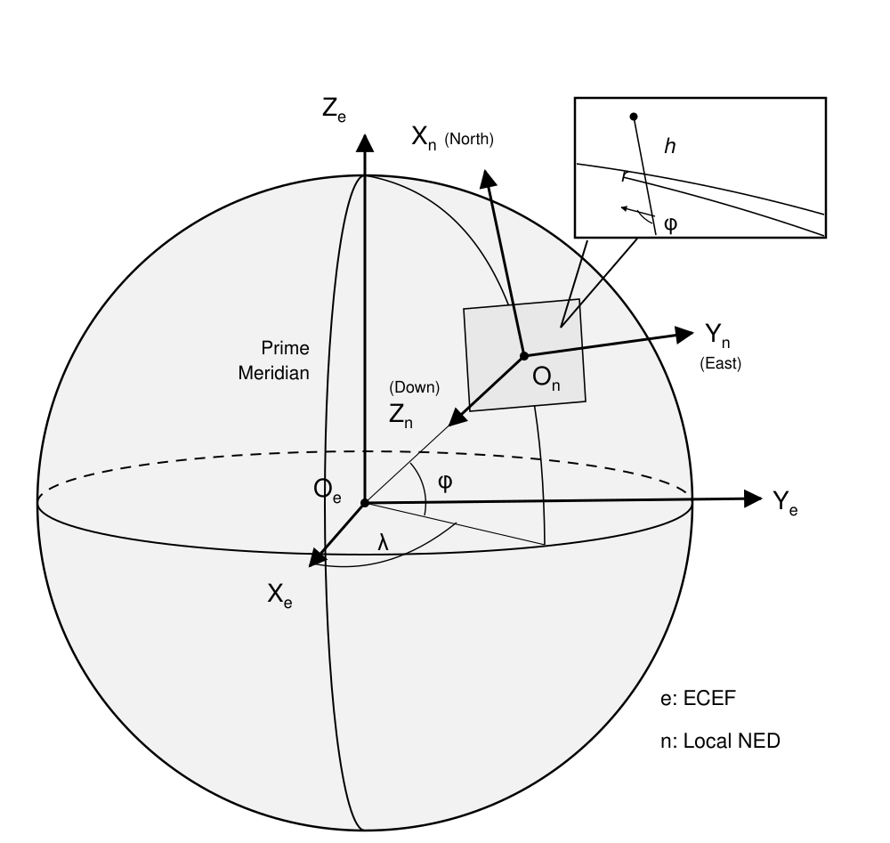

**그림 1 ECEF 좌표계와 Local NED 좌표계 정의**

#### 1.2.1.2. Geographic coordinates (Geodetic coordinates, LLA (longitude, latitude, altitude))

지구상의 3차원 구면좌표계를 말하며, 경도, 위도, 고도로 표현된다. 경도는 그린위치 천문대를 지나는 본초자오선(prime meridian)을 기준으로 0°~360°까지 표현하며, 위도는 적도를 기준으로 북위 0°~90°, 남위 0°~90°로 표현한다. 지구의 형상에 따라 위도는 달라질 수 있는데, 지구의 형상을 구라고 가정할 때와 정확한 계산을 위하여 타원형임을 반영할 때에 따라서 위도의 계산 방법이 달라지게 된다. 따라서, LLA는 INU에서 얻어진 경도는 같으나 지구 타원체의 효과 때문에 위도와 고도 결과가 다를 수 있다. 하기 그림은 지구의 형상을 나타내는 타원체 parameter와 경도/위도를 표현하고 있다. 지구의 형상을 대표로 하는 타원체는 항법장치에서 1990년때까지 Bessel 좌표계를 많이 사용하였으나 최근 GPS의 발달로 WGS84 좌표계가 많이 사용된다. 표 1에서 WGS84 타원체 파라메터를 보여 준다.

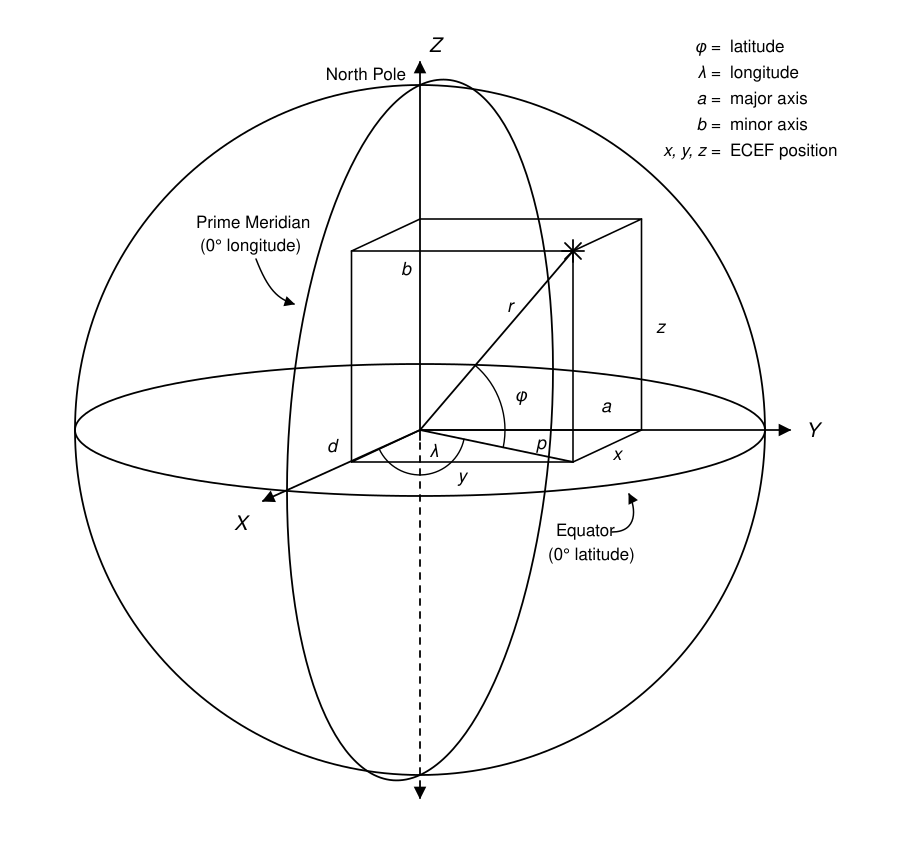

**그림 2 Longitude-latitude-altitude 정의**

---

<!-- p.5 -->

### 표 1. WGS 84 타원체 파라메터

| WGS 84 타원체 Parameters | |
| --- | --- |
| 장반경 (a) | 6378137.0 m |
| 단반경 (b) | 6356752.3 m |
| 1/f (inverse flattening) | 298.257223563 |

LLA좌표축에서 Position Vector Pg표현은 하기와 같다.

$$
\vec{P_g} = \begin{pmatrix} \lambda \\ \varphi \\ h \end{pmatrix}
$$

#### 1.2.1.3. Local Space Rectangular(LSR: ENU, NED 또는 Flat Earth Referenced 좌표계)

앞의 두 좌표계(ECEF, LLA)가 Global한 전 지구적 좌표계 라면, LSR 좌표계는 local 좌표계를 말하며, **Navigation 또는 Ground 좌표계(지면 좌표계) 또는 Local inertial 좌표계**라고 한다. 즉, **지구 표면상의 한 지점을 고정시키고,** 고정점을 원점으로 하여 목표물의 위치를 표현하는 방식이다. 하기 그림과 같이 지구 표면에 tangential한 평면을 북쪽과 동쪽을 향하도록 축을 정의하여 목표물의 위치를 표현한다. NED좌표계는 X축은 북쪽, Y축은 동쪽, Z축은 원점에서 지구 중심방향(중력방향)으로 정의되며, ENU 좌표계는 X축은 동쪽, Y축은 북쪽, Z축은 원점에서 지구와 멀어지는 방향으로 정의가 된다. **LSR은 좌표 기준축이 북쪽, 동쪽으로 고정되어 있기에 좌표축 회전이 없다.** 본 기술 레포트에서는 비행체에서의 좌표계 변환을 다루기에 상공에서 땅을 바라볼 때가 중요하며, 이때의 표현에 적합한 NED를 기준으로 기술한다.

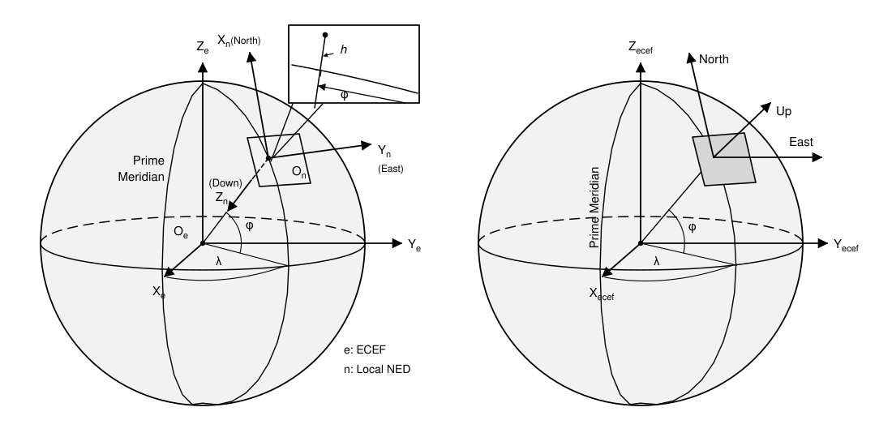

**그림 3 North-East-Down과 East-North-Up의 LSR 좌표계 정의**

---

<!-- p.6 -->

원점 : 지구 Surface에 고정된 Point, On로 표시.
X축 : 지구타원의 북쪽을 가르키는 방향(Geodetic North), Xn로 표시.
Y축 : 지구타원의 동쪽을 가르키는 방향(Geodetic East), Yn로 표시.
Z축 : 지구타원의 Normal방향으로 아래쪽, Zn로 표시.

Locall NED좌표계에서 Position Vector 표현 Pn, Velocity Vector 표현은 Vn, Acceleration Vector표현은 an으로 하기와 같이 표현한다.

$$
\vec{P_n} = \begin{pmatrix} x_n \\ y_n \\ z_n \end{pmatrix}
\qquad
\vec{V_n} = \begin{pmatrix} u_n \\ v_n \\ w_n \end{pmatrix}
\qquad
\vec{a_n} = \begin{pmatrix} a_{x,n} \\ a_{y,n} \\ a_{z,n} \end{pmatrix}
$$

#### 1.2.1.4 Vehicle-Carried North-East-Down Coordinate (VC-NED)

지구상에서 움직이는 platform을 원점으로 정의하여, 목표물의 위치를 표현하는 방식으로 좌표계의 원점은 Platform의 무게중심이며, X, Y, Z축은 Local NED와 동일하다. VC-NED는 좌표계가 가속운동을 하는 비관성 좌표계이지만, INU(Inertial Navigation Unit)를 통해 보상하면, 관성좌표계로 사용가능하기에 본 기술 레포트에서는 관성좌표계로 분류한다. 하기 그림은 Local NED와 Vehicle-Carried NED 그리고 Body 좌표계 간의 관계를 보인다. 보이는 바와 같이 **Local NED와 Vehicle-Carried NED의 좌표축은 원점(원점 Translation/원점 기동 존재)만 다를 뿐 X, Y, Z축이 동일**하다. 또한 VC NED도 **LSR은 좌표계(Flat earth 좌표계)로써 기준축이 북쪽, 동쪽으로 고정되어 있기에 좌표축 회전이 없다.** 전투기 탑재 사격통제 레이더 시스템에서는 LSR 좌표계로 Vehicle-Carrioed NED 좌표계를 기본으로 하며, **INU(Inertial Navigation Unit)를 통해 VC-NED를 관성좌표계로 보상(Local Inertial 좌표계로 유지,** 추정항법인 dead reckoning으로 자신의 위치를 추정함**)하여 사용**한다.

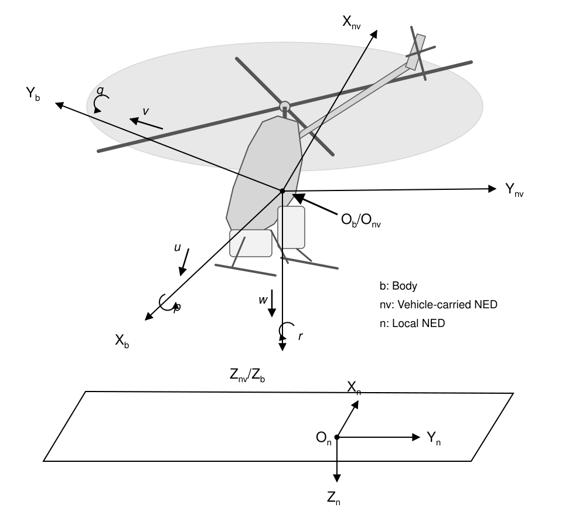

**그림 4 Local NED, Vehicle-carried NED, Body 좌표계 정의**

---

<!-- p.7 -->

원점 : Platform의 무게중심, Onv로 표시.

X축 : 지구타원의 북쪽을 가르키는 방향(Geodetic North), Xnv로 표시.

Y축 : 지구타원의 동쪽을 가르키는 방향(Geodetic East), Ynv로 표시.

Z축 : 지구타원의 Normal방향으로 아래쪽, Znv로 표시.

Vehicle-carried NED좌표계에서 Position Vector 표현 Pnv, Velocity Vector 표현은 Vnv, Acceleration Vector표현은 anv으로 하기와 같이 표현한다.

$$
\overrightarrow{P_l} = \overrightarrow{P_{nv}} = \begin{pmatrix} x_{nv} \\ Y_{nv} \\ Z_{nv} \end{pmatrix}
\qquad
\overrightarrow{V_l} = \overrightarrow{V_{nv}} = \begin{pmatrix} u_{nv} \\ v_{nv} \\ w_{nv} \end{pmatrix}
\qquad
\overrightarrow{a_l} = \overrightarrow{a_n} = \begin{pmatrix} a_{x,nv} \\ a_{y,nv} \\ a_{z,nv} \end{pmatrix}
$$

#### 1.2.1.5 INU 좌표계 (Inertial Navigation Unit 좌표계)

INU는 전투기가 Local Inertial 좌표계(지상에 고정된 NED좌표계, Flat Earth 좌표계)를 유지할 수 있도록 하는 장비이며, 이를 위해 **INU 좌표계는 결국 VC-NED와 동일 좌표계가 되어야 한다**. 그러나, INU는 전투기의 중력중심(무게중심)에 위치하지 않고 Equipment bay에 존재할 수 있기에, VC-NED로의 위치이동/회전변환이 필요하다.

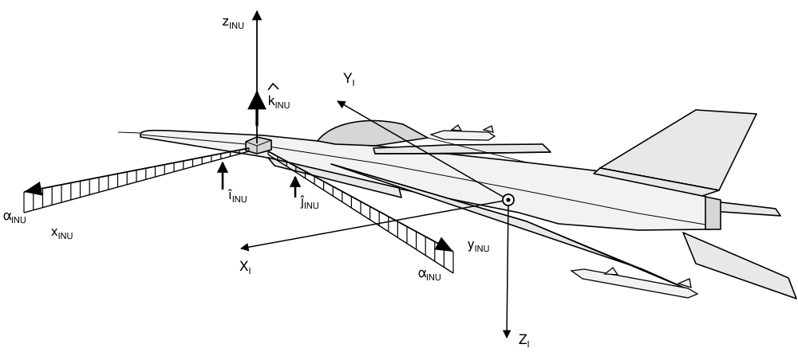

**그림 5 F-16 INU 좌표계**

위의 그림과 같이 F-16 INU 좌표계는 중력방향의 반대로 ZINU 축, 진북방향에서 Wander angle (αINU)각을 ZINU 축 회전한 XINU 축, ZINU 축에서 XINU 축으로 오른손법칙에 의해 만들어지는 YINU 축으로 구성된다. 또한 F-15 INU 좌표계의 경우에는 왼손법칙으로 North, East, Up의 좌표계를 갖는다.

F-16 INU 좌표계의 예 (전투기마다 다를 수 있음)

원점 : INU의 무게중심, Oinu로 표시.

X축 : 진북방향에서 Wander angle (αinu)각을 Zinu 축 회전한 방향, Xinu로 표시.

Y축 : INU X축과 Y축의 Cross-Product 방향(오른손법칙), Yinu로 표시.

Z축 : Platform 중력방향의 반대방향, Zinu로 표시.

INU 좌표계에서 Position Vector 표현 Pinu, Velocity Vector 표현은 Vinu, Acceleration Vector표현은 ainu으로 하기와 같이 표현한다.

---

<!-- p.8 -->

$$
\overrightarrow{P_{inu}} = \begin{pmatrix} x_{inu} \\ y_{inu} \\ z_{inu} \end{pmatrix}
\qquad
\overrightarrow{V_{inu}} = \begin{pmatrix} u_{inu} \\ v_{inu} \\ w_{inu} \end{pmatrix}
\qquad
\overrightarrow{a_{inu}} = \begin{pmatrix} a_{x,inu} \\ a_{y,inu} \\ a_{z,inu} \end{pmatrix}
$$

## 1.2.2 비관성 좌표계 (움직이는 Platform 좌표계, 움직이는 Local좌표계)

움직이는 Platform 좌표계이면서, 공력자료(INU 등)를 통해 Platform 움직임에 대한 표적의 움직임 보상(표적의 움직임만 얻어내기 위해 사용)이 없는 좌표계는 관성좌표계가 아닌 비관성 좌표계이다.

### 1.2.2.1 Body 좌표계 (Body Fixed 좌표계)

전투기의 무게중심(중력중심)을 원점으로 하는 Body-fixed 시스템은 Platform 즉, 전투기의 무게중심이 Body-fixed 좌표계의 원점이 되며, 전투기의 nose 방향이 X축, 오른쪽이 Y축, 전투기 중심으로부터 연직 하향이 Z축으로 회전하는 좌표축으로 정의된다. Body-fixed 시스템은 INU(항법장치)에서 제공하는 platform 정보를 이용하기에 항법장치(INU)과 전투기의 위치관계 정립이 필요하다. 전투기의 회전(Euler angle : Roll(Xb축 회전), Pitch(Yb축 회전), Yaw(Zb축 회전, INU Tru-Heading 값))각은 VC-NED를 기준으로 차이각을 표현한다. 하기 그림에서 Roll, Pitch, Yaw 양의 회전 방향은 오른손 법칙을 따른다.

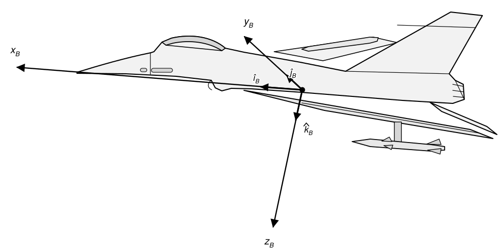

**그림 6 Body 좌표계**

원점 : Platform의 무게중심, Ob로 표시.  
X축 : Platform의 Nose 방향, Xb로 표시.  
Y축 : Platform의 오른쪽 방향, Yb로 표시.  
Z축 : Platform의 X축과 Y축의 Cross-Product 방향(오른손법칙), Zb로 표시.  
Body 좌표계에서 Position Vector 표현 Pb, Velocity Vector 표현은 Vb, Acceleration Vector표현은 ab 으로 하기와 같이 표현한다.

$$
\overrightarrow{P_b} = \begin{pmatrix} x_b \\ y_b \\ z_b \end{pmatrix}
\qquad
\overrightarrow{V_b} = \begin{pmatrix} u_b \\ v_b \\ w_b \end{pmatrix}
\qquad
\overrightarrow{a_b} = \begin{pmatrix} a_{x,b} \\ a_{y,b} \\ a_{z,b} \end{pmatrix}
$$

---

<!-- p.9 -->

#### 1.2.2.2 Space Stable 좌표계 (공대공 AAST, NAST에서 운용)

Body 좌표계와 동일하게 전투기의 무게중심(중력의 중심)을 원점으로 한다. 즉, 전투기의 무게중심이 Space stable 좌표계의 원점이 되며, 좌표계 기준으로 Elevation 각은 Horizontal(VC-NED의 Xnv, Ynv평면)에 기준으로 표현되고, Azimuth 각은 전투기 Heading 방향(Euler Yaw 회전방향) 기준으로 표현된다. 또한, Elevation/Azimuth 각은 전투기의 Euler Pitch와 roll 회전방향에는 영향을 받지 않는다. 따라서, Xs는 VC-NED의 Xnv, Ynv 평면상에 존재하면서 Yaw 방향을 나타내고, Zs는 전투기의 중력방향을 가르키며, Ys는 Zs와 Xs의 Cross Product 방향으로 VC-NED의 Xnv, Ynv 평면상에 존재 하면서 Zs 기준으로 Yaw 회전한 방향을 가르킨다.

Body 좌표계는 VC-NED 좌표계에서 Euler 회전을 Yaw, Pitch(Flight vector의 회전각과 AOA를 더한 값), Roll 순으로 수행하여 나타나지만, Space Stable 좌표계는 Yaw만을 회전한 좌표계로써, Yaw를 제외한 전투기 기동에 대해 Stable한 빔조향을 지원한다. 이로써, 안테나가 0도로 Tilt되어 있고, EL/AZ 0도 빔조향 시 빔조향 방향은 전투기의 Roll, Pitch와 상관없이 Flat earth와 전투기 heading 에 항상 평행하게 된다. **전투기 AESA 레이더의 AAST, NAST 빔운용 및 Display 좌표계 운용은 Space Stable 좌표계를 사용**한다.

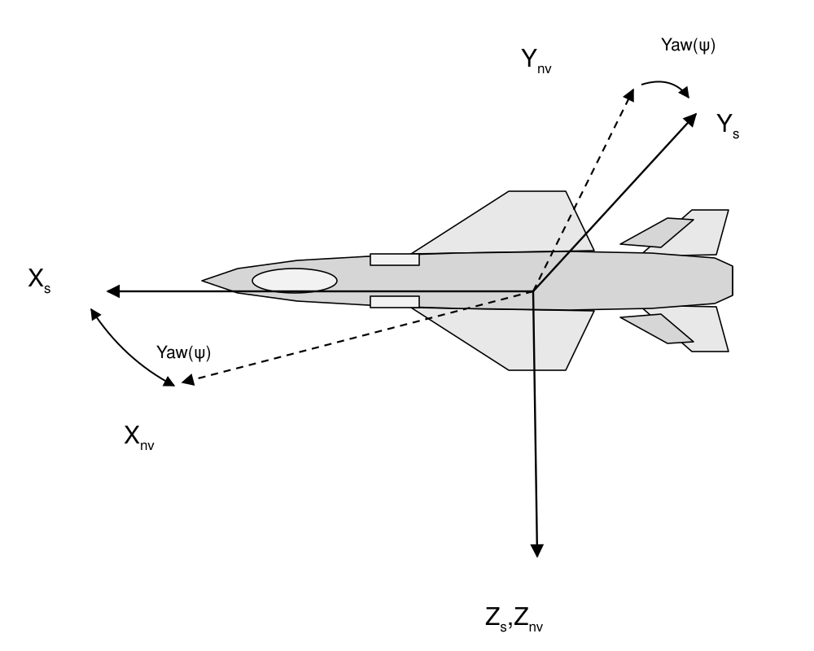

**그림 7 Space Stable 좌표계**

원점 : Platform의 무게중심(중력중심), Os로 표시.

X축 : VC-NED의 Xnv, Ynv 평면상에 존재하면서 Euler Yaw회전된 전투기 Heading 방향, Xs로 표시.

Y축 : Zs와 Xs의 Cross Product 방향(오른손법칙), Ys로 표시.

Z축 : 전투기의 중력방향, Zs로 표시.

Space Stable 좌표계에서 Position Vector 표현 Ps, Velocity Vector 표현은 Vs, Acceleration Vector 표현은 as으로 하기와 같이 표현한다.

$$
\vec{P_s} = \begin{pmatrix} x_s \\ y_s \\ z_s \end{pmatrix}
\qquad
\vec{V_s} = \begin{pmatrix} u_s \\ v_s \\ w_s \end{pmatrix}
\qquad
\vec{a_s} = \begin{pmatrix} a_{x,s} \\ a_{y,s} \\ a_{z,s} \end{pmatrix}
$$

---

<!-- p.10 -->

#### 1.2.2.3. Drift Stable 좌표계 (공대지 운용)

전투기는 외부공기흐름(바람 등)에 의해 영향을 받으면 Space Stable 좌표계의 Xs 방향(Pitch 값(Pitch방향의 flight Path각 + AOA 각)이 0도로 가정할 때, Xs는 전투기 Nose 방향임)으로 날아가지 않고, 비행방향(Flight Path 방향)이 바뀌게 된다. Drift Stable 좌표계는 Space Stable 좌표계와 거의 유사하나 외부공기흐름에 의해 Flight path 방향이 바뀌는 각도만큼 회전한 방향의 Xw 좌표축을 갖으며, 전투기 자세와 상관없이 Flat earth 좌표계 상에서 비행체가 실제 날아가는 방향에 대한 좌표계이다. 따라서, Drift Stable 좌표계에서 Elevation 각은 Space Stable 좌표계와 같이 Horizontal(VC-NED의 Xnv, Ynv평면)에 기준으로 표현되지만, Azimuth 각은 전투기 Heading 방향(Euler Yaw 회전방향)기준이 아닌 Velocity Vector의 Platform Azimuth 방향기준으로 표현된다. 또한, Elevation/Azimuth 각은 Space Stable 좌표계와 같이 전투기의 Euler Pitch와 roll 회전방향에는 영향을 받지 않는다.

Xw는 항상 외부공기흐름과 관련된 Xnv, Ynv 평면 상의 비행경로 벡터(Flight path vector) 방향으로 맞춰진다. Drift Stable 좌표계는 **Space Stable 좌표계에서 Side slip각(β)으로 Zs(=Zw) 기준 single 회전을 통해 만들어진다. 전투기에서 Side slip각(β)은 임무컴퓨터로부터 레이더에 전달되며, 공대지 운용모드의 빔운용 및 Display 좌표계 운용은 Drift Stable 좌표계를 사용**한다.

APG-67의 경우 Side slip각은 프로토콜 IMDC052-14의 "Drift Angle"을 통해 알려준다.

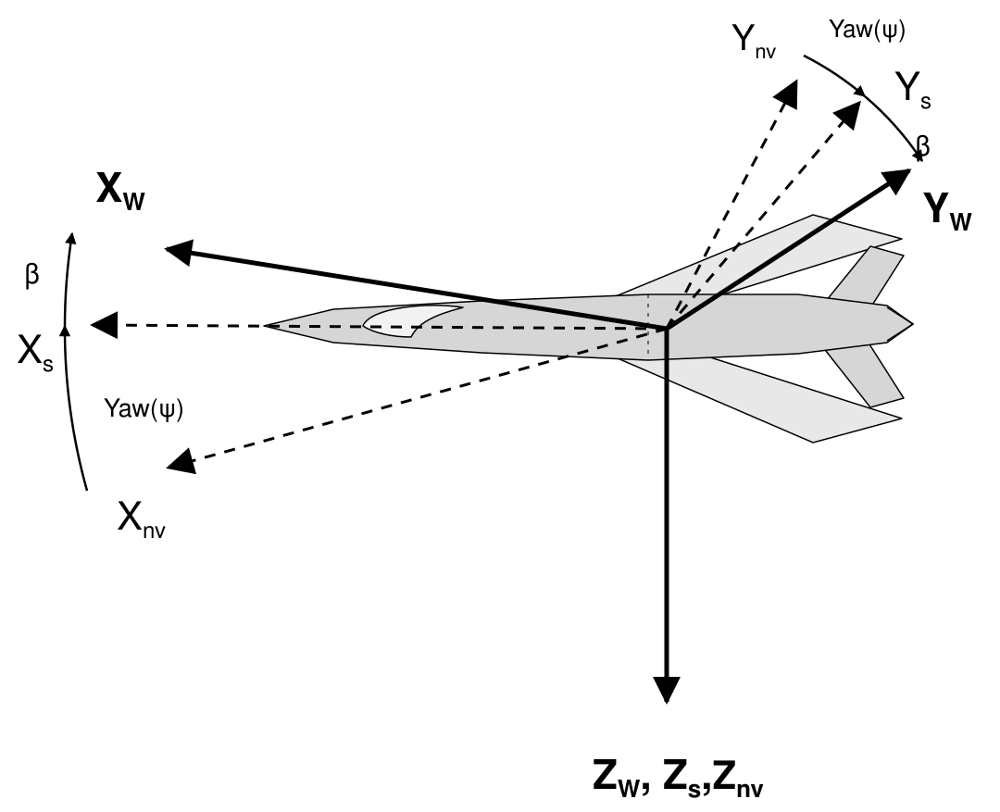

**그림 8 Drift Stable 좌표계**

원점 : Platform의 무게중심, Ow로 표시.

X축 : VC-NED의 Xnv, Ynv 평면상에 존재하면서 속도벡터 방향(Yaw Angle + Drift Angle) 방향, Xw로 표시.

Y축 : Zw와 Xw의 Cross Product 방향으로써, VC-NED의 Xnv, Ynv 평면상에 존재 하면서 Zs 기준으로 Yaw Angle 회전과 Drift Angle 회전한 Ys방향, Yw로 표시.

Z축 : Zw는 전투기의 중력방향, Zw로 표시.

Drift Stable 좌표계에서 Position Vector 표현 Pw, Velocity Vector 표현은 Vw , Acceleration Vector 표현은 aw으로 하기와 같이 표현한다.

---

<!-- p.11 -->

$$
\overrightarrow{\mathbf{P_w}} = \begin{pmatrix} \mathbf{x_w} \\ \mathbf{Y_w} \\ \mathbf{Z_w} \end{pmatrix}
\qquad
\overrightarrow{\mathbf{V_w}} = \begin{pmatrix} \mathbf{u_w} \\ \mathbf{v_w} \\ \mathbf{w_w} \end{pmatrix}
\qquad
\overrightarrow{\mathbf{a_w}} = \begin{pmatrix} \mathbf{a_{x,w}} \\ \mathbf{a_{y,w}} \\ \mathbf{a_{z,w}} \end{pmatrix}
$$

#### 1.2.2.4 안테나 좌표계

##### 1.2.2.4.1 안테나 좌표계에서 사용하는 직각좌표계

전투기의 platform에 탑재하는 레이더 시스템에서는 안테나를 기준으로 목표물의 위치가 측정된다. 안테나의 좌표체계는 안테나와 platform의 위치 차이에 따른 축의 정의와 offset된 거리에 의해 정의되므로, 앞서 정의된 body-fixed 좌표계를 기준으로 안테나 좌표 체계가 정의된다. 다중모드 능동배열 레이더 시험시제에서 안테나는 전투기에 하기 그림의 위치에 복사면이 Tilt 되지 않은 상태로 설치 될 예정이며, 이에 맞게 좌표 변환되어야 한다. 변환 시에는 X축 회전과 전투기 중심부로부터 안테나 위치까지의 offset 거리를 고려해야 한다.

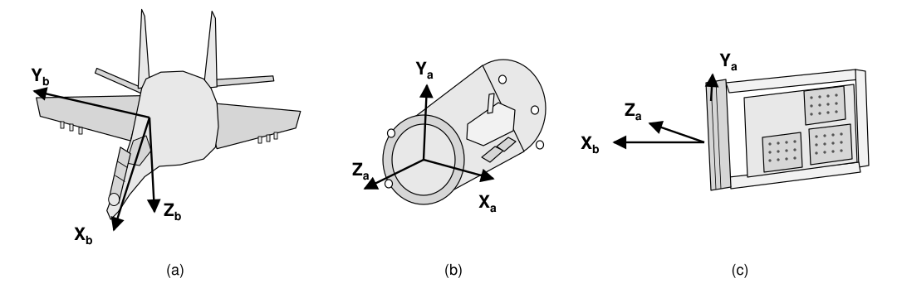

**그림 9 전투기 Body 좌표계와 AESA 안테나 좌표계**

원점 : 안테나의의 무게중심, Oa로 표시.

X축 : Y축과 Z축의 CrossProduct 방향(오른손법칙), Xa로 표시.

Y축 : 안테나의 상부방향, Ya로 표시.

Z축 : 안테나면의 normal 방향, Za로 표시.

안테나 좌표계에서 Position Vector 표현 Pb, Velocity Vector 표현은 Vb, Acceleration Vector표현은 ab으로 하기와 같이 표현한다.

$$
\mathbf{P_a} = \begin{pmatrix} \mathbf{x_a} \\ \mathbf{Y_a} \\ \mathbf{Z_a} \end{pmatrix}
\qquad
\mathbf{V_b} = \begin{pmatrix} \mathbf{u_a} \\ \mathbf{v_a} \\ \mathbf{w_a} \end{pmatrix}
\qquad
\mathbf{a_b} = \begin{pmatrix} \mathbf{a_{x,a}} \\ \mathbf{a_{y,a}} \\ \mathbf{a_{z,a}} \end{pmatrix}
$$

##### 1.2.2.4.2 안테나 좌표계에서 사용하는 3차원 구면좌표계

AESA레이더 안테나 패턴을 표현할 때 주로 사용되는 4가지 구면 좌표계에 대해 보인다.

---

<!-- p.12 -->

- **u - v 좌표계**

$$
u = k_x/k_0 \qquad v = k_y/k_0 \qquad w = k_z/k_0
$$

실제 전파가 전파하는 성분은 $u^2 + v^2 + w^2 = 1$의 관계식을 만족하므로 visible region은 $u^2 + v^2 \le 1$ 이 됨. w 가 양의 실수이면 전면 방향, w 가 음의 실수이면 후면 방향의 전파를 의미한다. u-v 좌표계를 사용하면 mono-pulse 처리시 Slope이 빔조향에 따라 바뀌지 않고 일정한 값을 갖기에 Bore-sight에서만 Full-Cut 측정 후 mono-pulse Slope을 하나로 관리할 수 있는 장점이 있다. 또한 빔조향 시 빔겹침에 의한 빔조향 문제를 해결할 수 있다.

- **θx - θy 좌표계 (Biconical 좌표계)**

Biconical 좌표계는 θxθy 좌표계로도 불리우는 좌표계로서, 안테나 패턴은 3차원 형상을 가지지만 실제 2차원 평면상에 안테나 패턴을 표시하기 위하여 θxθy 좌표계를 정의하고 사용한다. Biconical 좌표계는 안테나 **빔조향시 Phase shifter 값을 바로 적용할 수 있는 좌표계 값**으로서, 안테나장치 빔조향 시 유용하게 사용된다.

$$
u = \sin\,\theta_x\ ,\qquad v = \sin\,\theta_y\ ,\qquad w = \sin\,\theta_z
$$

$$
\theta_x = \sin^{-1}u\ ,\qquad \theta_y = \sin^{-1}v\ ,\qquad \theta_z = \sin^{-1}w
$$

θx 와 θy 는 점 (u, v, w)와 각각 y-z평면, x-z평면이 이루는 각의 의미한다. 이는 어떠한 표적이 그림12의 (b)와 같은 안테나 좌표계에서 표현되어질 때, θx는 sine space 상의 Azimuth 각을 θy는 sine space 상의 Elevation 각을 표현한다.

- **θ - φ 좌표계**

일반적인 구면 좌표계이며, 하기와 같은 관계식을 갖는다.

$$
u = \sin\theta\ \cos\phi, \qquad v = \sin\theta\ \sin\phi\ ,\qquad w = \cos\theta
$$

$$
\theta = \cos^{-1}w = \cos^{-1}\sqrt{(u^2 + v^2)}\ ,\qquad \phi = \tan^{-1}\frac{v}{u}
$$

- **Az-El 좌표계**

Az/El 좌표계는 Az방향 회전시킨 뒤 고각(El)방향으로 올리며 빔조향하는 탐색레이더에 사용되어진다. 3차원공간에서 탐색레이더의 동작을 가장 쉽게 표현 할 수 있는 방법으로서, **전투기 레이더에서 탐색영역 Search 시 운용하는 System 좌표계는 Az/El 좌표계로 동작**한다. 처리부는 Az-El 시스템좌표계로 스캔영역의 스캔좌표를 생성하고, Biconical 좌표계로 변환하여 안테나장치를 빔 제어하는 방식으로 효율적인 제어를 수행해야 한다.

$$
u = \sin Az\ \cos El, \qquad v = \sin El\ ,\qquad w = \cos Az \cos El
$$

$$
El = \sin^{-1}v\ ,\qquad Az = \sin^{-1}\frac{v}{\sqrt{1-v^2}}
$$

---

<!-- p.13 -->

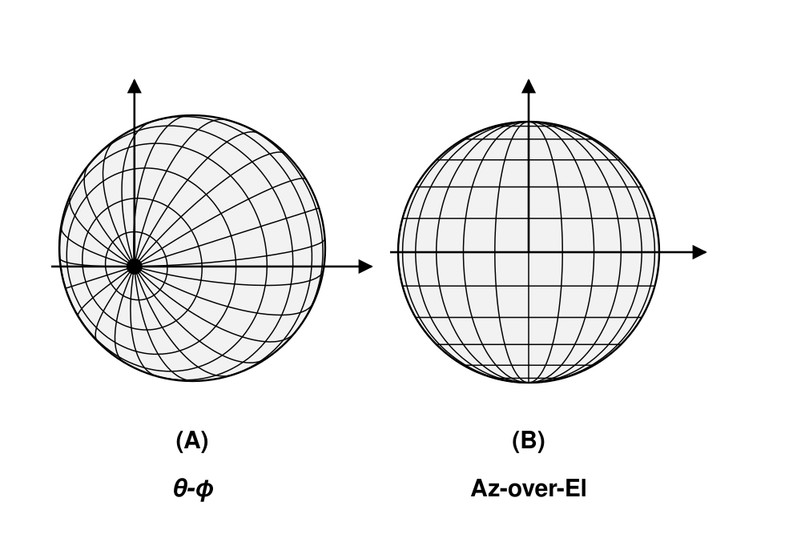

**그림 10 구면에서 좌표계에 따른 절단선**

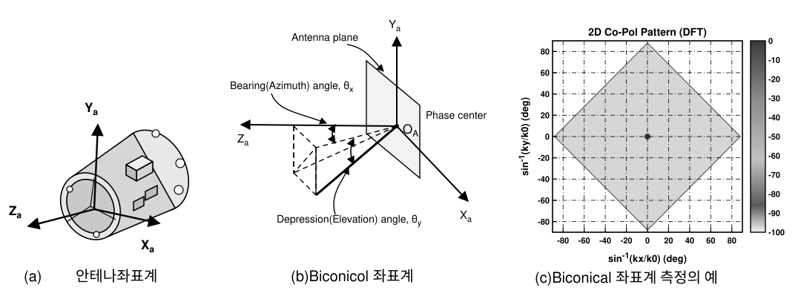

**그림 11 Biconical 좌표계와 측정의 예**

전자장론에서 표현 되어지는 Directional cosine은 하기와 같이 표현 가능하다.

$$
u = k_x/k_0 \qquad v = k_y/k_0 \qquad w = k_z/k_0
$$

(실제 전파가 전파하는 성분은 $u^2 + v^2 + w^2 = 1$의 관계식을 만족하므로 visible region은 $u^2 + v^2 \leq 1$ 이 됨.)

여기서, $u = \sin\ \theta_x$ , $\nu = \sin\ \theta_y$ , $w = \sin\ \theta_z$ 로 정의 될 수 있다.

$$
\theta_x = \sin^{-1} u \quad , \quad \theta_y = \sin^{-1} v \quad , \quad \theta_z = \sin^{-1} w
$$

위의 수식은 안테나 좌표계에서 표현 되어지는 값으로 표현될 수 있으며, 이는 하기와 같다.

$$
\mathbf{P_a} \; = \; \begin{bmatrix} \mathbf{x_a} \\ \mathbf{y_a} \\ \mathbf{z_a} \end{bmatrix} = \begin{bmatrix} \mathbf{R_a \sin \theta_x} \\ \mathbf{R_a \sin \theta_y} \\ \mathbf{\sqrt{R_a^2 - y_a^2 - x_a^2}} \end{bmatrix}
\qquad\qquad
\mathbf{P_\theta} \; = \; \begin{bmatrix} \mathbf{R_a} \\ \mathbf{\theta_x} \\ \mathbf{\theta_y} \end{bmatrix} = \text{Biconical 위치 값}
$$

$$
\mathbf{R_a} \; = \; \sqrt{\mathbf{x_a^2 \; + \; y_a^2 \; + \; z_a^2}}
$$

$$
\mathbf{u = \frac{x_a}{R_a} = \sin\ \theta_x} \; , \qquad \mathbf{\nu = \frac{y_a}{R_a} = \sin\ \theta_y} \; , \qquad \mathbf{w = \sin\ \theta_z}
$$

---

<!-- p.14 -->

## 1.3. 좌표계 변환

전투기 레이더에 사용되어지는 좌표계 변환에 대해 기술한다.

### 1.3.1. Biconical 좌표계 ↔ Antenna 좌표계

Biconical 좌표계를 통해 얻어지는 값은 Range값(**Ra**)과 Monipulse를 통해 얻은 Azimuth각 (**θx**)과 Elevation각 (**θy**) 이다. 따라서 이를 통해 하기 수식을 통해 좌표계를 변환할 수 있다.

#### 1.3.1.1. Biconical($\vec{P_\theta}$) → Antenna($\vec{P_a}$)

Biconical 좌표계를 통해 얻은 $R_a, \theta_x, \theta_y$를 통해 우선 $x_a$와 $y_a$를 구한 뒤 $R_a, x_a, y_a$를 통해 $z_a$를 얻어낸다.

$$
\vec{P_a} \;=\;
\begin{bmatrix} x_a \\ y_a \\ z_a \end{bmatrix}
\;=\;
\begin{bmatrix}
R_a \sin \theta_x \\
R_a \sin \theta_y \\
\sqrt{R_a^2 - y_a^2 - x_a^2}
\end{bmatrix}
$$

$$
R_a \;=\; \sqrt{x_a^2 + y_a^2 + z_a^2}
$$

$$
u = \frac{x_a}{R_a} = \sin \theta_x \;,\qquad
v = \frac{y_a}{R_a} = \sin \theta_y \;,\qquad
w = \sin \theta_z
$$

#### 1.3.1.2. Antenna($\vec{P_a}$) → Biconical($\vec{P_\theta}$)

$x_a$와 $y_a$를 통해 $R_a, \theta_x, \theta_y$ 를 얻어낸다

$$
\vec{P_\theta} \;=\;
\begin{bmatrix} R_a \\ \theta_x \\ \theta_y \end{bmatrix}
= \text{Biconical 위치 값}
$$

$$
\vec{P_\theta} \;=\;
\begin{bmatrix} R_a \\ \theta_x \\ \theta_y \end{bmatrix}
\;=\;
\begin{bmatrix}
\sqrt{x_a^2 + y_a^2 + z_a^2} \\
\sin^{-1} \dfrac{x_a}{R_a} \\
\sin^{-1} \dfrac{y_a}{R_a}
\end{bmatrix}
$$

### 1.3.2. Antenna 좌표계 ↔ Body 좌표계

안테나 좌표계는 platform인 전투기 위에 탑재된 안테나의 설치 조건에 따라서 Body 좌표체계에서 정의되는데, 이와 같은 안테나 설치 조건에 따른 축의 정의는 앞에서 설명하였다. 아래 식과 같은 변환식을 사용하여 안테나 좌표체계와 Body 좌표체계와의 변환과정이 이루어진다.

#### 1.3.2.1. Antenna($\vec{P_a}$) → Body($\vec{P_b}$)

$$
\vec{P_b} =
\begin{bmatrix} x_b \\ y_b \\ z_b \end{bmatrix}_{body}
\;=\;
R_{body\_trans/body\_trans\_tilt} \;\; R_{body\_trans\_tilt/antenna}
\begin{bmatrix} x_a \\ y_a \\ z_a \end{bmatrix}_{antenna}
\;+\;
\begin{bmatrix} x_{b,o} \\ y_{b,o} \\ z_{b,o} \end{bmatrix}_{body\_offset}
$$

---

<!-- p.15 -->

$$
R_{body\_trans\_tilt/antenna} =
\begin{bmatrix}
\cos 90° & 0 & \sin 90° \\
0 & 1 & 0 \\
-\sin 90° & 0 & \cos 90°
\end{bmatrix}
\begin{bmatrix}
\cos 90° & \sin 90° & 0 \\
-\sin 90° & \cos 90° & 0 \\
0 & 0 & 1
\end{bmatrix}
=
\begin{bmatrix}
0 & 0 & 1 \\
-1 & 0 & 0 \\
0 & -1 & 0
\end{bmatrix}
$$

$$
R_{body\_trans/body\_trans\_tilt} =
\begin{bmatrix}
\cos\phi_{tilt} & 0 & \sin\phi_{tilt}0 \\
0 & 1 & 0 \\
-\sin\phi_{tilt} & 0 & \cos\phi_{tilt}
\end{bmatrix}
$$

여기서,

$\begin{bmatrix} x_{b,o} \\ y_{b,o} \\ z_{b,o} \end{bmatrix}_{body\_offset}$ = Body 좌표계 원점에서 Antenna 좌표계 원점까지 Translation 하기위한 Vector

$\begin{bmatrix} x_{a} \\ y_{a} \\ z_{a} \end{bmatrix}$ = 안테나 좌표계에서 표현되는 임의의 위치 Vector

$\overrightarrow{P_b}$ : Body 좌표계에서 표현되는 위치 Vector

Rbody_trans_tilt/antenna : Body좌표계 좌표축으로 Antenna좌표계 좌표축 방향을 맞추기 위해 회전변환 한 것으로서, 안테나 Tilt된 상태까지 회전변환 한 것이다.

Rbody_trans/body_trans_tilt : Body좌표계 좌표축으로 Antenna좌표계 좌표축 방향을 맞추기 위해 안테나 tilt된 만큼 회전변환하여 Body좌표계 좌표축 방향을 맞추기 위한 회전변환

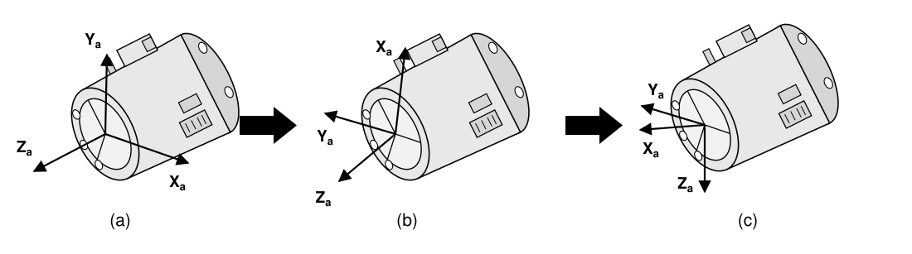

**그림 12 Rbody_trans_tilt/antenna**

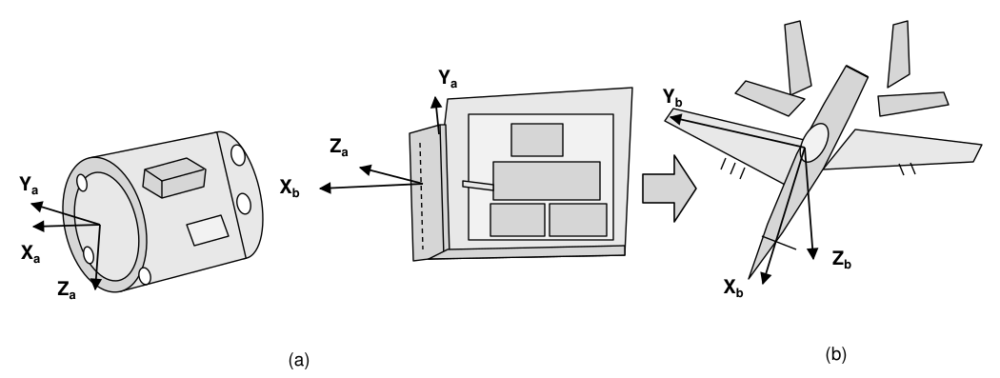

**그림 13 Rbody_trans/body_trans_tilt과 Offset 이동**

---

<!-- p.16 -->

#### 1.3.2.2 Body($\overrightarrow{P_b}$) → Antenna($\overrightarrow{P_a}$)

$$
R^{-1}_{body/body\_tilt\_trans} R^{-1}_{body/body\_tilt\_trans}
\begin{bmatrix} x_b - x_{b,o} \\ y_b - y_{b,o} \\ z_b - z_{b,o} \end{bmatrix}_{body\_trans}
= \begin{bmatrix} x_a \\ y_a \\ z_a \end{bmatrix}_{antenna}
= \overrightarrow{P_a}
$$

$$
\overrightarrow{P_a} = \begin{bmatrix} x_a \\ y_a \\ z_a \end{bmatrix}_{antenna}
= R^{T}_{body/body\_tilt\_trans} R^{T}_{body/body\_tilt\_trans}
\begin{bmatrix} x_b - x_{b,o} \\ y_b - y_{b,o} \\ z_b - z_{b,o} \end{bmatrix}_{body\_trans}
$$

### 1.3.3 Body 좌표계 ↔ INU 좌표계 (항법장치 좌표계, Local Inertial 좌표계, Flat earth 좌표계)

Body 좌표계와 INU 좌표계와의 관계는 INU(항법장치) 정보를 이용하여 변환한다. 즉, Body 좌표계에서의 전투기 Atitude(Yaw, Pitch, roll)정보는 INU (Local Inertial or 지면 or Flat earth 좌표계)를 기준으로 정의된다.

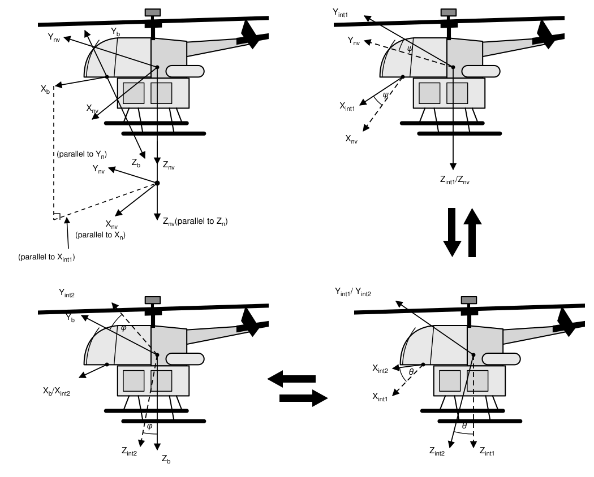

**그림 14 Euler Angle Rotation Sequence 통한 Local NED에서 Body좌표계로의 변환**

Body 좌표계로 부터 INU 좌표계로의 변환을 통해 Local Inertial 좌표계로 바로 변환하려면, Body 좌표계의 원점인 Platform 무게중심에 INU를 설치해야만 한다. Body 좌표계의 중력 중심에 항법장치가 설치되어 있으면, 원점 변화가 없기 때문에 Translation 및 회전을 고려하지 않고, Yaw, Pitch, Roll 값을 그대로 적용할 수 있다.

#### 1.3.3.1 INU ($\overrightarrow{P_{Inu}}$) 좌표계 → Body($\overrightarrow{P_b}$) 좌표계

회전변환은 위 그림의 파랑색 화살표 순서대로 Z-Y-X 좌표축 순(3-2-1순, 역순)으로 Rotation Sequence를 맞춰서 진행해야만 한다. 보여지는 3개의 Euler Angle은 Yaw (또는 Heading), Pitch,

---

<!-- p.17 -->

Roll Angle로 정의되며, INU(항법장치)으로 부터 얻어진다. 전투기에서 Target의 위치를 에러없이 정확히 식별하기 위해서는 INU시스템으로부터 Yaw, Pitch, Roll 정보를 빠르게 받아서(빠른 주기로 데이터를 전송받아서) Ownship의 자세를 고려한 빔조향을 정확히 해주어야 한다. 하지만 INU로부터 너무 빠르게 받으면 데이터 처리량이 많아지고, 느리게 받으면 Target 위치 에러가 늘어나기에 이에 대한 Trade-off를 감안하여 설계해야 한다. INU 정보 업데이트 주기는 1주기(INU와 통신하여 Yaw, Pitch, Roll정보를 받은 후 위치 Update 하는 주기) 내에 전투기의 움직임이 무시될 수 있는 시간으로 잡아서 위치 에러를 줄이면서, 데이터 처리량을 최소화 시킬 수 있도록 한다.

YAW, PITCH, ROLL 회전변환은 하기와 같다.

$$
\textbf{YAW Rotation Transform(Z축 기준)} = \mathbf{R}_{int1/nv} =
\begin{bmatrix}
\cos\psi & \sin\psi & 0 \\
-\sin\psi & \cos\psi & 0 \\
0 & 0 & 1
\end{bmatrix}
$$

$$
\textbf{PITCH Rotation Transform(Y축 기준)} = \mathbf{R}_{int2/int1} =
\begin{bmatrix}
\cos\theta & 0 & -\sin\theta \\
0 & 1 & 0 \\
\sin\theta & 0 & \cos\theta
\end{bmatrix}
$$

$$
\textbf{ROLL Rotation Transform(X축 기준)} = \mathbf{R}_{b/int2} =
\begin{bmatrix}
1 & 0 & 0 \\
0 & \cos\phi & \sin\phi \\
0 & -\sin\phi & \cos\phi
\end{bmatrix}
$$

수식에서 항법장치가 전투기 중력중심에 있다고 가정하면, Pinu는 PI(Inertial 좌표계)와 같다.

$$
\overrightarrow{P_I} = \overrightarrow{P_{inu}} =
\begin{bmatrix}
x_{inu} \\
y_{inu} \\
z_{inu}
\end{bmatrix}
$$

: Vehicle-carried NED의 position vector로 Inertial 좌표계 값임.

$$
\overrightarrow{P_b} =
\begin{bmatrix}
x_b \\
y_b \\
z_b
\end{bmatrix}_{body}
= R_{b/inu}
\begin{bmatrix}
x_{inu} \\
y_{inu} \\
z_{inu}
\end{bmatrix}_{INU}
\qquad 여기서, \; R_{b/inu} = R_{b/int2} \; R_{int2/int1} \; R_{int1/inu}
$$

$$
\overrightarrow{P_b} =
\begin{bmatrix}
x_b \\
y_b \\
z_b
\end{bmatrix}_{body}
= R_{b/int2} \; R_{int2/int1} \; R_{int1/inu}
\begin{bmatrix}
x_{inu} \\
y_{inu} \\
z_{inu}
\end{bmatrix}_{INU}
$$

$$
\overrightarrow{P_b} =
\begin{bmatrix}
x_b \\
y_b \\
z_b
\end{bmatrix}_{body}
=
\begin{bmatrix}
1 & 0 & 0 \\
0 & \cos\phi & \sin\phi \\
0 & -\sin\phi & \cos\phi
\end{bmatrix}
\begin{bmatrix}
\cos\theta & 0 & -\sin\theta \\
0 & 1 & 0 \\
\sin\theta & 0 & \cos\theta
\end{bmatrix}
\begin{bmatrix}
\cos\psi & \sin\psi & 0 \\
-\sin\psi & \cos\psi & 0 \\
0 & 0 & 1
\end{bmatrix}
\begin{bmatrix}
x_{inu} \\
y_{inu} \\
z_{inu}
\end{bmatrix}_{INU}
$$

$$
\overrightarrow{P_b} =
\begin{bmatrix}
x_b \\
y_b \\
z_b
\end{bmatrix}_{body}
$$

$$
=
\begin{bmatrix}
\cos\psi \; \cos\theta & \sin\psi \; \cos\theta & -\sin\theta \\
-\sin\psi \; \cos\phi + \cos\psi \; \sin\theta \; \sin\phi & \cos\psi \; \cos\phi + \sin\psi \; \sin\theta \; \sin\phi & \cos\theta \; \sin\phi \\
\sin\psi \; \sin\phi + \cos\psi \; \sin\theta \; \cos\phi & -\cos\psi \; \sin\phi + \sin\psi \; \sin\theta \; \cos\phi & \cos\theta \; \cos\phi
\end{bmatrix}
\begin{bmatrix}
x_{inu} \\
y_{inu} \\
z_{inu}
\end{bmatrix}_{INU}
$$

---

<!-- p.18 -->

#### 1.3.3.2 Body($\overrightarrow{P_b}$) 좌표계 → INU ($\overrightarrow{P_{inu}}$ 또는 $\overrightarrow{P_I}$) 좌표계

회전변환은 위 그림의 빨강색 화살표 순서대로 X-Y-Z 좌표축 순(1-2-3순, 순방향 순)으로 Rotation Sequence를 맞춰서 진행해야만 한다.

$$
P_{inu} = \begin{bmatrix} x_{inu} \\ y_{inu} \\ z_{inu} \end{bmatrix}_{INU} = R_{b/inu}^{-1} \begin{bmatrix} x_b \\ y_b \\ z_b \end{bmatrix}_{body}
$$

여기서,

$$
R_{b/inu}^{-1} = \left( R_{b/int2}\ R_{int2/int1}\ R_{int1/inu} \right)^{-1} = R_{int1/inu}^{-1} R_{int2/int1}^{-1} R_{b/int2}^{-1} = R_{int1/inu}^{T} R_{int2/int1}^{T} R_{b/int2}^{T} = R_{inu/int1}\ R_{int1/int2}\ R_{int2/b}
$$

$$
P_{inu} = \begin{bmatrix} x_{inu} \\ y_{inu} \\ z_{inu} \end{bmatrix}_{INU} =
\begin{bmatrix} \cos\psi & -\sin\psi & 0 \\ \sin\psi & \cos\psi & 0 \\ 0 & 0 & 1 \end{bmatrix}
\begin{bmatrix} \cos\theta & 0 & \sin\theta \\ 0 & 1 & 0 \\ -\sin\theta & 0 & \cos\theta \end{bmatrix}
\begin{bmatrix} 1 & 0 & 0 \\ 0 & \cos\phi & -\sin\phi \\ 0 & \sin\phi & \cos\phi \end{bmatrix}
\begin{bmatrix} x_b \\ y_b \\ z_b \end{bmatrix}_{body}
$$

$$
\overrightarrow{P_{inu}} = \begin{bmatrix} x_{inu} \\ y_{inu} \\ z_{inu} \end{bmatrix}_{INU} = \begin{bmatrix} x_I \\ y_I \\ z_I \end{bmatrix}_{Local\ Inertial}
$$

$$
= \begin{bmatrix}
\cos\psi\ \cos\theta & \sin\phi\ \sin\theta\ \cos\psi - \cos\phi\ \sin\psi & \cos\phi\ \sin\theta\ \cos\psi + \sin\phi\ \sin\psi \\
\cos\theta\ \sin\psi & \sin\phi\ \sin\theta\ \sin\psi + \cos\phi\cos\psi & \cos\phi\ \sin\theta\ \sin\psi - \sin\phi\ \cos\psi \\
-\sin\theta & \sin\phi\ \cos\theta & \cos\phi\ \cos\theta
\end{bmatrix}
\begin{bmatrix} x_b \\ Y_b \\ Z_b \end{bmatrix}_{Body}
$$

### 1.3.4 INU좌표계 → VC-NED 좌표계(Inertial 좌표계)

실제로 INU(항법장치)는 전투기 무게중심에 위치하기가 힘들고, VC-NED와 좌표가 정확히 일치시켜서 설치하기도 힘들기에 전투기 Platform에 따라 위치가 제각각 이다. 따라서, 실제 전투기 탑재하여 운용 시에는 INU를 VC-NED로 변환하여 Local Inertial 좌표계로 운용한다. 하기는 INU 좌표계에서 VC-NED좌표계로 변환하는 예 를보인다.

#### 1.3.4.1 F-16전투기, C-141 폭격기

F-16과 C-141폭격기의 INU좌표계는 하기의 그림과 같이 Xnv기준으로 +180도 회전하여 Zinu가 위를 향하고, Zinu 축 기준으로 Wander Angle(αinu) 회전되어 하기의 Transformation Matrix를 통해 VC-NED로 변환된다.

$$
\overrightarrow{P_{nv}} = R_{nv/inu} \overrightarrow{P_{inu}} + \overrightarrow{P_{nv/inu\_offset}}
$$

여기서,

$$
R_{nv/inu} = R_3(\alpha_{inu}) R_1(180°) =
\begin{bmatrix} \cos\alpha_{inu} & \sin\alpha_{inu} & 0 \\ -\sin\alpha_{inu} & \cos\alpha_{inu} & 0 \\ 0 & 0 & 1 \end{bmatrix}
\begin{bmatrix} 1 & 0 & 0 \\ 0 & -1 & 0 \\ 0 & 0 & -1 \end{bmatrix}
$$

---

<!-- p.19 -->

$$
\overrightarrow{P_{nv/inu\_offset}} =
\begin{bmatrix}
x_{nv,o} \\
y_{nv,o} \\
z_{nv,o}
\end{bmatrix}_{nv/inu\_offset}
$$

= INU 좌표계 원점에서 VC_NED 좌표계 원점까지 Translation 하기위한 Vector

따라서,

$$
\overrightarrow{P_{nv}} =
\begin{bmatrix}
x_{nv} \\
y_{nv} \\
z_{nv}
\end{bmatrix}_{VC-NED}
=
\begin{bmatrix}
\cos\alpha_{inu} & -\sin\alpha_{inu} & 0 \\
-\sin\alpha_{inu} & -\cos\alpha_{inu} & 0 \\
0 & 0 & -1
\end{bmatrix}
\begin{bmatrix}
x_{inu} \\
y_{inu} \\
z_{inu}
\end{bmatrix}_{inu}
+
\begin{bmatrix}
x_{nv,o} \\
y_{nv,o} \\
z_{nv,o}
\end{bmatrix}_{nv/inu\_offset}
$$

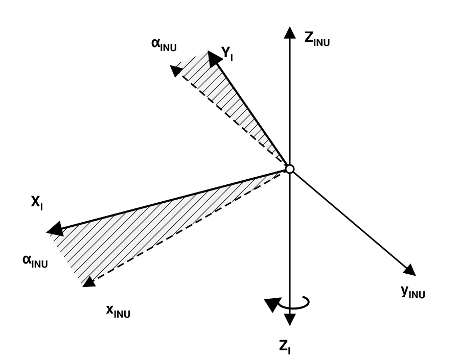

**그림 15 F-16, C141 INU 좌표계**

#### 1.3.4.2 F-15 전투기

F-15는 하기와 같은 INU 좌표계에서 VC-NED 좌표계로의 변환 Matrix를 갖는다.

$$
R_{nv/inu} =
\begin{bmatrix}
1 & 0 & 0 \\
0 & 1 & 0 \\
0 & 0 & -1
\end{bmatrix}
$$

INU좌표계가 Left-handed system(North, East, Up)을 취하기에 이를 right-handed system(North, East, Down)인 VC-NED로 바꿔주기만 하면 된다.

### 1.3.5 INU 좌표계 ↔ Space Stable 좌표계

하기 그림은 INU 좌표계와 Space Stable 좌표계, 그리고 Body 좌표계 간의 변환 관계를 보인다. INU 좌표계에서 Space Stable 좌표계로의 변환은 Yaw 회전만 수행하면 되며, Space Stable 좌표계에서 Body 좌표계로의 변환은 Pitch, Roll 순서로 추가 회전변환을 통해 수행한다. 반대로 Body좌표계에서 Space Stable 좌표계로의 변환은 Roll, Pitch 순서로 역회전을 걸어서 변환한다.

---

<!-- p.20 -->

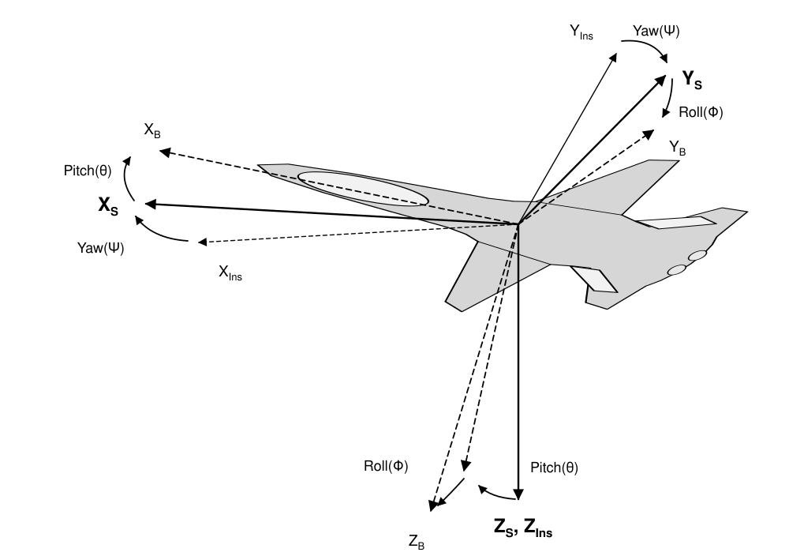

**그림 16 INU 좌표계와 Space Stable 좌표계 그리고 Body 좌표계간 관계**

#### 1.3.5.1 INU 좌표계($\overrightarrow{P_{inu}}$) 좌표계 → Space Stable($\vec{P_s}$) 좌표계

$$
\vec{P_s} = R_{s/inu}\overrightarrow{P_{inu}} \quad \text{여기서,} \quad R_{s/inu} =
\begin{bmatrix}
\cos\psi & \sin\psi & 0 \\
-\sin\psi & \cos\psi & 0 \\
0 & 0 & 1
\end{bmatrix}
$$

$$
\vec{P_s} =
\begin{bmatrix} x_s \\ y_s \\ z_s \end{bmatrix}_{Space\_Stable}
=
\begin{bmatrix}
\cos\psi & \sin\psi & 0 \\
-\sin\psi & \cos\psi & 0 \\
0 & 0 & 1
\end{bmatrix}
\begin{bmatrix} x_{inu} \\ y_{inu} \\ z_{inu} \end{bmatrix}_{INU}
$$

#### 1.3.5.2 Space Stable($\vec{P_s}$) 좌표계 → INU 좌표계($\overrightarrow{P_{inu}}$) 좌표계

$$
\overrightarrow{P_{inu}} = R_{s/inu}^{T}\vec{P_s} = R_{inu/s}\vec{P_s} \quad \text{여기서,} \quad R_{inu/s} =
\begin{bmatrix}
\cos\psi & -\sin\psi & 0 \\
\sin\psi & \cos\psi & 0 \\
0 & 0 & 1
\end{bmatrix}
$$

$$
\overrightarrow{P_{inu}} =
\begin{bmatrix} x_{inu} \\ y_{inu} \\ z_{inu} \end{bmatrix}_{INU}
=
\begin{bmatrix}
\cos\psi & -\sin\psi & 0 \\
\sin\psi & \cos\psi & 0 \\
0 & 0 & 1
\end{bmatrix}
\begin{bmatrix} x_s \\ y_s \\ z_s \end{bmatrix}_{Space\_Stable}
$$

### 1.3.6 Space Stable 직각 좌표계 ↔ Space Stable 구면 좌표계

하기 그림은 Space Stable 좌표계에서 구면좌표계를 보인다. Azimuth 각은 Zs 기준(오른손법칙 회전)으로 회전한 각을 표현하며, Elevation 각은 Azimuth 각을 회전한 상태에서 Ys 기준으로 회전(오른손 법칙 회전)한 각을 의미한다. 전투기 레이더의 빔조향은 Xs가 양의 값을 갖는 영역이기에, Xs가 양의 값을 갖는 경우에 대해서만 기술한다.

---

<!-- p.21 -->

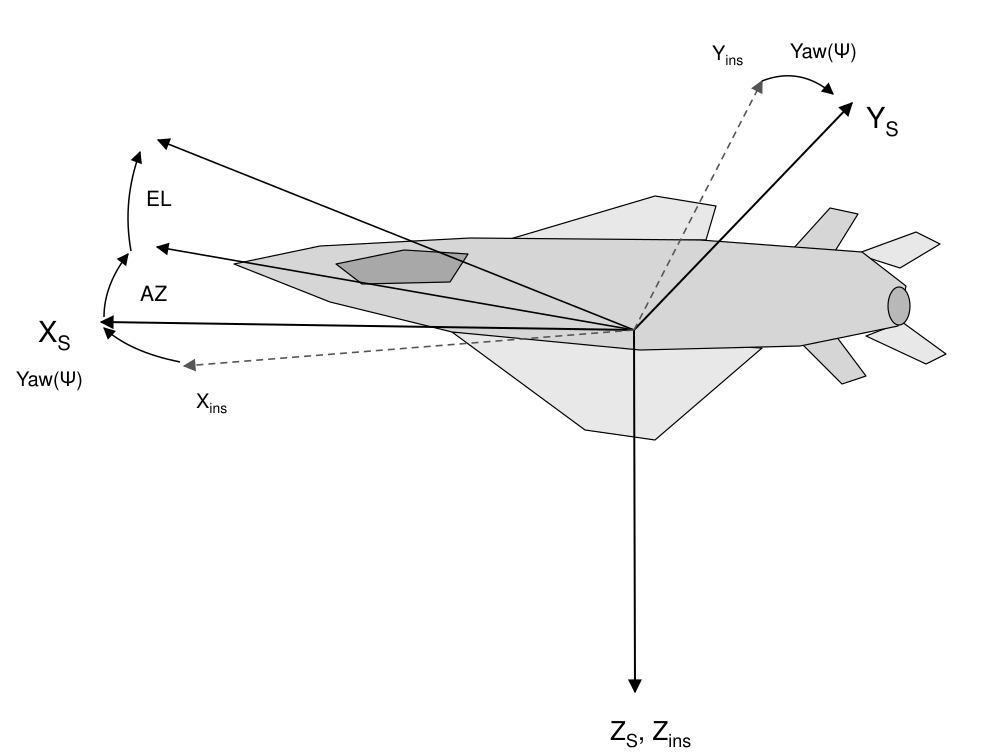

**그림 17 Space Stable 구면 좌표계**

#### 1.3.6.1 Space Stable 직각 좌표계 → Space Stable 구면 좌표계

$$
\overrightarrow{P_{S_{AZ\_EL}}} =
\begin{bmatrix} \text{Range} \\ \text{Az} \\ \text{EL} \end{bmatrix}_{\text{Space\_Stable}}
=
\begin{bmatrix}
\sqrt{x_{S_{cart}}^{2} + y_{S_{cart}}^{2} + z_{S_{cart}}^{2}} \\
\sin^{-1}\left(y_{S_{cart}} \Big/ \sqrt{x_{S_{cart}}^{2} + y_{S_{cart}}^{2}}\right) \\
-\sin^{-1}\left(z_{S_{cart}} \Big/ \sqrt{x_{S_{cart}}^{2} + y_{S_{cart}}^{2} + z_{S_{cart}}^{2}}\right)
\end{bmatrix}
$$

#### 1.3.6.2 Space Stable 구면 좌표계 → Space Stable 직각 좌표계

$$
\overrightarrow{P_{S_{cart}}} =
\begin{bmatrix} x_{S_{cart}} \\ y_{S_{cart}} \\ z_{S_{cart}} \end{bmatrix}_{\text{Cartesian}}
=
\begin{bmatrix}
\text{Range} * \cos \text{EL} * \cos \text{AZ} \\
\text{Range} * \cos \text{EL} * \sin \text{AZ} \\
-\text{Range} * \sin \text{EL}
\end{bmatrix}
$$

### 1.3.7 INU 좌표계 ↔ Drift Stable 좌표계

하기 그림은 INU 좌표계와 Drift Stable 좌표계, 그리고 Space Stable 좌표계 간의 변환 관계를 보인다. INU 좌표계에서 Drift Stable 좌표계로의 변환은 Yaw (INS로부터 제공받는 정보) 회전에 Side slip각(β) (임무컴퓨터로부터 제공받음)을 추가 회전시켜 수행한다. 이는 Yaw 회전만 수행한 Space Stable 좌표계에서 Side slip각(β)을 추가회전 시켜 얻는 결과와 같다.

---

<!-- p.22 -->

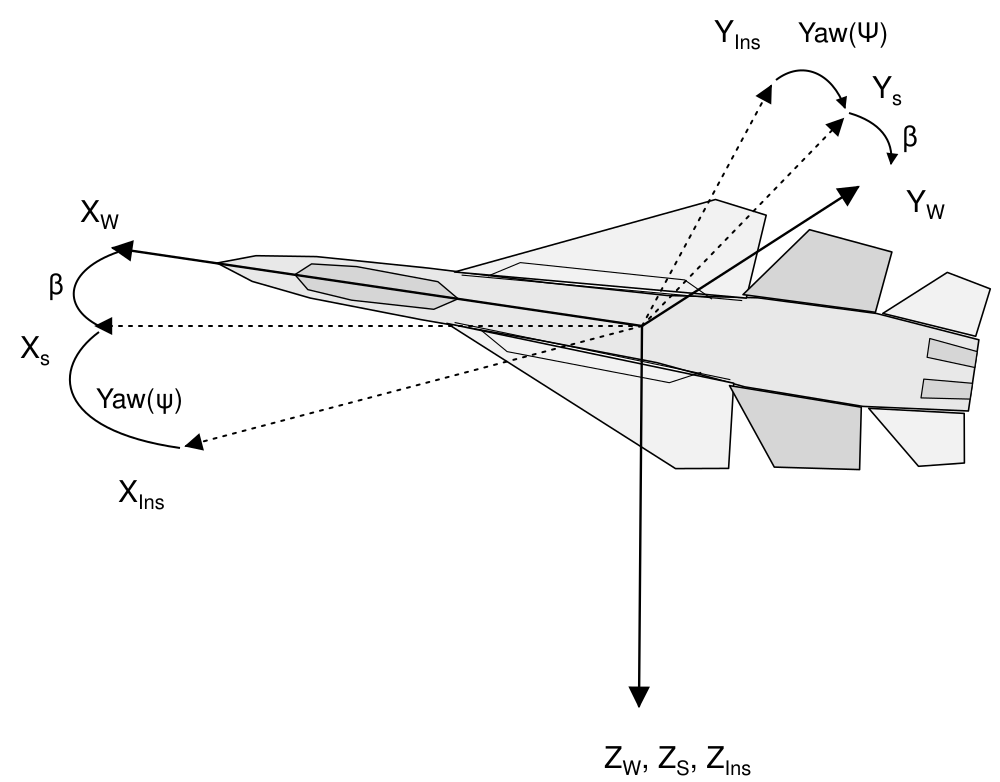

**그림 18 INU 좌표계와 Drift Stable 좌표계, 그리고 Space Stable 좌표계간 관계**

#### 1.3.7.1 INU 좌표계($\overrightarrow{P_{inu}}$) 좌표계 → Drift Stable ($\overrightarrow{P_{w}}$) 좌표계

$$
\overrightarrow{P_{w}} = R_{w/inu}\overrightarrow{P_{inu}} \quad \text{여기서,} \quad R_{w/s} =
\begin{bmatrix}
\cos\beta & \sin\beta & 0 \\
-\sin\beta & \cos\beta & 0 \\
0 & 0 & 1
\end{bmatrix}
\begin{bmatrix}
\cos\psi & \sin\psi & 0 \\
-\sin\psi & \cos\psi & 0 \\
0 & 0 & 1
\end{bmatrix}
$$

$$
\overrightarrow{P_{w}} =
\begin{bmatrix}
x_{w} \\
y_{w} \\
z_{w}
\end{bmatrix}_{Drift\_Stable}
=
\begin{bmatrix}
\cos(\psi + \beta) & \sin(\psi + \beta) & 0 \\
-\sin(\psi + \beta) & \cos(\psi + \beta) & 0 \\
0 & 0 & 1
\end{bmatrix}
\begin{bmatrix}
x_{inu} \\
y_{inu} \\
z_{inu}
\end{bmatrix}_{INU}
$$

#### 1.3.7.2 Drift Stable ($\overrightarrow{P_{w}}$) 좌표계 → INU 좌표계($\overrightarrow{P_{inu}}$) 좌표계

$$
\overrightarrow{P_{inu}} = R_{w/inu}^{T}\overrightarrow{P_{w}} = R_{inu/w}\overrightarrow{P_{w}} \quad \text{여기서,} \quad R_{inu/w} =
\begin{bmatrix}
\cos\psi & -\sin\psi & 0 \\
\sin\psi & \cos\psi & 0 \\
0 & 0 & 1
\end{bmatrix}
\begin{bmatrix}
\cos\beta & -\sin\beta & 0 \\
\sin\beta & \cos\beta & 0 \\
0 & 0 & 1
\end{bmatrix}
$$

$$
\overrightarrow{P_{inu}} =
\begin{bmatrix}
x_{inu} \\
y_{inu} \\
z_{inu}
\end{bmatrix}_{INU}
=
\begin{bmatrix}
\cos(\psi + \beta) & -\sin(\psi + \beta) & 0 \\
\sin(\psi + \beta) & \cos(\psi + \beta) & 0 \\
0 & 0 & 1
\end{bmatrix}
\begin{bmatrix}
x_{w} \\
y_{w} \\
z_{w}
\end{bmatrix}_{Drift\_Stable}
$$

### 1.3.8 Drift Stable 직각 좌표계 ↔ Drift Stable 구면 좌표계

Drift Stable 직각 좌표계에서 Stable 구면좌표계 변환은 일반적인 직각좌표계를 AZ-EL 좌표계로 변환하는 방법을 사용하며, 3.3.6절의 내용과 동일하기에 생략한다.

### 1.3.9 Vehicle-carried NED($\overrightarrow{P_{nv}}$) ↔ ECEF($\overrightarrow{P_{e}}$)

---

<!-- p.23 -->

하기 그림의 Local NED좌표계 상의 좌표원점이 되는 On(Xn,0 , Yn,0, Zn,0,지구Surface 상의 NED) 또는 Onv(Xnv,0 , Ynv,0, Znv,0, Vehicle-carried NED로써 Vehicle에서의 NED)은 ECEF 원점(지구의 무게중심점)으로부터 지구 Surface 상의 한 지점 또는 Platform의 무게중심을 나타낸다.

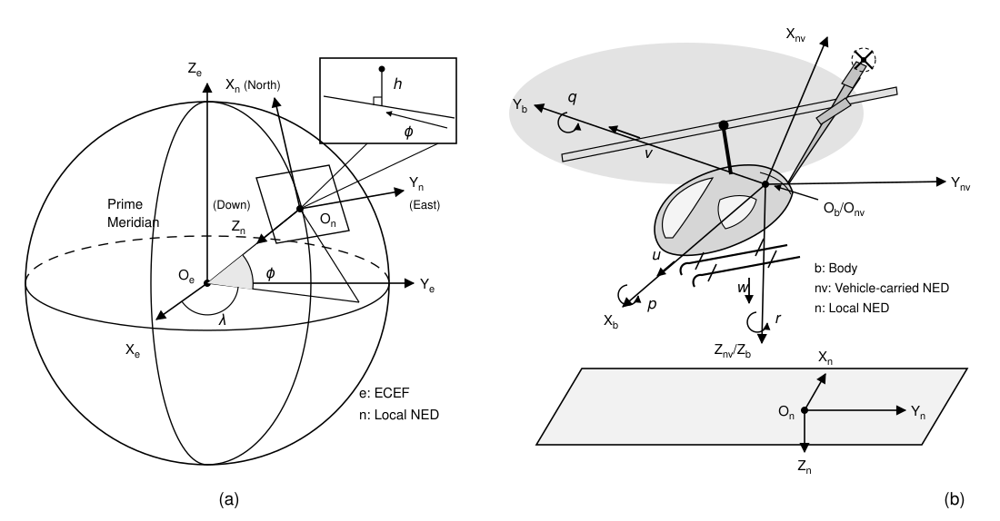

**그림 19 ECEF, Vehicle-carried NED, Body 좌표계 간의 비교**

상기 그림의 a)에서 보여주듯이, 지구 Surface 상의 어느 한 지점에 대해서 NED 좌표계를 정의하여, 목표물의 위치를 표현할 수 있으며, **상기 그림(b) 처럼 platform의 무게중심을 기준으로 표적의 위치를 표현할 수 있다. (Vehicle-carried NED는 Vehicle의 무게중심 기준으로 표적을 NED로 표현하기 위함**이다. 따라서 ECEF에서 표적과 VC_NED 좌표계의 원점(나의 전투기 무게중심)간의 상대적 거리를 통해 나를 기준으로 표적들을 NED로 표현할 때 사용한다.) Local NED 좌표계에서 ECEF로의 변환은 ECEF 상에서의 On(Xn,0, Yn,0, Zn,0) 또는 Onv(Xnv,0 , Ynv,0, Znv,0) 좌표가 INU(항법장치)를 통해 제공되어져야만 하며, INU에서 제공되는 LLA 좌표를 사용한다(VC-NED에서 ECEF를 표현하기 위해 LLA를 ECEF로 바꾸는 과정이 필요함).

여기서, Local NED는 Flat earth surface상의 NED좌표계와 Vehicle-carried NED를 포함한다.

#### 1.3.9.1. ECEF($\overrightarrow{P_e}$) → Vehicle-carried NED($\overrightarrow{P_{nv}}$)

ECEF를 Vehicle-carried NED로 변환하기 위해 ECEF 좌표축 원점을 Platform 무게중심까지 이동시킨 뒤 좌표축 회전변환을 통해 Vehicle-carried NED로 만든다.

$$
\mathbf{P}_{nv} = \mathbf{R}_{nv/e}\left(\mathbf{P}_{e} - \mathbf{P}_{e,ref}\right)
$$

여기서, $P_e$는 ECEF 좌표계에서 표현되는 위치벡터, **$P_{e,ref}$ 는 ECEF 좌표축 원점에서 Platform 무게중심까지의 위치 Vector**(ECEF 좌표계에서 platform 무게중심 위치벡터)로서 INU의 LLA정보로부터 얻어짐.

---

<!-- p.24 -->

$$
P_{e,ref} = \begin{bmatrix} X_{e,ref} \\ Y_{e,ref} \\ Z_{e,ref} \end{bmatrix} = O_{nv} = \begin{bmatrix} X_{nv,0} \\ Y_{nv,0} \\ Z_{nv,0} \end{bmatrix}_{Local\_NED\_Offset\ from\ ECEF}
$$

위 그림에서 보여지는 바와 같이 경도를 λ, 위도를 φ라 표시 할 때에, Rnv/e는 ECEF 좌표축 방향을 Vehicle-carried NED 좌표축 방향으로 회전 시키기 위해 ECEF의 Ze축을 기준으로 경도 λ 만큼 양의 방향으로 먼저 회전시킨 뒤, Ye축(ECEF Y축)을 기준으로 음의 방향으로 90회전시켜서 Xe가 Xn과 같이 북극을 향하게 만든 뒤 Ye축(ECEF Y축)을 기준으로 음의 방향으로 위도 φ 만큼 회전 시키는 회전변환이다.

$$
\begin{aligned}
R_{\frac{nv}{e}} &= \begin{bmatrix} \cos\varphi & 0 & \sin\varphi \\ 0 & 1 & 0 \\ -\sin\varphi & 0 & \cos\varphi \end{bmatrix}
\begin{bmatrix} \cos 90° & 0 & \sin 90° \\ 0 & 1 & 0 \\ -\sin 90° & 0 & \cos 90° \end{bmatrix}
\begin{bmatrix} \cos\lambda & \sin\lambda & 0 \\ -\sin\lambda & \cos\lambda & 0 \\ 0 & 0 & 1 \end{bmatrix} \\
&= \begin{bmatrix} -\sin\varphi & 0 & \cos\varphi \\ 0 & 1 & 0 \\ -\cos\varphi & 0 & -\sin\varphi \end{bmatrix}
\begin{bmatrix} \cos\lambda & \sin\lambda & 0 \\ -\sin\lambda & \cos\lambda & 0 \\ 0 & 0 & 1 \end{bmatrix}
= \begin{bmatrix} -\sin\varphi\ \cos\lambda & -\sin\varphi\ \sin\lambda & \cos\varphi \\ -\sin\lambda & \cos\lambda & 0 \\ -\cos\varphi\ \cos\lambda & -\cos\varphi\ \sin\lambda & -\sin\varphi \end{bmatrix}
\end{aligned}
$$

$$
P_{nv} = \begin{bmatrix} x_{nv} \\ y_{nv} \\ z_{nv} \end{bmatrix}_{Local\_NED}
= \begin{bmatrix} -\sin\varphi\ \cos\lambda & -\sin\varphi\ \sin\lambda & \cos\varphi \\ -\sin\lambda & \cos\lambda & 0 \\ -\cos\varphi\ \cos\lambda & -\cos\varphi\ \sin\lambda & -\sin\varphi \end{bmatrix}
\left( \begin{bmatrix} x_e \\ y_e \\ z_e \end{bmatrix} - \begin{bmatrix} x_{e,ref} \\ y_{e,ref} \\ z_{e,ref} \end{bmatrix} \right)
$$

$r_{XY} = \sqrt{x_e^2 + y_e^2}$ : 위치벡터 R의 x,y평면 Projection 길이

$R = \sqrt{x_e^2 + y_e^2 + z_e^2}$ : 위치벡터 R의 크기

여기서, $\sin\lambda = y_e/r_{XY}$    $\cos\lambda = x_e/r_{XY}$    $\sin\varphi = z_e/R$    $\cos\varphi = r_{XY}/R$

INU로부터 들어오는 정보에는 OwnShip의 LLA(경도,위도,고도) 정보가 포함되어 있기에, 3.3.1.13 LLA(Pg, Geodetic coordinates) ↔ ECEF(Pe)에서 서술될 하기의 식에 의해

$$
P_{e,ref} = \begin{bmatrix} X_{e,ref} \\ Y_{e,ref} \\ Z_{e,ref} \end{bmatrix} = O_{nv} = \begin{bmatrix} X_{nv,0} \\ Y_{nv,0} \\ Z_{nv,0} \end{bmatrix}_{Local\_NED\_Offset\ from\ ECEF}
$$

를 구해낼 수 있다.

하기의 식은 INU로부터 얻어지는 플랫폼 LLA정보로부터 ECEF상의 위치를 얻기 위한 수식으로써, **NED 좌표계 변환을 위한 Pe,ref를 얻어내기 위해 사용**된다.

== 지구를 타원체로 가정했을 때의 LLA (Pg) → ECEF(Pe) 수식 (WGS84 사용 경우) ======

$$
x_e = (N_E + h)\cos\varphi\ \cos\lambda \qquad y_e = (N_E + h)\cos\varphi\ \sin\lambda \qquad z_e = [N_E(1 - e^2) + h]\sin\varphi
$$

$$
P_e = \begin{bmatrix} (N_E + h)\cos\varphi\ \cos\lambda \\ (N_E + h)\cos\varphi\ \sin\lambda \\ [N_E(1 - e^2) + h]\sin\varphi \end{bmatrix} = \begin{bmatrix} x_e \\ y_e \\ z_e \end{bmatrix}
$$

여기서, λ : 경도  φ :위도  R : 지구 radius  h : 지구 Surface에서 표적까지의 거리

NE, e는 표2 참조

==================================================================

#### 1.3.9.2 Vehicle-carried NED($\overrightarrow{P_{nv}}$) → ECEF($\overrightarrow{P_e}$)

---

<!-- p.25 -->

Vehicle-carried NED를 ECEF로 변환하기 위해 ECEF를 Vehicle-carried NED로 변환하는 반대순서로써 회전변환을 통해 좌표축을 ECEF로 만들고, Vehicle-carried NED의 원점(platform의 무게중심)에서 ECEF좌표축 원점으로 Translation한다.

$$
\mathbf{P_{nv}} = \mathbf{R_{nv/e}}\left(\mathbf{P_e} - \mathbf{P_{e,ref}}\right)
$$

$$
\mathbf{P_e} = \mathbf{R_{nv/e}^{-1}}\mathbf{P_{nv}} + \mathbf{P_{e,ref}} = \mathbf{R_{nv/e}^{T}}\mathbf{P_{nv}} + \mathbf{P_{e,ref}}
$$

$$
\mathbf{P_e} =
\begin{bmatrix} \mathbf{X_e} \\ \mathbf{Y_e} \\ \mathbf{Z_e} \end{bmatrix}_{\mathbf{ECEF}}
=
\begin{bmatrix}
-\sin\varphi\ \cos\lambda & -\sin\lambda & -\cos\varphi\ \cos\lambda \\
-\sin\varphi\ \sin\lambda & \cos\lambda & -\cos\varphi\ \sin\lambda \\
\cos\varphi & 0 & -\sin\varphi
\end{bmatrix}
\begin{bmatrix} \mathbf{X_{nv}} \\ \mathbf{Y_{nv}} \\ \mathbf{Z_{nv}} \end{bmatrix}
+
\begin{bmatrix} \mathbf{X_{e,ref}} \\ \mathbf{Y_{e,ref}} \\ \mathbf{Z_{e,ref}} \end{bmatrix}
$$

### 1.3.10 LLA(Pg, Geodetic coordinates) ↔ ECEF(Pe)

3차원 직각좌표계인 ECEF에서 경위도 좌표계로 변환하는 방법은 지구가 구임을 가정할 때 가장 간단한 계산 과정을 거쳐, 지구상에서의 경도, 위도로 표현할 수 있다. 그러나 지구의 형상은 구가 아니고 타원체이므로 지구 형상을 가정한 타원체의 Parameter를 이용하여 계산 할 수 있다.  다음에서는 지구의 형상이 구일 때와 타원체일 때의 경위도 계산 방법을 보여준다.

$$
P_g = \begin{bmatrix} \lambda \\ \varphi \\ h \end{bmatrix}
$$

: LLA좌표축에서 Platform의 Position Vector Pg 표현

$$
P_e = \begin{bmatrix} x_e \\ y_e \\ z_e \end{bmatrix}
$$

: ECEF좌표축에서 Platform의 Position Vector Pe 표현

#### 1.3.10.1 지구의 형상을 구라고 가정할 때

- **Case1-1. LLA (Pg) → ECEF(Pe)**

$$
\mathbf{x_e} = (\mathbf{R} + \mathbf{h})\cos\varphi\ \cos\lambda \qquad
\mathbf{y_e} = (\mathbf{R} + \mathbf{h})\cos\varphi\ \sin\lambda \qquad
\mathbf{z_e} = (\mathbf{R} + \mathbf{h})\sin\varphi
$$

$$
\mathbf{P_e} =
\begin{bmatrix}
(\mathbf{R} + \mathbf{h})\cos\varphi\ \cos\lambda \\
(\mathbf{R} + \mathbf{h})\cos\varphi\ \sin\lambda \\
(\mathbf{R} + \mathbf{h})\sin\varphi
\end{bmatrix}
=
\begin{bmatrix} \mathbf{x_e} \\ \mathbf{y_e} \\ \mathbf{z_e} \end{bmatrix}
$$

여기서, λ : 경도  φ :위도  R : 지구 radius  h : 지구 Surface에서 표적까지의 거리 R(지구반경)은 6400000m로 놓고 계산한다.

- **Case1-2. ECEF(Pe) → LLA (Pg)**

$$
\lambda = \arctan\left(\frac{\mathbf{Y_e}}{\mathbf{X_e}}\right) \qquad
\varphi = \arctan\left(\frac{\mathbf{Z_e}}{\sqrt{\mathbf{X_e^2} + \mathbf{Y_e^2}}}\right)
$$

$$
\mathbf{R} + \mathbf{h} = \sqrt{\mathbf{z_e^2} + \mathbf{y_e^2} + \mathbf{z_e^2}} \qquad
\mathbf{h} = \sqrt{\mathbf{x_e^2} + \mathbf{y_e^2} + \mathbf{z_e^2}} - \mathbf{R}
$$

---

<!-- p.26 -->

$$
P_g = \begin{bmatrix} \arctan\left(\dfrac{y_e}{x_e}\right) \\[6pt] \arctan\left(\dfrac{z_e}{\sqrt{x_e^2 + y_e^2}}\right) \\[6pt] \sqrt{x_e^2 + y_e^2 + z_e^2} - R \end{bmatrix} = \begin{bmatrix} \lambda \\ \varphi \\ h \end{bmatrix}
$$

### 1.3.10.2 지구의 형상을 타원체로 고려 할 때

지구의 형상을 타원체로 고려할 때는 지구 형상을 대표하는 타원체의 parameter를 이용하므로 이에 대해 정의된 값을 이용하여 계산하게 된다. GPS에서는 WGS 84 타원체를 이용하므로 하기의 표와 같은 타원체 Parameter가 쓰인다.

### 표 2. WGS 84 타원체 Parameter

| WGS 84 타원체 Parameters | |
| --- | --- |
| 장반경 (REa),Semi-major axis | 6378137.0 m |
| 단반경 (REb), Semi-minor axis | 6356752.3 m |
| 1/f (inverse flattening factor) | 298.257223563 |
| First eccentricity squared(e2, 타원체이심률의 제곱) | $e^2 = \left(\dfrac{\sqrt{R_{Ea}^2 - R_{Eb}^2}}{R_{Ea}}\right)^2 =$ 6.69437999014 x 10-3 |
| ME (Meridian radius of curvature, 자오선 곡률반경) | $M_E = \dfrac{R_{Ea}(1 - e^2)}{(1 - e^2 \sin^2 \varphi_e)^{3/2}}$ |
| NE(Prime vertical radius of curvature) | $N_E = \dfrac{R_{Ea}}{\sqrt{(1 - e^2 \sin^2 \varphi)}}$ |

- **Case2-1. LLA (Pg) → ECEF(Pe)**

$$
x_e = (N_E + h)\cos\varphi \ \cos\lambda \qquad y_e = (N_E + h)\cos\varphi \ \sin\lambda \qquad z_e = [N_E(1 - e^2) + h]\sin\varphi
$$

$$
P_e = \begin{bmatrix} (N_E + h)\cos\varphi \ \cos\lambda \\ (N_E + h)\cos\varphi \ \sin\lambda \\ [N_E(1 - e^2) + h]\sin\varphi \end{bmatrix} = \begin{bmatrix} x_e \\ y_e \\ z_e \end{bmatrix}
$$

여기서, λ : 경도  φ :위도  R : 지구 radius  h : 지구 Surface에서 표적까지의 거리

- **Case2-2. ECEF(Pe) → LLA (Pg)**

3차원 직각좌표계에서 타원체 위도를 계산할 때는 iteration을 통해서 하기와 같이 한계치(ε) 이하로 수렴하도록 계산하며 타원체로 정의된 상수를 이용한다.

$$
\lambda_e = \arctan\left(\frac{y_e}{z_e}\right) \qquad \varphi_0 = \arctan\left(\frac{z_e}{\sqrt{x_e^2 + y_e^2}}\right)
$$

$$
N_0 = \frac{R_{Ea}}{\sqrt{(1 - e^2 \sin^2 \varphi)}}
$$

$$
\varphi_e = \arctan\left(\frac{z_e + N_E e^2 \sin\varphi_0}{\sqrt{x_e^2 + y_e^2}}\right)
$$

---

<!-- p.27 -->

$$
N_E = \frac{R_{Ea}}{\sqrt{(1-e^2 \sin^2 \varphi_e)}} \; ; \; N_E(\text{Prime vertical radius of curvature})
$$

$$
\begin{aligned}
&|\varphi_e - \varphi_0| < \varepsilon \\
&h_e = \sqrt{x_e^2 + y_e^2 + (z + N_E e^2 \sin \varphi_e)^2} - N_E
\end{aligned}
$$

$$
P_g =
\begin{bmatrix}
\arctan\left(\dfrac{y_e}{x_e}\right) \\[2ex]
\arctan\left(\dfrac{z_e + N_E e^2 \sin\varphi_0}{\sqrt{x_e^2 + y_e^2}}\right) \\[2ex]
\sqrt{x_e^2 + y_e^2 + (z + N_E e^2 \sin \varphi_e)^2} - N_E
\end{bmatrix}
=
\begin{bmatrix}
\lambda_e \\
\varphi_e \\
h_e
\end{bmatrix}
$$

## 1.4 전투기 탑재 AESA레이더에서의 좌표계 운용

본 절에서는 전투기 탑재 AESA레이더에 대해 운용모드별 좌표계 운용법에 대해 기술한다. 각 운용모드별로 기술된 좌표계는 가능한 자세하게 여러단계로 풀어서 기술하고자 하였으며, 추후 INU의 위치와 INU, NED, Body 좌표계간의 관계를 가정하는 방법에 따라 더 단순화 될 수 있기에, 실제 구현 시에는 본 기술 레포트를 참조하여 가장 간단하면서 효율적인 방법으로 구현되었으면 한다.

### 1.4.1 공대공 운용모드 탐색 좌표계 운용

#### 1.4.1.1 AAST, NAST, ACM Slew 탐색 좌표계 운용

공대공 AAST, NAST, ACM Slew 모드의 빔운용과 Display 좌표계 운용은 Space Stable 좌표계를 사용한다. 앞서 기술된 바와 같이 Space stable 좌표계 기준으로 Elevation 각은 Horizontal(VC-NED의 Xnv, Ynv평면)에 기준으로 표현되고, Azimuth 각은 전투기 Heading 방향(Euler Yaw 회전방향)기준으로 표현되며, Elevation/Azimuth 각은 전투기의 Euler Pitch/roll 회전방향과는 무관하다. 하기에는 빔 운용과 Display 좌표계 운용방법을 기술하며, 이해를 돕기위해 탐색에 대한 송/수신을 나누어 좌표계 운용방법을 기술한다.

##### 1.4.1.1.1 AAST, NAST, ACM Slew 탐색 송신

하기 그림은 Space Stable 좌표계를 사용하는 AAST, NAST, ACM Slew 모드의 탐색 시 송신에 대한 좌표계 운용을 보인다. AAST, NAST, ACM Slew 운용모드에서 MFD(Multi-Function Display) 상의 표적 시현은 Space Stable 좌표계 기준으로 시현하며, HOTAS와 MFD를 통해 빔 조향각을 조정하는 것 또한 Body 좌표계가 아닌 Space Stable 좌표계 기준으로 조정한다. 하기의 그림과 같이 임무컴퓨터(IMDC)는 Space Stable 좌표계 상의 탐색영역 Center 지점(Space Stable 좌표계 상의 Xs,Ys 평면기준으로 측정된 지점)을 AZ, EL 각도로 레이더에 보낸다(APG-67의 경우 IMDC-03 "AZIMUTH/ ELEVATION ANGLE COMMAND"는 이 정보를 의미함. 허나, 본 사항은 외부 인터페이스 검토를 통해 재확인되어져야 함).

레이더 처리장치는 탐색영역 Center 지점을 기준으로 기 설정한 방위각 탐색영역 범위(±10, ±20 ±30)와 고각 탐색영역 범위(1/2/3/4 bar), 빔 겹침을 기준으로 AZ-EL 시스템 좌표계상에 탐

---

<!-- p.28 -->

색 Grid를 설정하고, Mission manager(임무관리자, 자원관리 업무수행)는 Dwell 단위 Task로 탐색 Grid 셀에 탐색업무를 할당한다. 할당된 업무의 첫번째 빔 조향각은 하기 그림의 2번과 같이 Space Stable 직각좌표계 변환을 거쳐 3번의 전투기 자세와 무관한 INU 좌표계로 변환한다. 변환시 INU가 설치된 위치로 변환하고 전투기 자세정보(INU 설치위치에서의 자세정보) 중 Yaw 정보만을 적용한다 (Pitch와 Roll은 회전 없이 변환함). 이후 변환된 **4번 VC-NED좌표계에서의 빔조향 정보는 비행자세와 무관한 Inertial 좌표계 상의 빔조향 정보이며, 현 비행자세를 반영한 Body 좌표계 기준의 빔조향 방향으로 재 설정**해야 한다.

INU는 전투기 Platform마다 설치 위치가 다르며, Wander Angle 등으로 VC-NED 대비 회전변환도 되어 있기에 VC-NED 좌표계로부터 INU 좌표계로의 변환이 필요하며, INU좌표계를 통해 얻어진 항공기 자세정보를 기반으로 6번의 Body 좌표계로 변환한다. 변환된 Body 좌표계를 기반으로 7번 안테나 직각좌표계로 변환하고, 능동위상배열 안테나장치로 레이더 내부 인터페이스를 통해 빔조향 명령을 전달 시 8번의 sine-domain 명령으로 변환하여 전송한다.

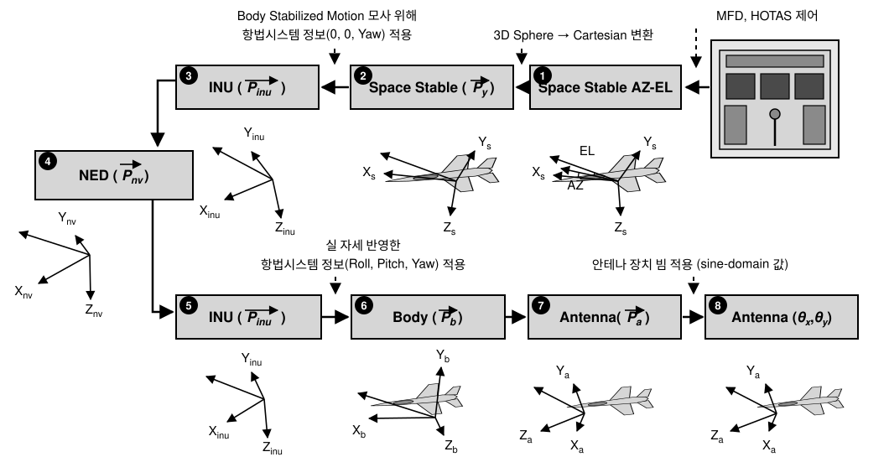

**그림 20 AAST/NAST/ACM Slew 탐색 송신시 좌표계 운용**

##### 1.4.1.1.2 AAST, NAST, ACM Slew 탐색 수신

하기 그림은 Space Stable 좌표계를 사용하는 AAST, NAST의 탐색 운용 시 수신에 대한 좌표계 운용을 보인다. 레이더 수신신호는 HIT 단위에서 Mono-pulse 처리를 수행하며, Mono-pulse 처리는 조향각에 상관없는 값을 갖도록 Sine-domain 값으로 처리장치에 저장하고 비교한다. 하나의 Dwell에서 HIT 데이터들을 통해 얻어지는 Plot 데이터는 거리와 Mono-pulse로 얻어진 각도 정보를 통해, 2번의 안테나 직각 좌표계로 변환한 후 3번위 Body 좌표계로 변환한다. 이후 INU 정보를 이용하여 전투기 자세와 무관한 INU 좌표계로 변환하고, VC-NED 좌표계로 변환함으로써 관성 좌표계 결과를 얻는다.

---

<!-- p.29 -->

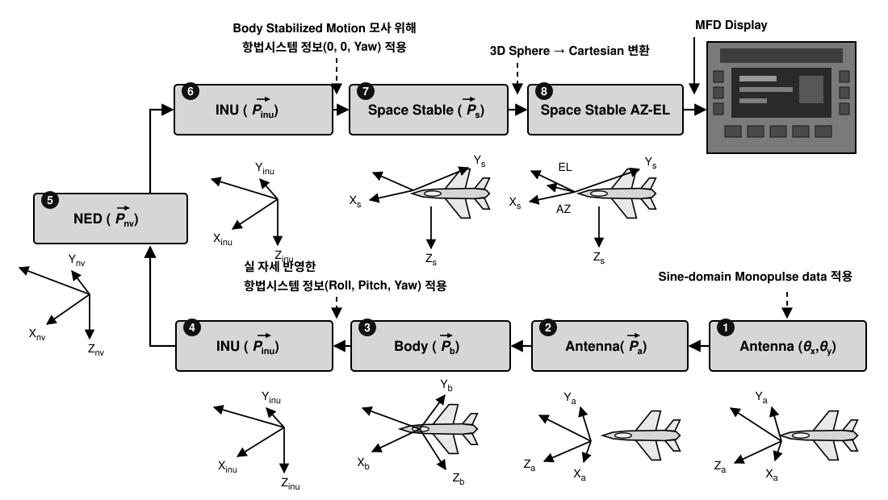

**그림 21 AAST/NAST/ACM Slew 탐색 수신시 좌표계 운용**

만약 얻어진 Plot 데이터를 MFD에 전시를 한다면(현재로서는 TWS를 포함하는 Track데이터만 화면에 표시할 예정이나, 좌표계 설명을 위해 Plot을 MFD에 전시하는 것으로 함), 관성좌표계인 VC-NED에서 INU좌표계를 거쳐 Space Stable 구면좌표계로 변환한 뒤 MFD화면에 Range, Azimuth, Elevation 정보로 표적을 전시한다. 이러한 전시영상은 레이더 처리장치 내의 영상처리에서 생성하고, 외부 Protocol을 통해 표적정보를 임무컴퓨터에 전달한다(프로토콜로 전송하는 데이터 정보는 추후 외부인터페이스에서 다룸).

#### 1.4.1.2 ACM 탐색 좌표계 운용

공대공 ACM(Slew모드 제외) 모드의 **빔운용과 Display 좌표계 운용은 Body 좌표계를 사용**한다. 앞서 기술된 바와 같이 Body 좌표계 기준으로 Elevation/Azimuth 각을 표현한다. 하기에는 빔 운용과 Display 좌표계 운용방법을 기술하며, 이해를 돕기위해 탐색에 대한 송/수신을 나누어 좌표계 운용방법을 기술한다.

##### 1.4.1.2.1 ACM 탐색 송신 (Slew 모드 제외)

하기 그림은 Body 좌표계를 사용하는 ACM의 탐색 운용시 송신에 대한 좌표계 운용을 보인다. ACM 운용모드에서 MFD(Multi-Function Display) 상의 표적 시현은 Body 좌표계 기준으로 시현하며, HOTAS와 MFD를 통해 빔 조향각을 조정하는 것 또한 Body 좌표계 기준으로 조정한다.

---

<!-- p.30 -->

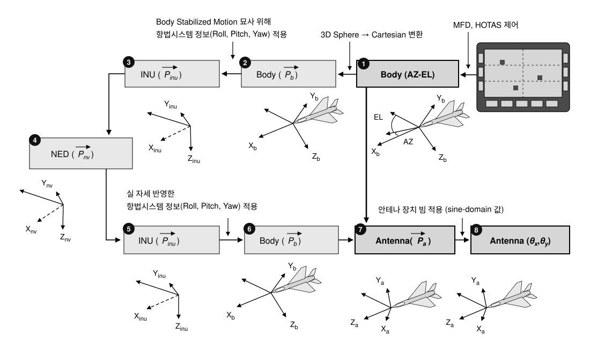

**그림 22 ACM(Slew 제외) 탐색 송신시 좌표계 운용**

상기의 그림과 같이 임무컴퓨터(IMDC)는 MFD 또는 HOTAS를 통해 ACM 운용모드 설정을 레이더 처리장치에 전송하면 레이더 처리장치는 내부적으로 Body 좌표계 상의 탐색영역 Center 지점(HUD, VS, Bore에 대해 정해져 있음)을 AZ, EL 각도로 설정한다. 이를 기준으로 ACM Sub-mode에 따른 방위각/고각 탐색영역 범위를 AZ-EL 시스템 좌표계상에서 탐색 Grid로 설정하고, 설정된 그리드의 첫번째 빔 조향각을 하기 그림의 7번과 같이 안테나 직각좌표계를 거쳐, 안테나 Sine-domain 각으로 변환하여, 능동위상배열 안테나장치로 명령 전송한다.

##### 1.4.1.2.2 ACM 탐색 수신 (Slew 모드 제외)

하기 그림은 Body 좌표계를 사용하는 ACM의 탐색 운용시 수신에 대한 좌표계 운용을 보인다.

---

<!-- p.31 -->

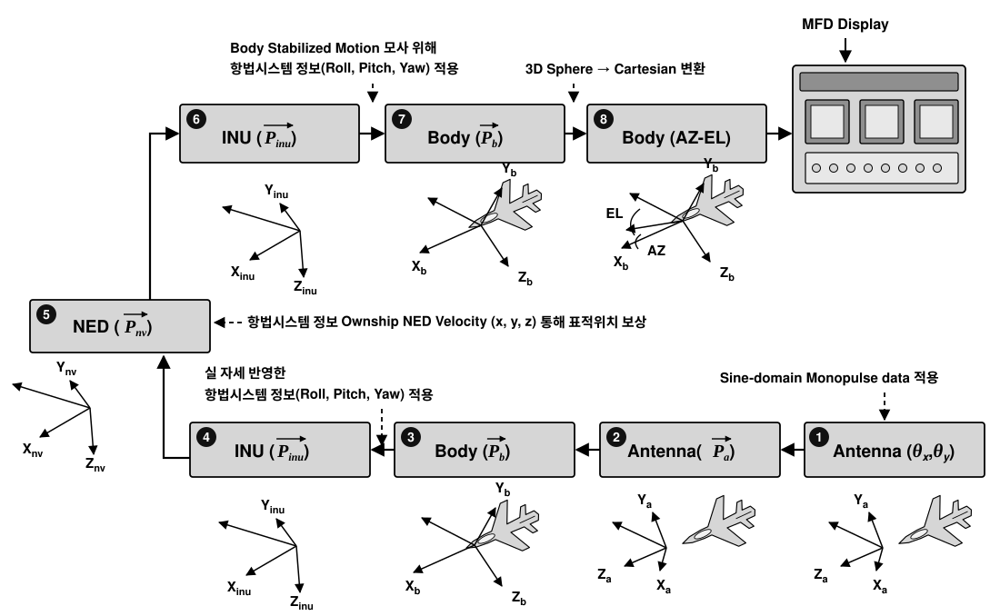

**그림 23 ACM(Slew 제외) 탐색 수신시 좌표계 운용**

레이더 수신신호는 HIT 단위에서 Mono-pulse 처리를 수행하며, Mono-pulse 처리는 조향각에 상관없는 값을 갖도록 Sine-domain 값으로 처리장치에 저장하고 비교한다. 하나의 Dwell에서 HIT 데이터들을 통해 얻어지는 Plot 데이터는 거리와 Mono-pulse로 얻어진 각도정보를 통해, 2번의 안테나 직각 좌표계로 변환한 후 3번위 Body 좌표계로 변환한다. 이후 INU 정보를 이용하여 전투기 자세와 무관한 INU 좌표계로 변환하고, VC-NED 좌표계로 변환함으로써 관성 좌표계 결과를 얻는다. 만약 얻어진 Plot 데이터를 MFD에 전시를 한다면(현재로서는 TWS를 포함하는 Track데이터만 화면에 표시할 예정이나, 좌표계 설명을 위해 Plot을 MFD에 전시하는 것으로 함), 관성좌표계인 VC-NED에서 INU좌표계를 거쳐 Body 좌표계로 변환한뒤 구면좌표계 MFD화면에 Range, Azimuth, Elevation 정보로 표적을 전시한다. 이러한 전시영상은 레이더 처리장치 내의 영상처리에서 생성하고, 외부 Protocol을 통해 표적정보를 임무컴퓨터에 전달한다(프로토콜로 전송하는 데이터 정보는 추후 외부인터페이스에서 다룸). ACM 송신 대비 수신의 좌표계 변환이 많은 것은 **표적을 Plot 형태로 관리하고, 추후 추적으로 가져가는 좌표계가 VC-NED(Local Inertial 좌표계)이기 때문**이며, VC-NED에서 다시 표적 전시를 위해 Body 좌표계로 되돌아와야 하기 때문이다.

### 1.4.2. 공대공 운용모드 추적 좌표계 운용

추적데이터 관리 및 추적필터 운용은 Inertial 좌표계에서 수행해야하며, 전투기/전함과 같이 움직이는 Platform 위의 레이더는 Inertial 좌표계 중 VC-NED 좌표계에서 추적데이터 관리 및 추적필터를 운용하는 것이 효율적이다. 하기 그림은 NED좌표계를 통해 추적데이터 관리하는 것을 보이며, 이는 앞 그림의 5번 부분이 추적으로 동작할 때의 내부 추적데이터 관리에 대한 그림이다.

---

<!-- p.32 -->

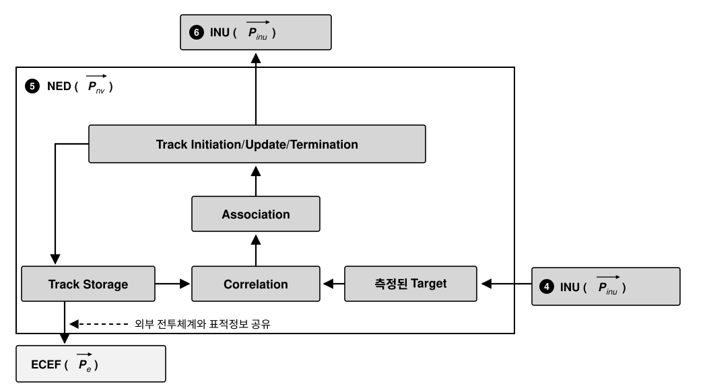

**그림 24 VC-NED 좌표계를 통한 추적데이터 관리**

항법장치(INU)는 Body좌표계에서 INU좌표계로 변환시키기 위한 전투기 자세정보만 제공하는 것이 아닌 INU 좌표계상의 Xinu, Yinu, Zinu 성분의 Range rate 벡터와 Ownship의 LLA 좌표정보도 함께 제공한다. 매번 측정 되는 표적을 ECEF 좌표계로 옮기기 위해서는 NED좌표축을 ECEF 좌표축으로 회전 변환하는 과정과, ECEF좌표계상의 전투기 위치를 Translate 해주기 위한 LLA좌표로부터의 ECEF 좌표변환 과정을 함께해줘야 하기에 매번 추가적인 수식연산을 해주어야 한다. 허나, INU가 관성항법장치인 이유는 비관성 좌표계인 VC-NED에게 X, Y, Z 축상의 Range rate값을 제공하여 VC-NED를 Inertial 좌표계로 변환시킬 수 있기 때문이다. 따라서, VC-NED 좌표계 상에서 Ownship의 변화량을 표적에 상대 적용해주면 Flat earth 상의 고정점에서 표적을 바라보는 효과(표적의 절대위치를 표현하는 효과)를 제공할 수 있다. 표적에 적용하는 Ownship의 거리 변화량은 INU에서 제공되는 Xinu, Yinu, Zinu 성분의 Range rate 벡터를 통해 얻어내며, 모든 표적에 더하기/빼기만을 해주기에 상대적 연산로드가 적다. 따라서, 표적정보를 타 전투체계에 제공하고자 할 때에만, 지구중심의 ECEF좌표계로 한번 변환해주면 되며, 이는 INU에서 제공되는 LLA좌표정보를 통해 Ownship의 위치를 ECEF 변환하여 모든 표적에 Offset 적용함(위치 Translation)으로써 이루어진다. VC-NED좌표계 상에서 표적데이터의 위치를 정확히 표현하기 위해서는 Ownship의 Range rate로부터 표적의 거리변화량을 정확히 보정 해줘야하며, INU로부터 들어오는 정보가 APG-67의 경우 50Hz인 것을 감안하면, Ownship의 기체속도 변화가 1/50초에 거의 변화가 없다고 가정할 수 있기에 50Hz로 동작하는 INU에 있어서 VC-NED 좌표계는 Inertial 좌표계 사용하기에 충분하다고 할 수 있다.

#### 1.4.2.1 AAST, NAST, ACM Slew 추적 좌표계 운용

공대공 AAST, NAST, ACM Slew 모드의 빔운용과 Display 좌표계 운용은 Space Stable 좌표계를 사용한다.

##### 1.4.2.1.1 AAST, NAST, ACM Slew 추적 송신/수신

하기 그림25는 Space Stable 좌표계를 사용하는 AAST, NAST, ACM Slew 모드의 추적 운용 시 송신에 대한 좌표계 운용을 보인다.

---

<!-- p.33 -->

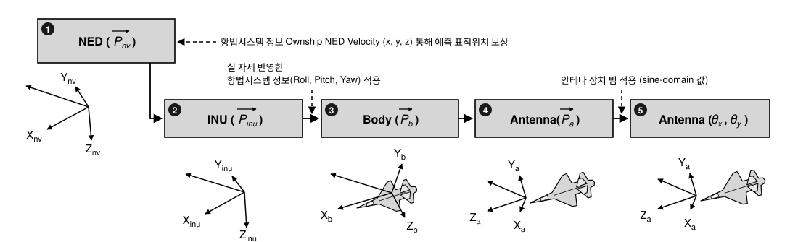

**그림 25 AAST/NAST/ACM Slew 추적 송신시 좌표계 운용**

레이더 처리장치는 VC-NED 좌표계에서 추적데이터를 관리하며, 추적필터를 통해 얻어진 표적의 다음 예측위치에 빔을 조사한다. 이를 위해 INU 좌표계 변환과 INU 전투기 자세 정보를 반영한 Body 좌표계 변환, 그리고 안테나 좌표계로의 변환을 거쳐 빔조향 정보를 능동위상배열 안테나장치에 전송하며, 이는 탐색운용 시와 같다.

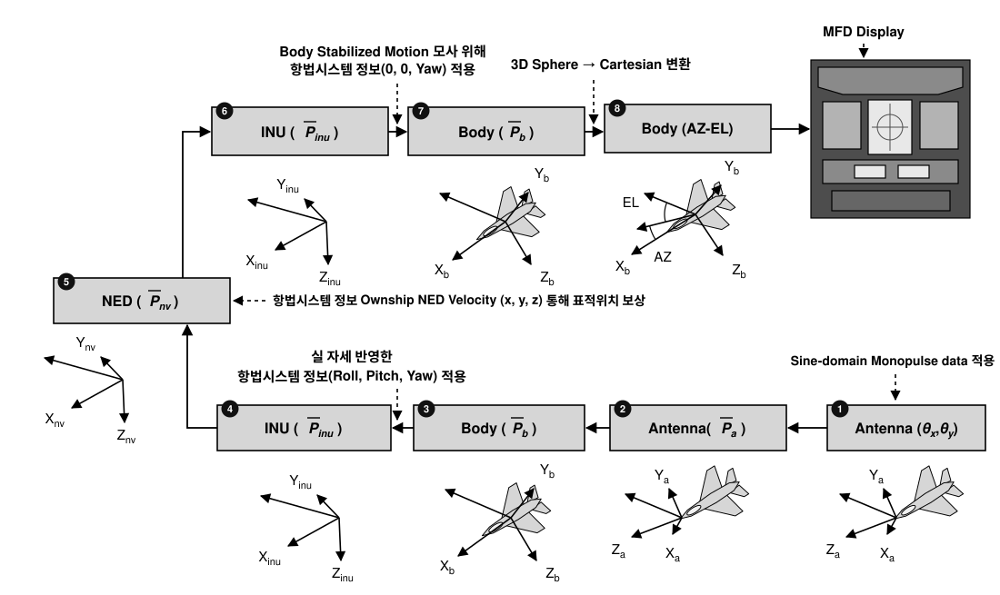

**그림 26 AAST/NAST/ACM Slew 추적 수신시 좌표계 운용**

상기 그림26은 Space Stable 좌표계를 사용하는 AAST, NAST, ACM Slew 모드의 탐색 운용 시 수신에 대한 좌표계 운용을 보인다. 추적 수신의 과정 및 추적표적의 MFD 전시 과정에 대한 좌표계 변환은 탐색의 과정과 동일하며, 다른 내용을 갖는 위 그림의 5번 NED좌표계 부분에 대해서는 1.4.2절에서 다루었다.

#### 1.4.2.2. ACM (Slew 제외) 추적 좌표계 운용

공대공 ACM (Slew Sub-mode 제외) 모드의 빔운용과 Display 좌표계 운용은 Body 좌표계를 사용

---

<!-- p.34 -->

한다.

##### 1.4.2.2.1 ACM 추적 송신/수신 (Slew 모드 제외)

하기 그림27은 Body 좌표계를 사용하는 ACM 모드(Slew 제외) 모드의 추적 시 송신에 대한 좌표계 운용을 보이며, AAST, NAST, ACM Slew 추적 송신의 내용과 동일하다.

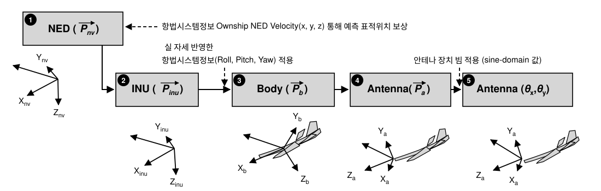

**그림 27 ACM 추적 송신시 좌표계 운용**

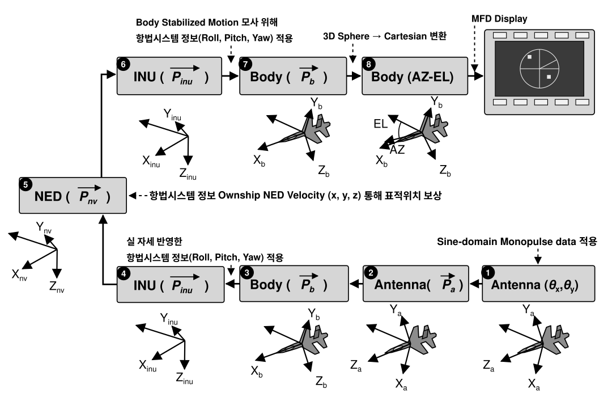

**그림 28 ACM(Slew 제외) 추적 수신시 좌표계 운용**

상기 그림28은 Body 좌표계를 사용하는 ACM(Slew 제외) 모드의 추적 운용 시 수신에 대한 좌표계 운용을 보인다. 추적 수신의 과정 및 추적표적의 MFD 전시 과정에 대한 좌표계 변환은 탐색의 과정과 동일하다.

### 1.4.3 공대지 운용모드 탐색 좌표계 운용

공대지 모드의 빔운용과 Display 좌표계 운용은 Drift Stable 좌표계를 사용한다. 앞서 기술된

---

<!-- p.35 -->

Drift Stable 좌표계 정의에서와 같이 Elevation 각은 Horizontal(VC-NED의 Xnv, Ynv평면)에 기준으로 표현되고, Azimuth 각은 전투기 Heading 방향(Euler Yaw 회전방향)에 Drift Angle 각이 더해진 방향 기준으로 표현되며, Elevation/Azimuth 각은 전투기의 Euler Pitch/roll 회전방향과는 무관하다. 하기에는 빔 운용과 Display 좌표계 운용방법을 기술하며, 이해를 돕기위해 탐색에 대한 송/수신을 나누어 좌표계 운용방법을 기술한다.

#### 1.4.3.1. 공대지 탐색 송신

하기 그림은 Drift Stable 좌표계를 사용하는 공대지 모드의 탐색 운용시 송신에 대한 좌표계 운용을 보인다. 공대지 운용모드에서 MFD(Multi-Function Display) 상의 표적 시현은 Drift Stable 좌표계 기준으로 시현하며, HOTAS와 MFD를 통해 빔 조향각을 조정하는 것 또한 Drift Stable 좌표계 기준으로 조정한다. 위의 그림과 같이 임무컴퓨터(IMDC)는 Drift Stable 좌표계 상의 탐색영역 Center 지점(Drift Stable 좌표계 상의 Xw, Yw 평면기준 표현된 지점)을 AZ, EL 각도로 레이더에 보낸다.

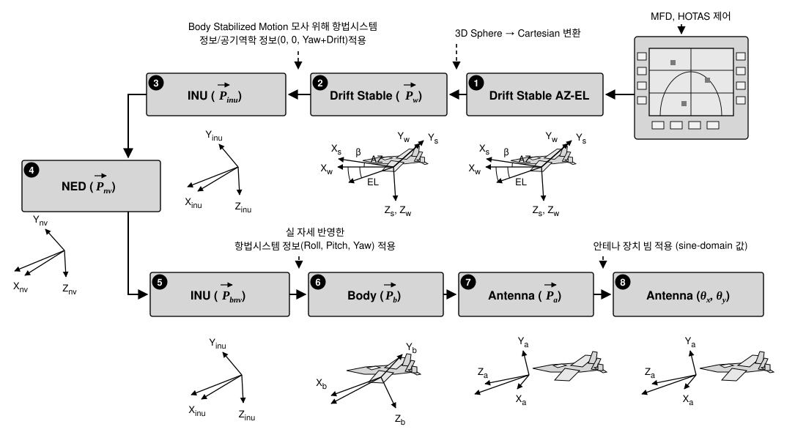

**그림 29 공대지 탐색 송신시 좌표계 운용**

공대지 모드에서는 기본적으로 AZ, EL이 Steering Point 등으로 자동 설정되며, 조종사 요구에 의해 탐색영역 Center 지점을 이동할 수 있다. 레이더 처리장치는 탐색영역 Center 지점을 기준으로 기 설정한 방위각 탐색영역 범위(±10, ±20 ±30)와 고각 탐색영역 범위(1 bar)를 AZ-EL 시스템 좌표계상에서 형성하고, 공대지 빔 운용을 위해 2번과 같이 Drift Stable 직각좌표계 변환을 거쳐 3번의 전투기 자세와 무관한 INU 좌표계로 변환한다. 변환 시 INU가 설치된 위치로 변환하고 전투기 자세정보(INU 설치위치에서의 자세정보) 중 Yaw와 임무컴퓨터로부터 수신된 Drift Angle을 더하여 적용한다 (Pitch와 Roll은 회전 없이 변환함). 이후 변환된 4번 VC-NED좌표계에서의 빔조향 정보는 비행자세와 무관한 Inertial 좌표계 상의 빔조향 정보이며, 현 비행자세를 반영한 Body 좌표계 기준의 빔 조향 방향으로 재 설정해야 한다.

---

<!-- p.36 -->

INU는 전투기 Platform마다 설치 위치가 다르며, Wander Angle 등으로 VC-NED 대비 회전변환도 되어 있기에 VC-NED 좌표계로부터 INU 좌표계로의 변환이 필요하며, INU좌표계를 통해 얻어진 항공기 자세정보를 기반으로 6번의 Body 좌표계로 변환한다. 변환된 Body 좌표계를 기반으로 7번 안테나 직각좌표계로 변환하고, 능동위상배열 안테나장치로 레이더 내부 인터페이스를 통해 빔조향 명령을 전달 시 8번의 sine-domain 명령으로 변환하여 전송한다.

#### 1.4.3.2. 공대지 탐색 수신

하기 그림은 Drift Stable 좌표계를 사용하는 공대지 탐색 운용 시 수신에 대한 좌표계 운용을 보인다. 레이더 수신신호는 8번에서 설정한 AZ-EL에 대한 영상데이터로서 2번의 안테나 직각 좌표계로 변환한 후 3번위 Body 좌표계로 변환한다. 이후 INU 정보와 임무컴퓨터로부터 얻는 Drift Angle값을를 이용하여 전투기 자세와 무관한 INU 좌표계로 변환하고, VC-NED 좌표계로 변환함으로써 관성 좌표계 상에서의 영상 결과를 얻는다. 이 영상 데이터를 MFD에 전시를 한다면, VC-NED에서 INU좌표계를 거쳐 Space Stable 구면좌표계로 변환한 뒤 MFD화면에 Range, Azimuth, Elevation 정보로 영상을 전시한다. 이러한 전시영상은 레이더 처리장치 내의 영상처리에서 생성하여 전시한다.

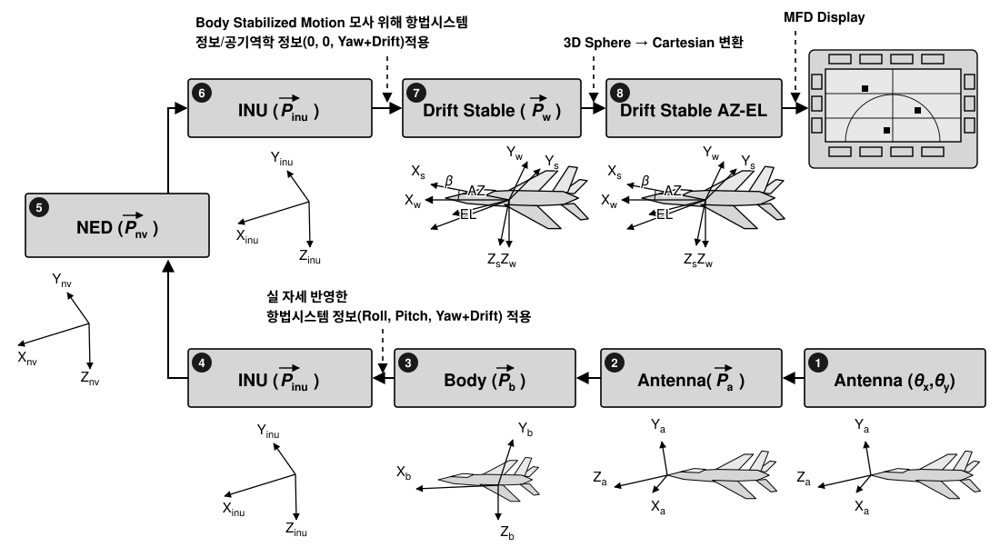

**그림 30 공대지 탐색 수신시 좌표계 운용**

### 1.4.4. 공대지 운용모드 추적 좌표계 운용

공대지 운용모드의 추적 좌표계는 본 사업의 범위를 넘어서기에 간략한 그림만을 도식한다.

#### 1.4.4.1. 공대지 추적 송신/수신

하기 그림은 Drift Stable 좌표계를 사용하는 공대지 추적 운용 시 송신에 대한 좌표계 운용을 보인다.

---

<!-- p.37 -->

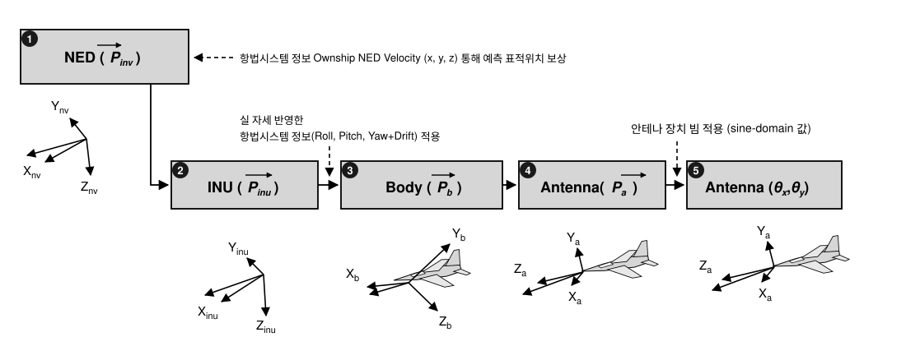

**그림 31 공대지 추적 송신시 좌표계 운용**

하기 그림은 Drift Stable 좌표계를 사용하는 공대지의 추적 운용 시 수신에 대한 좌표계 운용을 보인다.

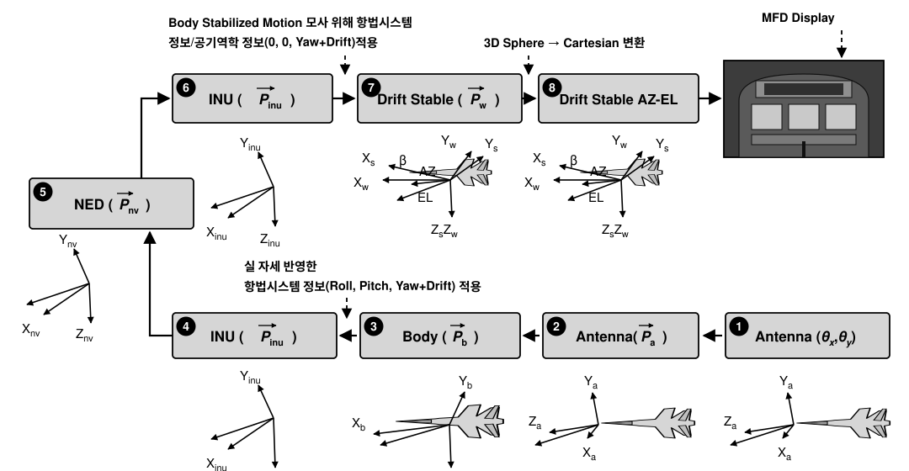

**그림 32 공대지 추적 수신시 좌표계 운용**

### 1.4.5. 항법장치에서 레이더 시스템으로의 정보 전달

전투기 탑재 레이더 시스템의 경우 전투기에 탑재되어 있는 항법장치로부터 전투기에 대한 위치정보를 받을 수 있으므로 항법장치에서 전달 된 정보를 이용하여 목표물의 위치를 레이더에서 탐지한 위치와 융합하여 위치를 파악할 수 있다. 이 때, 항법장치에서 전달되는 정보의 주기가 중요하며, 필요로 하는 시각과 항법장치에서 정보를 전달하는 시간의 오차를 줄여주는 것이 위치 정확도를 높이는데 중요하다고 할 수 있다. ELTA 2052의 경우 INU에서 Radar 시스템으로 전달되는 정보는 50회/Sec이므로 이에 대한 적용을 고려해야 한다.

---

<!-- p.38 -->

### 표 3 INU에서 Radar로 전달되는 data format 에

INSPVAS: Message ID = 508

| Field # | Field Name | Field Type | Description | Binary Bytes |
| --- | --- | --- | --- | --- |
| 1 | INS Header | - | Log Header | H |
| 2 | Week | ULONG | GPS Week | 4 |
| 3 | Seconds of Week | Double | Seconds from start of week | 8 |
| 4 | Latitude | Double | Latitude in WGS84 [deg] | 8 |
| 5 | Longitude | Double | Latitude in WGS84 [deg] | 8 |
| 6 | Altitude | Double | Ellipsoidal Altitude in WGS84 [m] | 8 |
| 7 | North Velocity | Double | Velocity in northern direction [m/s] | 8 |
| 8 | East Velocity | Double | Velocity in eastern direction [m/s] | 8 |
| 9 | Up Velocity | Double | Velocity in up direction [m/s] | 8 |
| 10 | Roll | Double | Roll (around y axis) [deg] | 8 |
| 11 | Pitch | Double | Pitch (around x axis) [deg] | 8 |
| 12 | Azimuth | Double | Azimuth (around down direction, clockwise from north) [deg] | 8 |
| 13 | Status | ENNUM | INS/GPS Status | 4 |
| 14 | Xxxx | 32 Bit CRC | Hex | 4 |
| 15 | `<CR><LF>` | - | Sentence Terminator (ASCII only) | - |

Example: log INSPVASA ontime 1

INU에서 레이더로 전달되는 data의 format은 여러 가지 종류로 나누어 진다. 하기의 표는 일반적으로 많이 사용되는 INU 자료 형태를 보여준다. 여기에서 4, 5, 6항에 해당되는 경도, 위도, 고도의 정보가 Ownship의 LLA 좌표계상에서의 위치를 말해주며, Ownship의 위치를 VC-NED 좌표계에서 ECEF 좌표계로 변환하여 타 항전센서나, 상위 전투체계(AWACS 등)에 정보 전송할 때에 사용한다. 7항~9항까지가 VC-NED 좌표계 상에서 Ownship의 Velocity Vector를 나타낸다. Ownship의 Velocity Vector값은 VC-NED 좌표계를 Inertial 좌표계로 만들어주는 중요한 자료이다(레이더로부터 탐지/추적된 표적을 보상하여 Inertial 좌표계상의 움직임으로 만드는데 사용함). 10항~12항까지는 항공기 자세정보이며, Body 좌표계에서 INU/VC-NED 좌표계로 변환하는데 사용한다.

# 2. 결론

본 Technical Report에서는 전투기 탑재 AESA레이더에서의 좌표계 운용에 대해 기술하였다. 공대공/공대지 운용모드별로 효율적인 좌표계 운용 방법과 좌표 변환과정을 검토하였으며, 항전장비로 부터 레이더로 들어오는 좌표계 관련정보의 종류와 이에 대한 사용법을 기술하였다. 운용모드별 레이더 빔운용 방법과, 빔운용에 맞는 좌표계의 정의, 그리고 송신에서 수신 후 MFD에 전시하기까지의 좌표계를 정의하고 운용법에 대해 체계관점에서 정리하였다.
